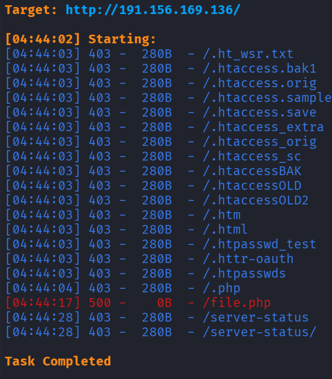
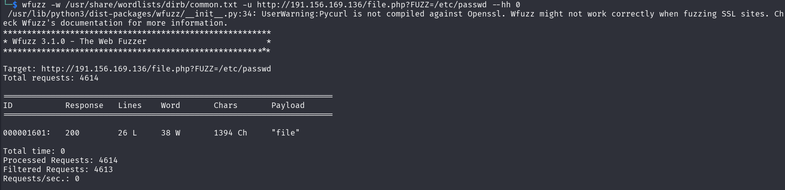
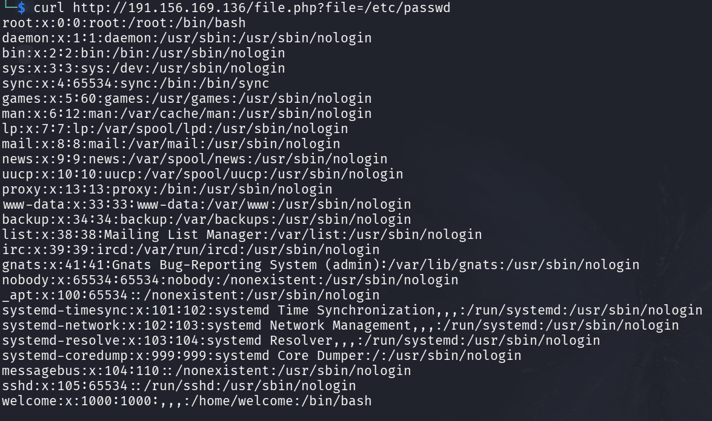

```table-of-contents
```

# 信息收集

基本的信息搜集方法就不展示了，若有重要的内容会单独给出

只有两个端口：22，80
但前端没有找到有用的信息

## 枚举

```bash
dirsearch -u http://191.156.169.136/
```

找到了一个file.php，但是状态码为：500
如果网站不存在这个内容就是403（Not Found），而500则是服务器错误，也就说单独访问file.php不是正确的请求方式

尝试进行参数探测（这里可以猜测这里应该存在LFI，可以先尝试手工进行猜测，比如：file、page、path、f等）
这里使用的工具是：wfuzz （fuff）

探测出了一个参数为：file

# 渗透

这里看样子貌似是存在LFI的
尝试读取一下可能有用的文件
```bash
└─$ curl http://191.156.169.136/file.php?file=/var/www/html/file.php
<?php
// file.php
$file = $_GET['file'];
echo file_get_contents($file);
?>
```
这里有一个输出相关的函数 file_get_contents() 与 include不一样，无法进行代码执行（如果存在其他漏洞可以尝试结合使用，但是这里没有发现其他漏洞）

既然无法进行代码执行，也就是想要直接进行反弹shell是不可能的，只有尝试读取可能存在敏感信息的内容

把已知的能想到的（能搜索找到有关的）配置文件等内容都读取了一遍，没有发现可利用的内容
常规的日志投毒、SSRF、PHP封装以及凭据/密钥等都没法进行或找到并利用

既然第三方的软件等没有详细的可用信息暴露就考虑从Linux的系统出发，比如：内核，伪设备文件,伪系统文件等

通过所以的分析与权衡，这里尝试一下伪系统文件是否存在必要的内容泄露：

## 伪系统文件

伪系统文件主要有：
- /proc：进行及内核信息文件系统
- /sys：设备及内核对象文件系统
- /dev：设备文件系统
- /run：
- /tmp：
- /dev/shm：