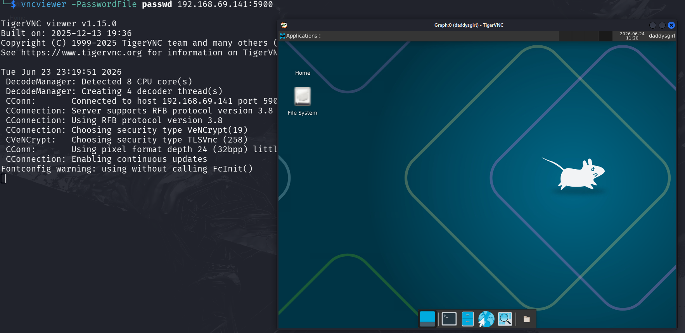
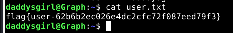

```table-of-contents
```

# 信息收集

```bash
PORT     STATE  SERVICE  VERSION
21/tcp   open   ftp      vsftpd 3.0.5
| ftp-anon: Anonymous FTP login allowed (FTP code 230)
|_-rwxrwxrwx    1 0        0               8 May 31 14:03 passwd [NSE: writeable]
| ftp-syst: 
|   STAT: 
| FTP server status:
|      Connected to 192.168.69.128
|      Logged in as ftp
|      TYPE: ASCII
|      No session bandwidth limit
|      Session timeout in seconds is 300
|      Control connection is plain text
|      Data connections will be plain text
|      At session startup, client count was 3
|      vsFTPd 3.0.5 - secure, fast, stable
|_End of status
22/tcp   open   ssh      OpenSSH 10.3 (protocol 2.0)
5900/tcp open   vnc      VNC (protocol 3.8)
| vnc-info: 
|   Protocol version: 3.8
|   Security types: 
|     VeNCrypt (19)
|     VNC Authentication (2)
|   VeNCrypt auth subtypes: 
|     VNC auth, Anonymous TLS (258)
|_    Unknown security type (2)

```
**21端口**可匿名登录（存在一个**passwd**文件，先**get**下来）

**5900端口**疑似存在：
- VNC登录（尝试了需要密码）
- 密码强度测试

刚好我们获得了一个**passwd**文件尝试使用它进行**VNC**登录

```bash
└─$ vncviewer --help                                  

TigerVNC viewer v1.15.0
Built on: 2025-12-13 19:36
Copyright (C) 1999-2025 TigerVNC team and many others (see README.rst)
See https://www.tigervnc.org for information on TigerVNC.

Usage: vncviewer [parameters] [host][:displayNum]
       vncviewer [parameters] [host][::port]
       vncviewer [parameters] [unix socket]
       vncviewer [parameters] -listen [port]
       vncviewer [parameters] [.tigervnc file]

Options:

  -display Xdisplay  - Specifies the X display for the viewer window
  -geometry geometry - Initial position of the main VNC viewer window. See the
                       man page for details.

Parameters can be turned on with -<param> or off with -<param>=0
Parameters which take a value can be specified as -<param> <value>
Other valid forms are <param>=<value> -<param>=<value> --<param>=<value>
Parameter names are case-insensitive.  The parameters are:
......
  passwd         - Alias for PasswordFile
  PasswordFile   - Password file for VNC authentication
  PointerEventInterval - Time in milliseconds to rate-limit successive pointer
                   events (default=17)
  PreferredEncoding - Preferred encoding to use (Tight, ZRLE, Hextile or Raw)
                   (default=Tight)
......
```
添加**PasswordFile**参数即可


成功登录了VNC

打开终端获得**User_Flag**：**flag{user-62b6b2ec026e4dc2cfc72f087eed79f3}**


# 提权枚举

为了方便在Kail上操作，进行了ssh配置（刚好允许配置，若不行尝试反弹Shell到Kali也许）


