```table-of-contents
```

# 信息收集

基本主机发现、端口与服务探测、默认脚本扫描

端口很少，只有22与80
那就直接进行80端口服务的探测

# Web打点


## 第一阶段：

直接访问：
```bash
curl -v http://192.168.69.140
*   Trying 192.168.69.140:80...
* Established connection to 192.168.69.140 (192.168.69.140 port 80) from 192.168.69.128 port 45616 
* using HTTP/1.x
> GET / HTTP/1.1
> Host: 192.168.69.140
> User-Agent: curl/8.19.0
> Accept: */*
> 
* Request completely sent off
< HTTP/1.1 200 OK
< Date: Tue, 23 Jun 2026 09:44:53 GMT
< Server: Apache/2.4.67 (Unix)
< X-Powered-By: PHP/8.3.31
< X-Required-UA: Matryoshka-Bot/1.0
< X-Hint-Stage: 1
< X-Accepted-Headers: User-Agent
< Content-Length: 107
< Content-Type: text/html; charset=UTF-8
< 
* Connection #0 to host 192.168.69.140:80 left intact

{"status":"fail","current_stage":1,"accepted_headers":["User-Agent"],"msg":"Access Denied: Invalid Agent."}
```

返回内容显示：处于**Stage 1**，只接受**User-Agent**头
同时响应头存在：**X-Required-UA: Matryoshka-Bot/1.0**

那就根据要求添加上该请求头信息

```bash
curl -v http://192.168.69.140 -H "User-Agent: Matryoshka-Bot/1.0"
*   Trying 192.168.69.140:80...
* Established connection to 192.168.69.140 (192.168.69.140 port 80) from 192.168.69.128 port 48432 
* using HTTP/1.x
> GET / HTTP/1.1
> Host: 192.168.69.140
> Accept: */*
> User-Agent: Matryoshka-Bot/1.0
> 
* Request completely sent off
< HTTP/1.1 200 OK
< Date: Tue, 23 Jun 2026 09:50:50 GMT
< Server: Apache/2.4.67 (Unix)
< X-Powered-By: PHP/8.3.31
< X-Next-Stage: challenge_start
< X-Hint-Stage: 2
< X-Accepted-Headers: User-Agent, X-Stage
< Content-Length: 125
< Content-Type: text/html; charset=UTF-8
< 
* Connection #0 to host 192.168.69.140:80 left intact
{"status":"fail","current_stage":2,"accepted_headers":["User-Agent","X-Stage"],"msg":"Stage 1 Clear. Advance to next stage."} 
```

成功获得了不一样的输出

## 第二阶段

虽然第一阶段成功获得了其他输出内容，但是依旧是失败的！
继续观察请求头的构造，有一个不一样的点：**X-Next-Stage: challenge_start**
那么依旧添加尝试！

```bash
curl -v http://192.168.69.140 -H "User-Agent: Matryoshka-Bot/1.0" -H "X-Stage: challenge_start"
*   Trying 192.168.69.140:80...
* Established connection to 192.168.69.140 (192.168.69.140 port 80) from 192.168.69.128 port 35448 
* using HTTP/1.x
> GET / HTTP/1.1
> Host: 192.168.69.140
> Accept: */*
> User-Agent: Matryoshka-Bot/1.0
> X-Stage: challenge_start
> 
* Request completely sent off
< HTTP/1.1 200 OK
< Date: Tue, 23 Jun 2026 09:53:20 GMT
< Server: Apache/2.4.67 (Unix)
< X-Powered-By: PHP/8.3.31
< X-Expected-Auth: sha256(UA + Salt)
< X-Hint-Salt: mAtRy0sHk4_2026
< X-Hint-Stage: 3
< X-Accepted-Headers: User-Agent, X-Stage, X-Auth
< Content-Length: 142
< Content-Type: text/html; charset=UTF-8
< 
* Connection #0 to host 192.168.69.140:80 left intact
{"status":"fail","current_stage":3,"accepted_headers":["User-Agent","X-Stage","X-Auth"],"msg":"Stage 2 Clear. Auth hash missing or mismatch."}  
```

返回内容有所变化

## 第三阶段

继续观察请求头，出现了一个**X-Hint-Salt: mAtRy0sHk4_2026**的请求

```bash
└─$ curl -v http://192.168.69.140 -H "User-Agent: Matryoshka-Bot/1.0" -H "X-Stage: challenge_start" -H "X-Salt: mAtRy0sHk4_2026"
*   Trying 192.168.69.140:80...
* Established connection to 192.168.69.140 (192.168.69.140 port 80) from 192.168.69.128 port 49942 
* using HTTP/1.x
> GET / HTTP/1.1
> Host: 192.168.69.140
> Accept: */*
> User-Agent: Matryoshka-Bot/1.0
> X-Stage: challenge_start
> X-Salt: mAtRy0sHk4_2026
> 
* Request completely sent off
< HTTP/1.1 200 OK
< Date: Tue, 23 Jun 2026 09:55:16 GMT
< Server: Apache/2.4.67 (Unix)
< X-Powered-By: PHP/8.3.31
< X-Expected-Auth: sha256(UA + Salt)
< X-Hint-Salt: mAtRy0sHk4_2026
< X-Hint-Stage: 3
< X-Accepted-Headers: User-Agent, X-Stage, X-Auth
< Content-Length: 142
< Content-Type: text/html; charset=UTF-8
< 
* Connection #0 to host 192.168.69.140:80 left intact
{"status":"fail","current_stage":3,"accepted_headers":["User-Agent","X-Stage","X-Auth"],"msg":"Stage 2 Clear. Auth hash missing or mismatch."} 
```
按照之前的步骤操作，发现还是不行

注意到了上面还有一个重要内容：**X-Expected-Auth: sha256(UA + Salt)**
这里的提示**UA** + **Salt** 后的 **SHA256编码** (`Matryoshka-Bot/1.0mAtRy0sHk4_2026`)
那就按提示进行操作：

```bash
echo -n "Matryoshka-Bot/1.0mAtRy0sHk4_2026" | sha256sum
7b59aad06ca201fcdf0a2845932b323c5bfa6e191614f115b613d3b145b49dbf                                                   
curl -H "User-Agent: Matryoshka-Bot/1.0" \
     -H "X-Stage: challenge_start" \
     -H "X-Auth: 7b59aad06ca201fcdf0a2845932b323c5bfa6e191614f115b613d3b145b49dbf" \
     http://192.168.69.140

{"status":"fail","current_stage":4,"accepted_headers":["User-Agent","X-Stage","X-Auth","X-Signature"],"msg":"Stage 3 Clear. Signature verification failed or expired."} 
```

成功进入了第四步

## 第四阶段

上一步没有输出具体的请求头，先看一看有什么提示吧！

```bash
curl -v -H "User-Agent: Matryoshka-Bot/1.0" \
     -H "X-Stage: challenge_start" \
     -H "X-Auth: 7b59aad06ca201fcdf0a2845932b323c5bfa6e191614f115b613d3b145b49dbf" \
     http://192.168.69.140

*   Trying 192.168.69.140:80...
* Established connection to 192.168.69.140 (192.168.69.140 port 80) from 192.168.69.128 port 33148 
* using HTTP/1.x
> GET / HTTP/1.1
> Host: 192.168.69.140
> Accept: */*
> User-Agent: Matryoshka-Bot/1.0
> X-Stage: challenge_start
> X-Auth: 7b59aad06ca201fcdf0a2845932b323c5bfa6e191614f115b613d3b145b49dbf
> 
* Request completely sent off
< HTTP/1.1 200 OK
< Date: Tue, 23 Jun 2026 10:01:48 GMT
< Server: Apache/2.4.67 (Unix)
< X-Powered-By: PHP/8.3.31
< X-Expected-Signature: md5(Auth + Secret + TimeStep)
< X-Hint-Secret: OWUyZF9oaWRkZW5fc3RhdGU=
< X-Time-Step: 178220890
< X-Hint-Stage: 4
< X-Accepted-Headers: User-Agent, X-Stage, X-Auth, X-Signature
< Content-Length: 167
< Content-Type: text/html; charset=UTF-8
< 
* Connection #0 to host 192.168.69.140:80 left intact
{"status":"fail","current_stage":4,"accepted_headers":["User-Agent","X-Stage","X-Auth","X-Signature"],"msg":"Stage 3 Clear. Signature verification failed or expired."}
```

注意到了很重要的地方：**X-Hint-Secret: OWUyZF9oaWRkZW5fc3RhdGU=**
这貌似是一个**Base64**编码
解码看一看：
```bash
echo "OWUyZF9oaWRkZW5fc3RhdGU=" | base64 -d            
9e2d_hidden_state 
```

但是上面还有一个：**X-Expected-Signature: md5(Auth + Secret + TimeStep)**

**Auth**：**7b59aad06ca201fcdf0a2845932b323c5bfa6e191614f115b613d3b145b49dbf**
**Secret**：**9e2d_hidden_state**
**TimeStep**：每次请求都会变化，且验证窗口极短（几秒内过期）

等写一个脚本来处理一下了：
```bash
└─$ auth="7b59aad06ca201fcdf0a2845932b323c5bfa6e191614f115b613d3b145b49dbf"                                                     
secret="9e2d_hidden_state"
while true; do
    # 1. 不带签名请求一次，获取最新的 TimeStep
    resp=$(curl -s -D - \
        -H "User-Agent: Matryoshka-Bot/1.0" \
        -H "X-Stage: challenge_start" \
        -H "X-Auth: $auth" \
        http://192.168.69.140)
    timestep=$(echo "$resp" | grep -i 'X-Time-Step' | awk '{print $2}' | tr -d '\r')
    [ -z "$timestep" ] && echo "未获取到 TimeStep" && break

    # 2. 计算签名
    sig=$(echo -n "${auth}${secret}${timestep}" | md5sum | awk '{print $1}')

    # 3. 立刻用该签名发送请求
    resp2=$(curl -s -D - \
        -H "User-Agent: Matryoshka-Bot/1.0" \
        -H "X-Stage: challenge_start" \
        -H "X-Auth: $auth" \
        -H "X-Signature: $sig" \
        http://192.168.69.140)

    echo "=== 时间步: $timestep | 签名: $sig ==="
    echo "$resp2"

    # 成功时（不再包含“fail”或“expired”）会退出循环
    if ! echo "$resp2" | grep -q 'fail'; then
        break
    fi
done

```

返回内容：
```bash
=== 时间步: 178220930 | 签名: 084fbe07a9668ebc33936e939c3f3d48 ===
HTTP/1.1 200 OK
Date: Tue, 23 Jun 2026 10:08:20 GMT
Server: Apache/2.4.67 (Unix)
X-Powered-By: PHP/8.3.31
X-Flag: bWlrYXNhOjAwYjc4ZGMx
Content-Length: 52
Content-Type: text/html; charset=UTF-8

{"status":"success","msg":"Done! Challenge Solved."}

```

**Flag**：**bWlrYXNhOjAwYjc4ZGMx** -->(base64解码) --> **mikasa:00b78dc1**


# 提权枚举

基本的信息枚举：没有找到可利用的点（传入了**linpeas**，但是尝试了一下并没有成功复现扫出的CVE）

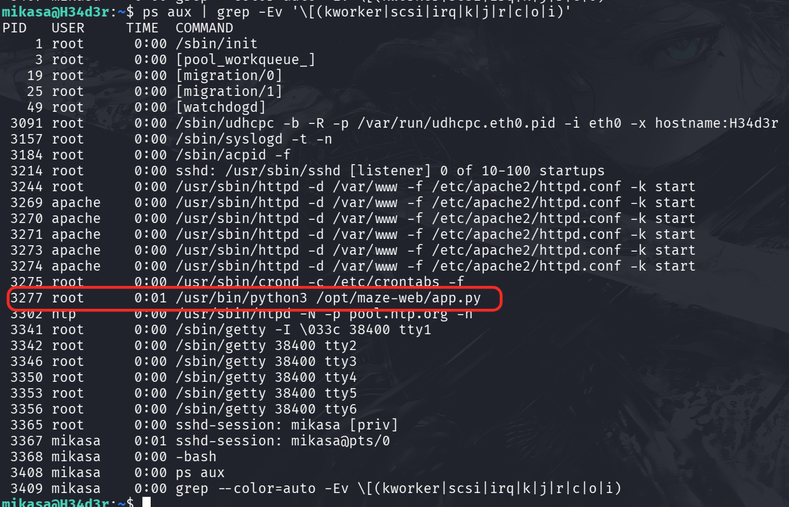
查看进程时发现有一个可以的进行（还是以**root**权限执行的）
但是并不能读写

那就先看一下端口开放情况吧！！！
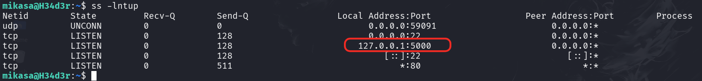
也存在一个可疑的开放端口

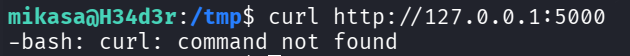
不能直接**curl**，但是尝试后发现可疑使用**python** ---> 那就想办法将5000端口**转发/代理**出来看看

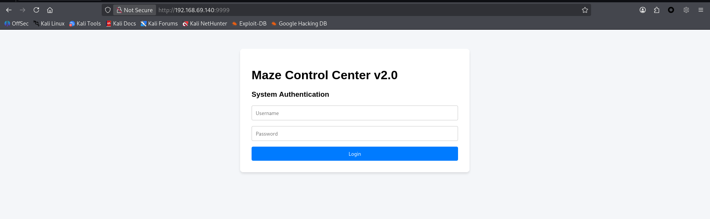
成功代理到端口9999！！！

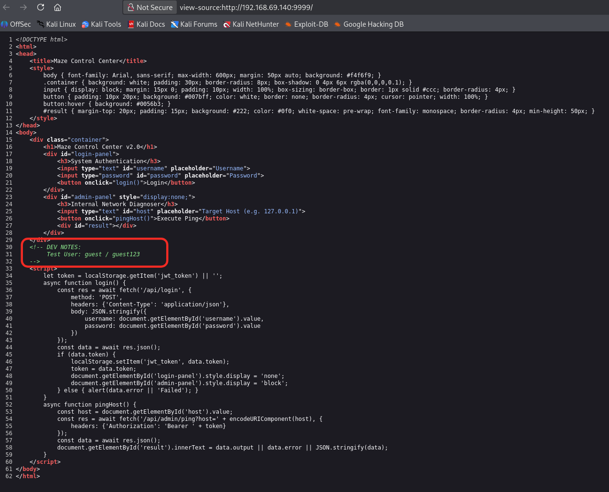
本来说有登录接口可能需要爆破的，看来直接得到了：guest:guest123

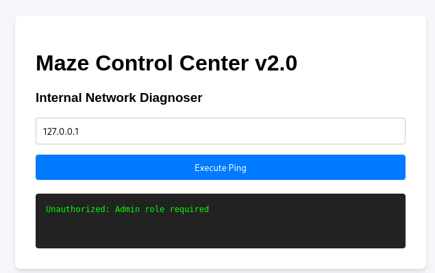

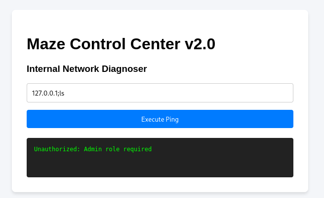

需要admin用户请求才行！！！那就看一看网络请求！！！


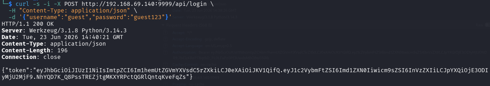
返回了一个**token**且类型为**JWT**

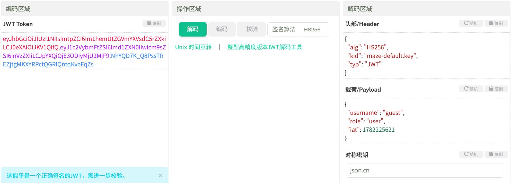
看来得修改**JWT**内容进行伪造了！！！

有一个**kid**：`maze-default.key`
记得**opt**下有一个key：
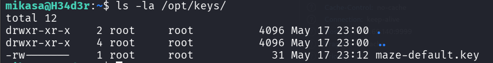

emmm，也没法读取！！！

`kid` (Key ID) 通常用于让服务端在密钥库里取 key，代码常见写法是 `open("/opt/keys/" + kid).read()`。如果未做路径校验，可以把 kid 改成穿越路径，指向 **「任意可读文件」**，然后用同样内容当 HMAC secret 自己签 token。

 `/etc/hostname` 内容是 `H34d3r`

先进行尝试：
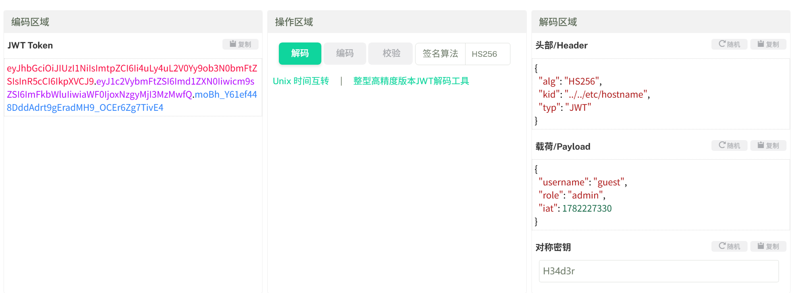

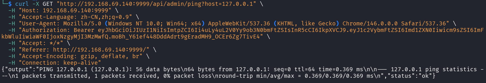
成功了！！！

普通ping可以，但是加上文件操作等就不行（意思存在WAF）
尝试绕过WAF
经过多方测试返现`%0a`可以绕过

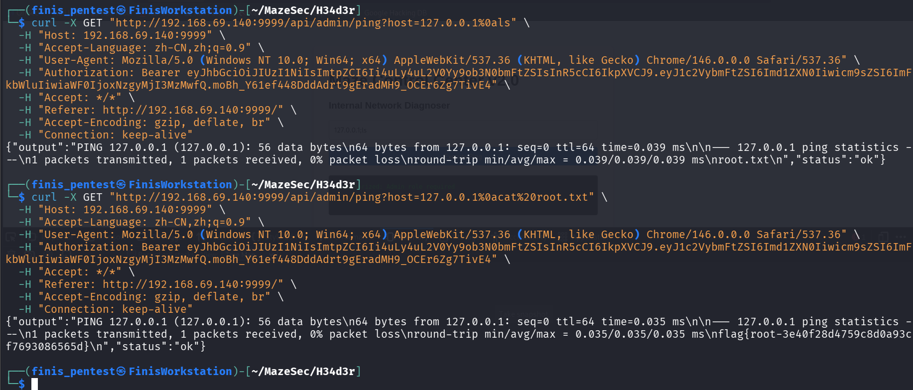

**Root_Flag**：**flag{root-3e40f28d4759c8d0a93cf7693086565d}**

成功！！！

