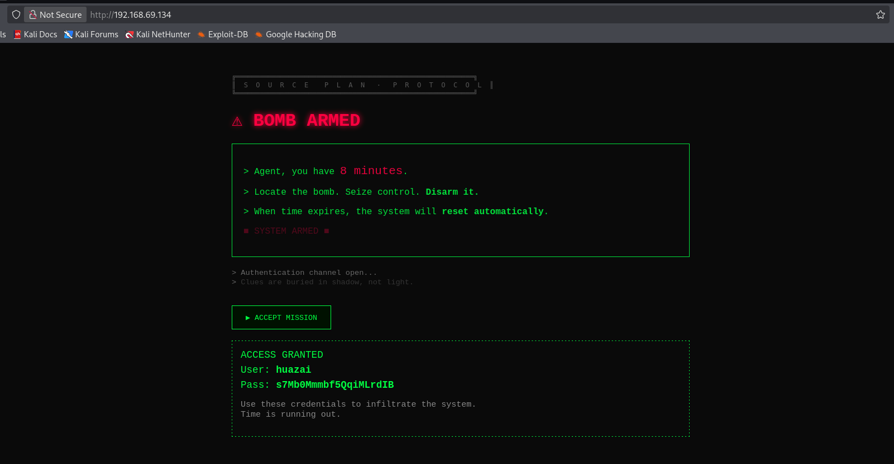
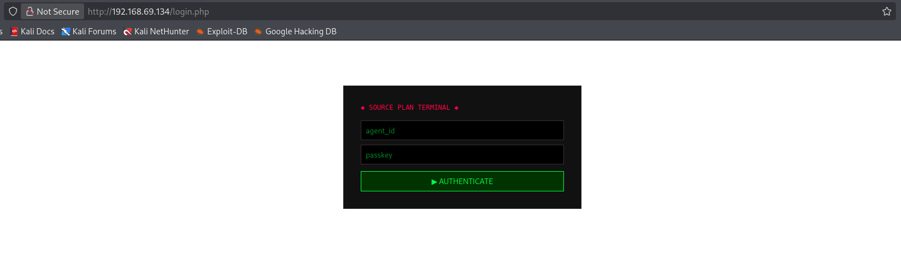
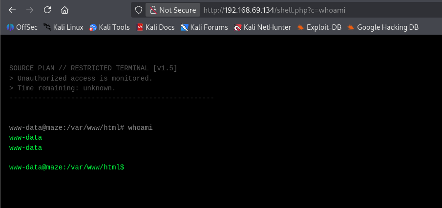
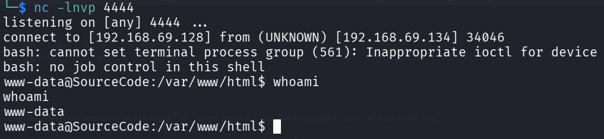
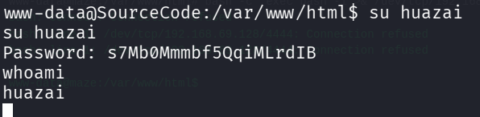
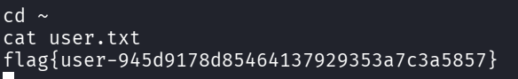
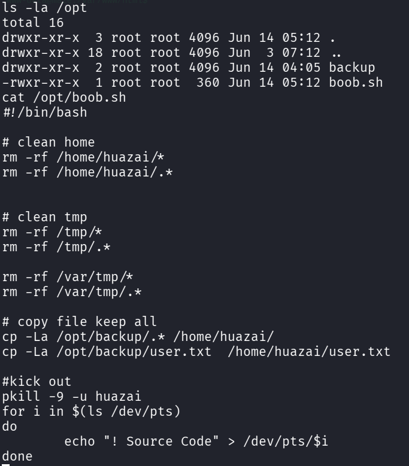

```table-of-contents
```

# 信息收集

基础的主机发现、端口与服务的探测、默认脚本处理

访问一下 Web 服务内容：

发现一个凭证: **huazai:s7Mb0Mmmbf5QqiMLrdIB**

先尝试了一下SSH，发现并不能直接登录
那就进行目录枚举（可先手工尝试一下常见的路径）


直接尝试 **login.php** 发现一个登录界面


是一个Web终端服务
那就直接反弹Shell


反弹成功

查看了一下大致内容，几乎没有什么可利用点，得想办法将权限横移到 **huazai** 该用户

# 权限横移

大致都浏览查看了一遍，没有能直接利用的点或凭据等
之前得到过一个凭据（那就先尝试一下吧，死马当活马医）


看来是成功了！！！



# 提权枚举


通过文件查找等操作，在 **/opt** 目录下有一个 **boob.sh**

该脚本会删除 `/home/huazai`、`/tmp`、`/var/tmp` 三个目录下的全部内容
但是却保留 **复制文件 保留所有**

`cp -La`：**递归、归档模式、跟随符号链接（`-L`），将 `/opt/backup/` 下的所有隐藏文件复制到家目录**

**注意：在操作的过程中发现被踢出来！**（这应该是存在定时任务的）
但是提权枚举时却发现相关的定时任务
所以不是当前用户的任务，而是**root**用户下的任务

之前的分析有一个备份操作，也就是说可以尝试通过这个备份内容进行必要的操作

