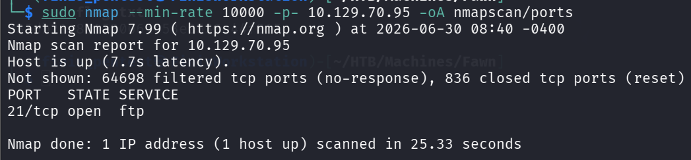
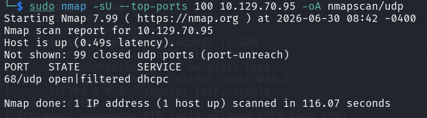
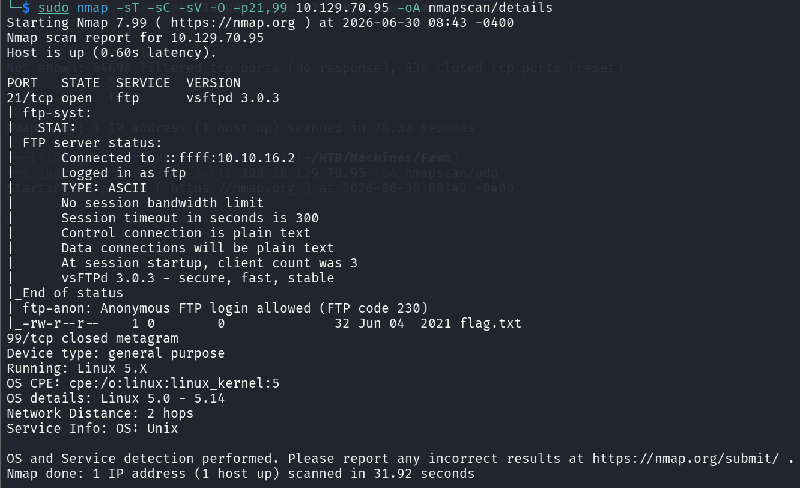
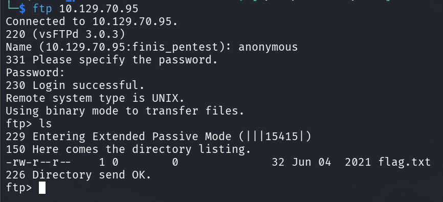

# 信息收集

对**Fawn**进行端口扫描

只有一个端口（可以考虑进行**UDP**扫描）

**UDP**扫描：

UDP只有一个**dhcpc**服务：这是分配IP的服务，不能作为渗透的目录

**详细信息扫描**：

**21**端口运行的是**FTP**协议（File Transfer Protocol）
且默认脚本探测出存在**匿名登陆**（anonymous）

# FTP匿名登录


补充一下：**匿名登陆**的密码直接置空即可

将**flag.txt**拉取下来即可！！！
```flag
035db21c881520061c53e0536e44f815 
```

# 补充分析

**Nmap**的探测中能获得很多有用的信息：
- **FTP**服务版本号：**vsftpd 3.0.3**
- **目标设备运行的操作系统版本**：Service Info: OS: **Unix**

同时也可以总结出：
- FTP登录成功的相应代码为：**230**

**FTP**拉取文件的操作：**get File_Name**

## 补充：

**FTP以明文发送数据，不进行任何加密**
随着科技发展，安全的重要性凸显而出，也因此基于**SSH**扩展出了一种类似**FTP**功能的协议：
**SFTP**（SSH File Transfer Protocol）