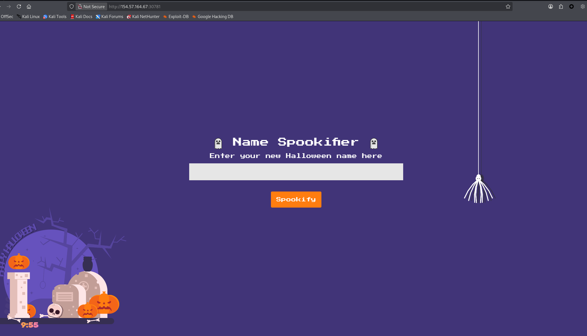
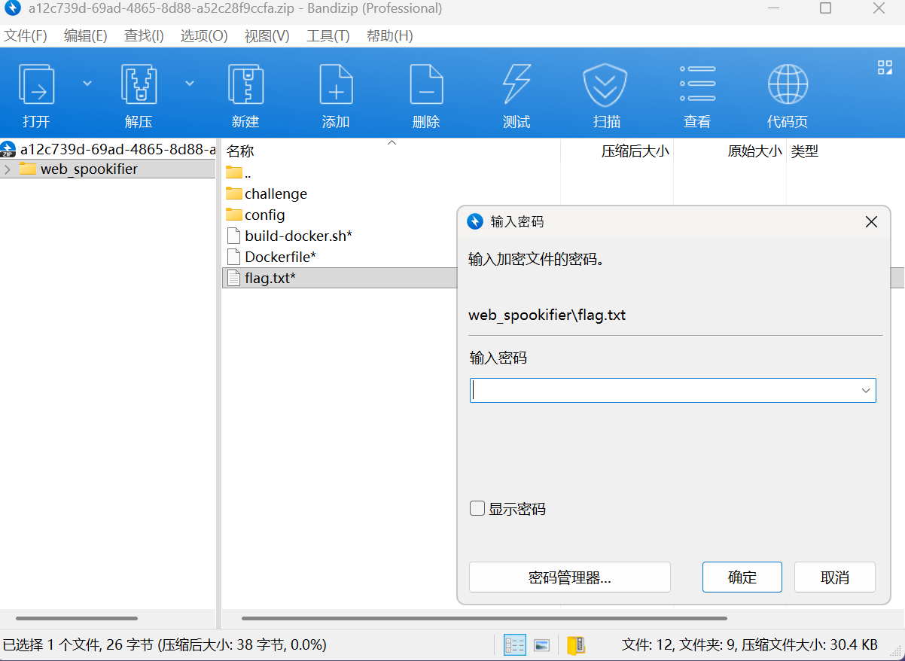
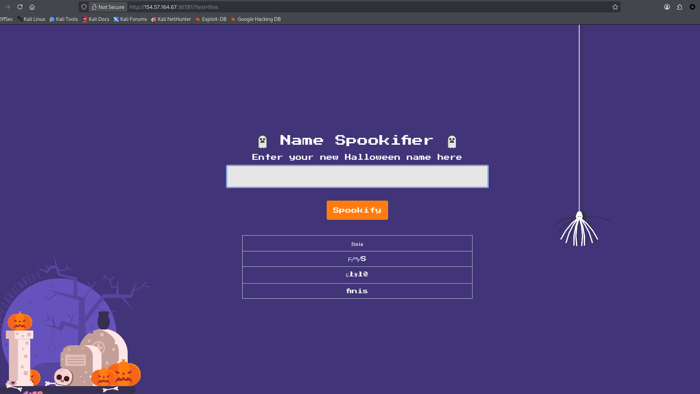
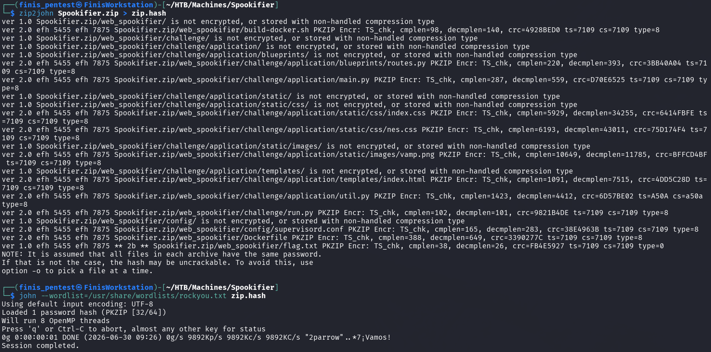
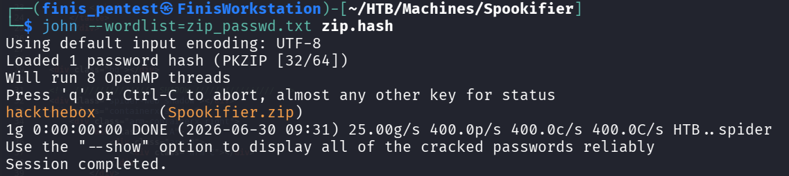
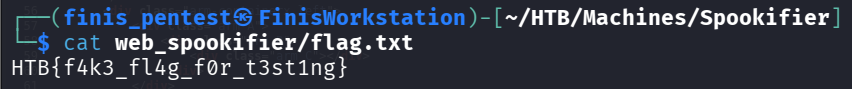
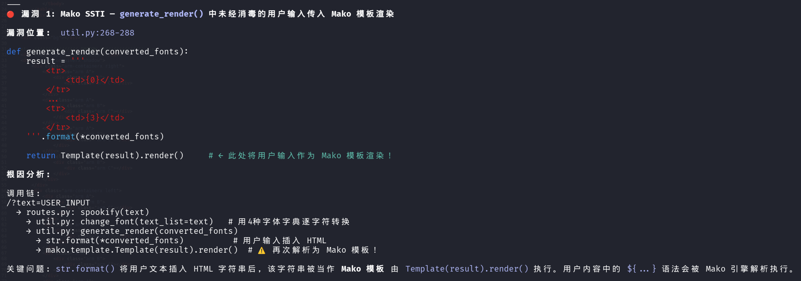
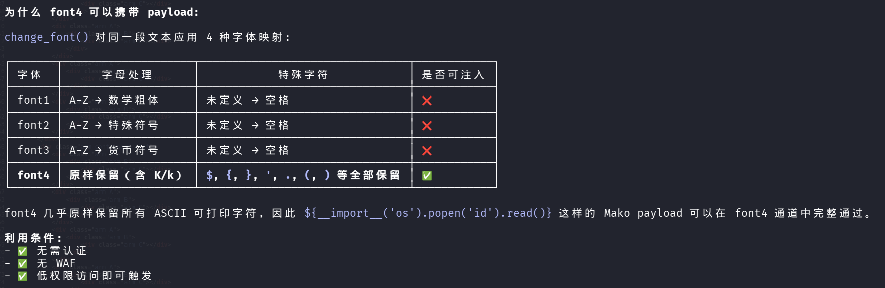
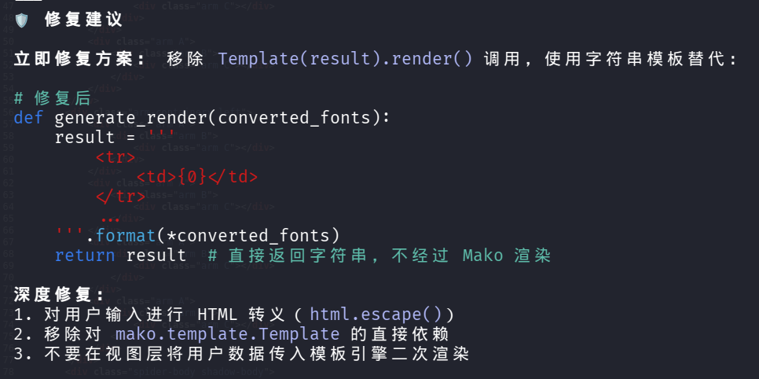
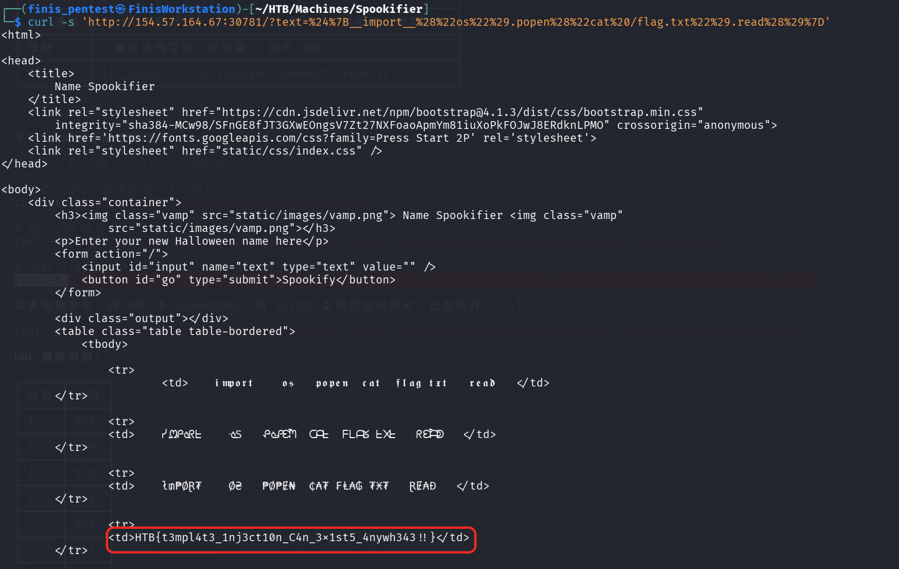

# 信息搜集


页面很简单，尝试目录枚举（概率很低）

经过长时间的等待，目录枚举完成（没有其余可用的点）

还给了一个ZIP压缩包

里面有一个**flag.txt**文件，但是需要密码。

**对Web服务功能进行探测**：

貌似是将用户输入转换成4种不同的书写方式？？？
会存在**SQL注入**、**XSS**、**SSI注入**等漏洞吗？？？（可能性不大，从功能分析它几乎不需要这些配置也能实现），但也不是说一定没有，应为能分析的点不多那么如果一一尝试就会太费时间（当然如果其他路都不行也只有**手工一一尝试**）

# ZIP密码爆破

那就先从给的**ZIP**压缩包入手：
这里选择使用：**john**对zip的hash值进行爆破（还有其他工具：**hashcat**、**fcrackzip**等）

默认的字典跑不出来

那么就得尝试根据自己的收集能力进行字典构建了：
```zip_passwd
HTB
htb
HackTheBox
hackthebox
Spookifier
spookifier
Halloween
halloween
SHADOW
shadow
Shadow
Password
password
SPIDER
Spider
spider
```


这样爆破出了密码（**hackthebox**）

## 补充

>[!Note]
>其实HTB提供了该ZIP的密码，但是为什么我要进行爆破呢？
>因为这是靶机（页面功能很简单，信息也少），所以作者的旨意不是考察社工能力（从Web服务等以外的相关内容获得有用数据，比如：精确的字典构建等）
>所以我直接默认的增加了该靶机难度，不仅是展示ZIP密码爆破的操作，更多的是多方面思考，锻炼正真实战的能力。在现实中更多的是难以获取密码等凭据的，需要通过各种信息收集构建精确的攻击体系（比如：通过邮箱、文章标注等收集管理者用户名；通过社工能力找到该开发者或管理者的一些基本信息，手机号码，姓名，出生日期以及喜好等，这些很可能是他们便于记忆的习惯）


# 代码审计

好了，回到该靶机！


能直接就读取到**flag.txt**：**HTB{f4k3_fl4g_f0r_t3st1ng}**，但是这不是最重要的
**重要的是**：有了源代码即可进行审计，精确定位其漏洞类型

`代码审计是一个很枯燥的内容，尤其是文件较多时，若没有较强的代码分析能力很容易绕晕`
但好在现如今的**AI**已经很厉害了，利用AI进行辅助可以大大提高速度与正确率




利用AI的分析已经很明确了（而且使用了几分钟，如果是我自己进行的话可能是好几个小时了）


AI甚至给出了修复建议（当然不能盲目的按照它的建议进行操作，得自己权衡利弊后再进行，也不要忘了修复后得测试步骤）

使用`${__import__("os").popen("cat /flag.txt").read()}`读取flag.txt



# 思考

这台靶机算是二刷了，第一次就是简单的**SSTI**利用（代码审计耗时了半天有余）；而这次再次回顾就有了很多新的体会：现实中很难这么顺利的拿到源码（要不是页面源代码或git等配置不当有所泄露，要不就是得利用各种漏洞反弹Shell后才能进行审计），像这种直接给**ZIP**得情况很少，本来想的是通过**SSTI**漏洞进行文件读取审计的(直接使用**SSTI**漏洞就缺少了思考的内容以及确切的 “**证据**” )，所以HTB既然给了**ZIP**（且需要密码），那么就将**ZIP**密码的爆破作为一个思考点也是很好的存在。

而对于代码的审计，提示自身的代码理解/审计能力固然重要，但是随着时代的发展（若一味的排斥**AI**带来的便利必然会被时代所抛弃，其他工作者高效的完成了自己的“作业”，而我却是耗费大量时间且正确率“堪忧”，这不是符合现代化的好“**学生**”）。因此我尝试将AI的利用也写了进来，这并不是为了偷懒（或与有点吧！），但更多的是能从AI哪里学到 “前所未有” 的现代化思想。

