```table-of-contents
```

# 信息收集

基本主机发现、端口与服务扫描、基本漏洞扫描

**80端口**：


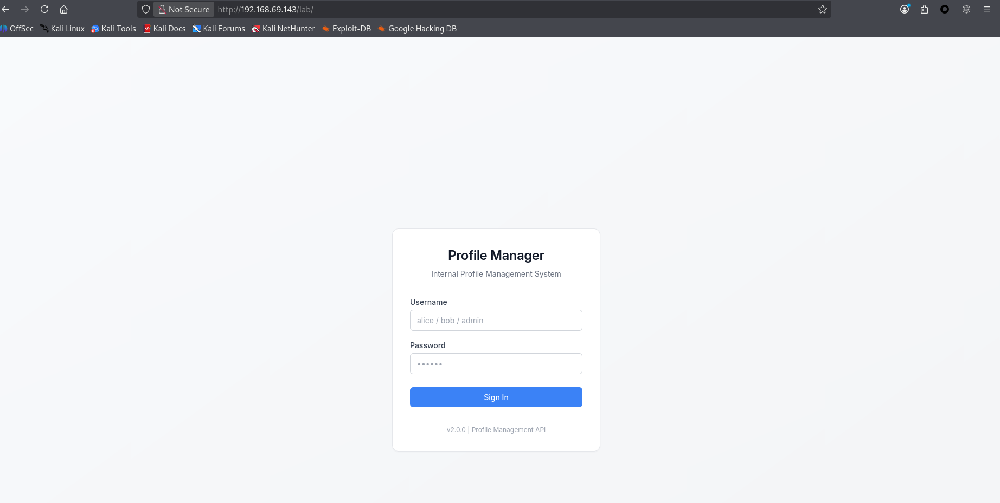
80端口的服务功能很简单（只有一个登录功能） ---> 搜集到可能的用户名：**alice**、**bob**、**admin**

**5000端口**：
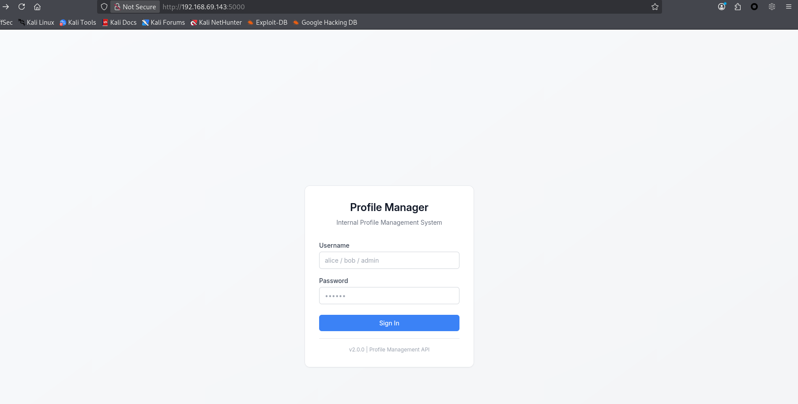
5000端口也是一样的登录功能

那就尝试一下弱口令看是否能爆破出来
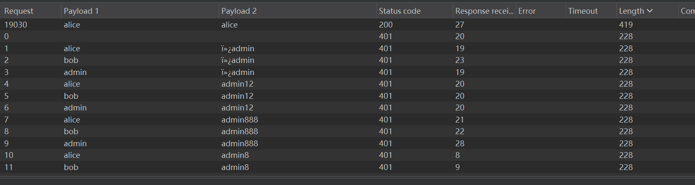
获得凭证：**alice:alice**

## Web入口点

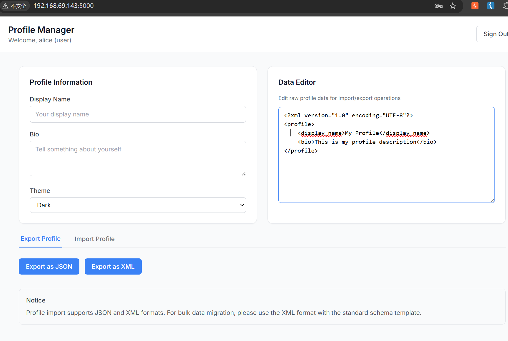
登录后初步判断：**XXE**或**SQL注入**的可能性更高

**XXE**漏洞探测：
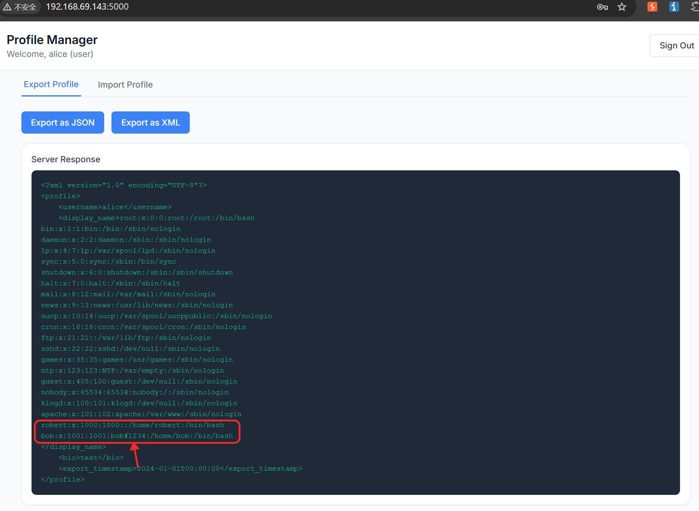
直接通过**XXE**读取到了 **/etc/passwd** 且**bob**用户有一个**bob#1234**的描述（考虑是否可能是**bob**的Password）

**问题：** 为什么第一步就考虑探测**XXE**？
很简单，**SQL注入**的探测相对而言要负责点（无法直接知晓是否存在过滤等以及无法确定数据库类型），所以探测起来相对而言较为复杂点。因此**XXE**的探测权重要高一点

## 立足点判定

获得了凭证： **bob:bob#1234** 
有的时候会难以权衡其是什么功能的凭据或者该如何有效的利用该凭据

这里的思考就是：凭据是从 **/etc/passwd** 中获得的，优先考虑的点应该就是**SSH**这一类直接通过用户名/密码进行登录的功能；再是考虑**Web服务**的利用与探测

验证：
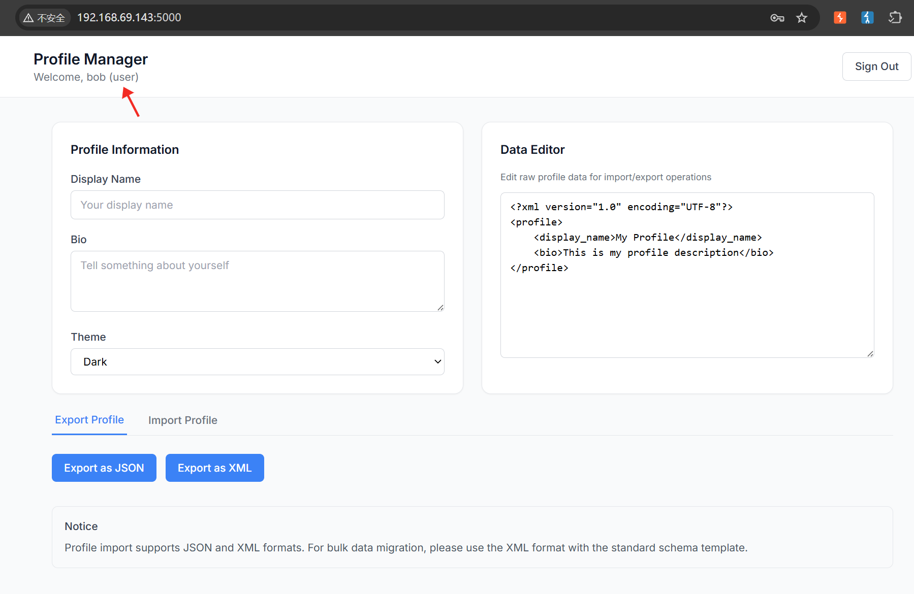
像这里，登录了**Web服务**，但是依旧只是**user**用户的权限（无论是其与**alice**同一级别权限也好还是只是单独的**User**用户权限也罢，都是不可能有过高权限的用户）

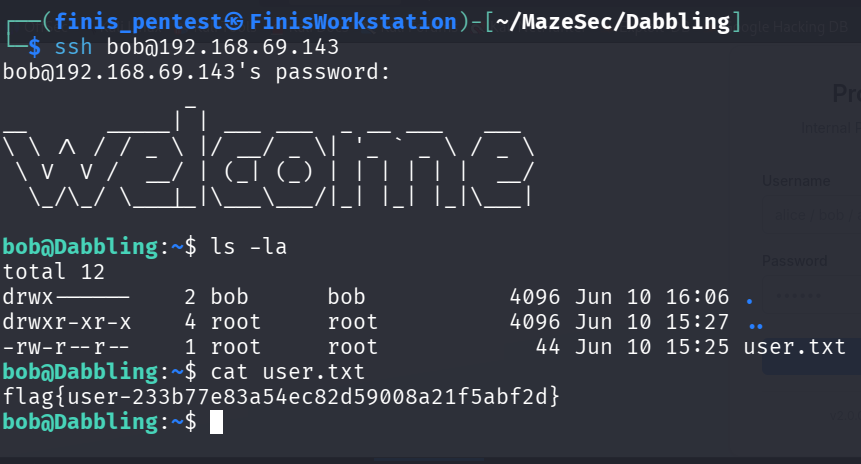
获得**User_Flag**：**flag{user-233b77e83a54ec82d59008a21f5abf2d}**


# 枚举提权&横向移动

基本用户的权限枚举后无直接可用的漏洞或脚本等，就需考虑进行**横向移动**

刚好也有一个**robert**用户，所以得枚举一下是否存在凭据泄露等问题

查看了进程、端口开放情况以及按主或组权限文件的查找，都没有直接点（那就得找一下是否存在不正常的报错或可疑点）

## 可疑点收集

通过5000端口使用凭据是可以正常登录的，但是80端口的 **/lab** 路径却无法正常登录

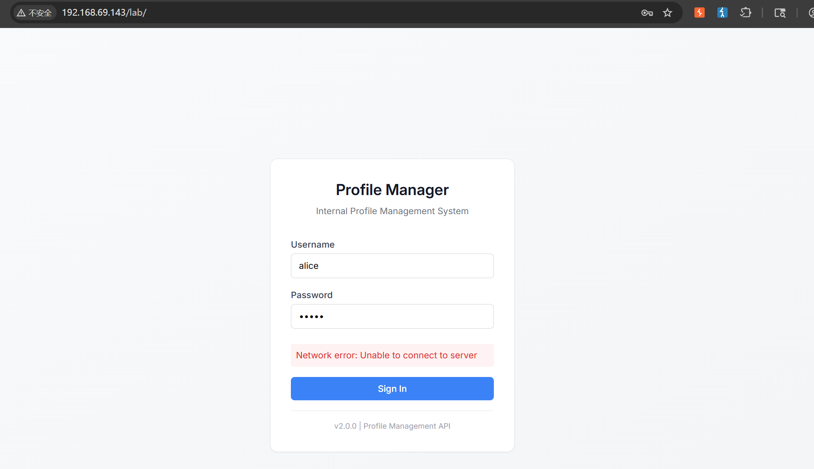
如果是密码报错应该是这样的：
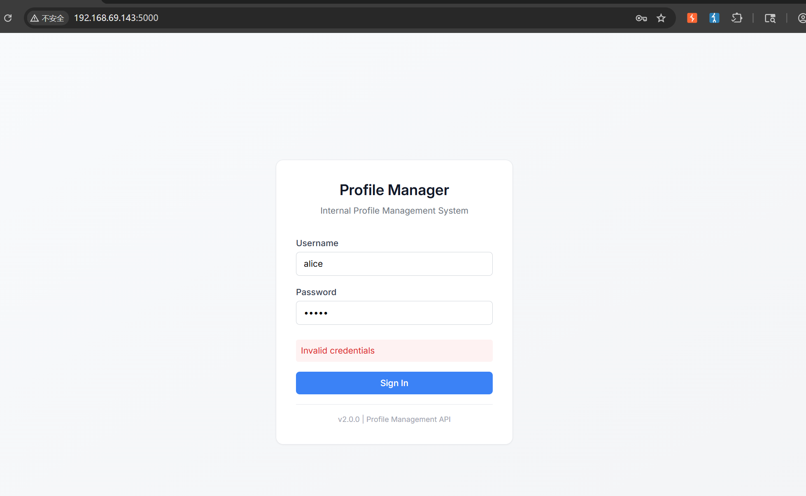

所以找一下 **/lab** 目录是否存在可疑的内容

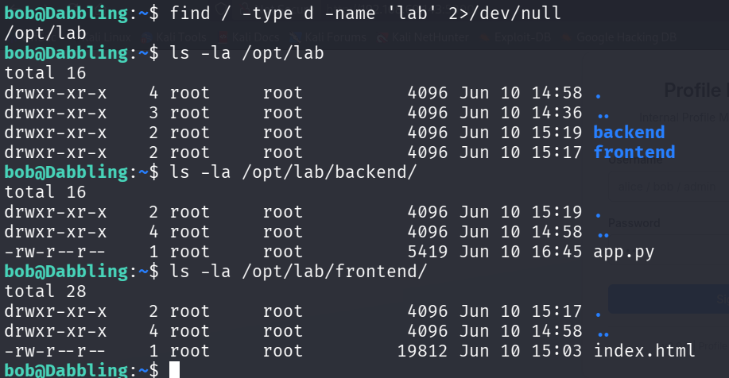
有一个可疑的**app.py**文件（可读）

```python
from flask import Flask, request, Response, session, send_from_directory
import lxml.etree as etree

import json
import uuid
import os

app = Flask(__name__, static_folder=None)
app.secret_key = 'a3f1c9b2e7d84f6a1b0e3c5d7f9a2b4c'

FRONTEND_DIR = os.path.join(os.path.dirname(os.path.abspath(__file__)), '..', 'frontend')

users = {
    'alice': {'password': 'alice', 'role': 'user'},
    'bob': {'password': 'bob#1234', 'role': 'user'},
    'admin': {'password': 'R0bert&^%8805', 'role': 'admin'}
}

@app.route('/api/auth/login', methods=['POST'])
def login():
    data = request.get_json()
    username = data.get('username')
    password = data.get('password')
    
    if username in users and users[username]['password'] == password:
        session['user_id'] = str(uuid.uuid4())
        session['username'] = username
        session['role'] = users[username]['role']
        return Response(
            json.dumps({'status': 'success', 'username': username, 'role': users[username]['role']}),
            mimetype='application/json'
        )
    return Response(
        json.dumps({'status': 'error', 'message': 'Invalid credentials'}),
        status=401,
        mimetype='application/json'
    )

@app.route('/api/profile/export', methods=['POST'])
def export_profile():
    if 'username' not in session:
        return Response(
            json.dumps({'error': 'Unauthorized'}),
            status=401,
            mimetype='application/json'
        )
    
    content_type = request.headers.get('Content-Type', '')
    
    if 'application/json' in content_type:
        try:
            profile = request.get_json()
            result = {
                'username': session['username'],
                'display_name': profile.get('display_name', ''),
                'bio': profile.get('bio', ''),
                'settings': profile.get('settings', {})
            }
            return Response(json.dumps(result), mimetype='application/json')
        except:
            return Response(
                json.dumps({'error': 'Invalid JSON format'}),
                status=400,
                mimetype='application/json'
            )
    
    elif 'application/xml' in content_type:
        xml_data = request.data
        try:
            parser = etree.XMLParser(resolve_entities=True, load_dtd=True)
            root = etree.fromstring(xml_data, parser)
            
            result_xml = f'''<?xml version="1.0" encoding="UTF-8"?>
<profile>
    <username>{session['username']}</username>
    <display_name>{root.findtext('display_name', '')}</display_name>
    <bio>{root.findtext('bio', '')}</bio>
    <export_timestamp>2024-01-01T00:00:00</export_timestamp>
</profile>'''
            return Response(result_xml, mimetype='application/xml')
        except Exception as e:
            return Response(f'<error>{str(e)}</error>', status=400, mimetype='application/xml')
    
    else:
        return Response(
            json.dumps({'error': 'Unsupported Content-Type. Use application/json or application/xml'}),
            status=415,
            mimetype='application/json'
        )

@app.route('/api/profile/import', methods=['POST'])
def import_profile():
    if 'username' not in session:
        return Response(
            json.dumps({'error': 'Unauthorized'}),
            status=401,
            mimetype='application/json'
        )
    
    content_type = request.headers.get('Content-Type', '')
    
    if 'application/json' in content_type:
        try:
            data = request.get_json()
            return Response(
                json.dumps({'message': 'Profile imported successfully', 'data': data}),
                mimetype='application/json'
            )
        except:
            return Response(
                json.dumps({'error': 'Invalid JSON format'}),
                status=400,
                mimetype='application/json'
            )
    
    elif 'application/xml' in content_type:
        xml_data = request.data
        try:
            parser = etree.XMLParser(resolve_entities=True, load_dtd=True, no_network=False)
            root = etree.fromstring(xml_data, parser)

            root.findtext('display_name')
            root.findtext('bio')
            root.findtext('preferences')

            response_xml = '''<?xml version="1.0" encoding="UTF-8"?>
<response>
    <status>success</status>
    <message>Profile imported successfully</message>
</response>'''
            return Response(response_xml, mimetype='application/xml')
        except Exception as e:
            return Response(f'<error>{str(e)}</error>', status=400, mimetype='application/xml')
    
    else:
        return Response(
            json.dumps({'error': 'Unsupported Content-Type'}),
            status=415,
            mimetype='application/json'
        )

@app.route('/')
def serve_frontend():
    return send_from_directory(FRONTEND_DIR, 'index.html')

@app.route('/api/system/info', methods=['GET'])
def system_info():
    info = {
        'name': 'Profile Management API',
        'version': '2.0.0',
        'supported_formats': ['JSON', 'XML']
    }
    return Response(json.dumps(info), mimetype='application/json')

if __name__ == '__main__':
    app.run(host='0.0.0.0', port=5000, debug=False)
```

获得三个凭据：**alice:alice**、**bob:bob#1234**、**admin:R0bert&^%8805**
从**admin:R0bert&^%8805**可以看出其密码中包含了**robert**（考虑是否是该用户的密码）

## 移动到Robert用户

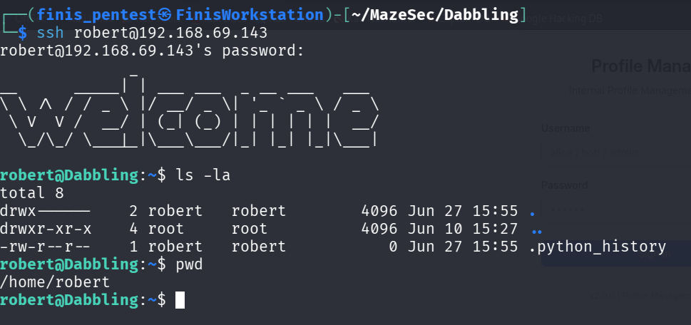
连接上了**robert**用户

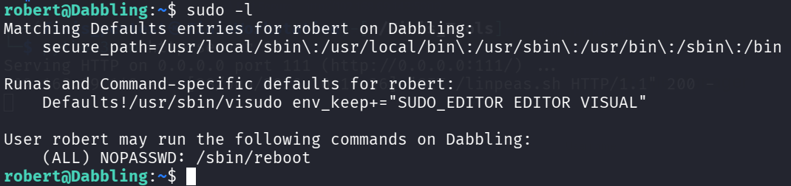
有一个**reboot**重启无需密码就可以执行
继续枚举并未发现其他的可疑点或可利用点
手动枚举难免不够全面，所以上传了一个**linpeas**进行运行

内容很多，得仔细看一下：
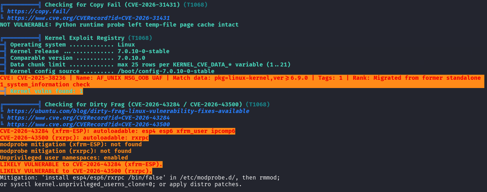

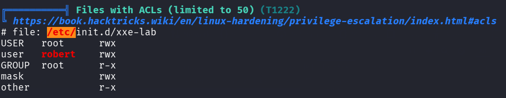
大致看来一下，可能有用的主要是这两个：
- **Dirty Frag**（脏碎片）：**CVE-2026-43500** （尝试了一下，貌似已经被修复了没法提权成功）
- **ACLs**（访问控制列表）：Linux/Unix 系统中对传统 **UGO（用户-组-其他）** 权限模型的扩展，它允许你**为任意数量的特定用户或组单独设置精细的访问权限**

**注意**：**linpeas**扫描出**ACL**权限，**robert**用于着 可读、可写、可执行（很大可能就是突破点）

## 提权分析

查看一下 **/etc/init.d/xxe-lab**
```bash
#!/sbin/openrc-run

name="XXE Lab"
description="XXE Challenge Lab"
command="/usr/bin/python3"
command_user="nobody"
command_args="/opt/lab/backend/app.py"
directory="/opt/lab/backend"
pidfile="/run/${RC_SVCNAME}.pid"
command_background=true

depend() {
    need net
    after firewall
}
```
安全隔离措施（使用 `nobody` 用户、独立目录）（这也是XXE漏洞的存在点）

那就尝试直接修改该文件：
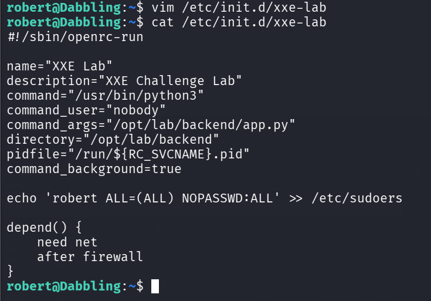
尝试重新执行该文件
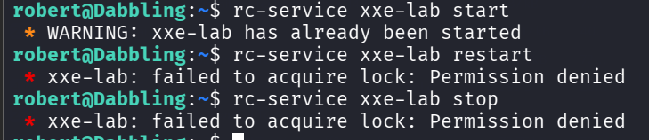
但是权限貌似不足

**思考**：一般而言，通过**SSH**远程连接（对于普通用户）是不会有**reboot**这个功能的
所以突破点应该就是重启进行重新加载该文件配置

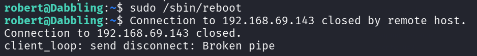

等待一会儿！！！！

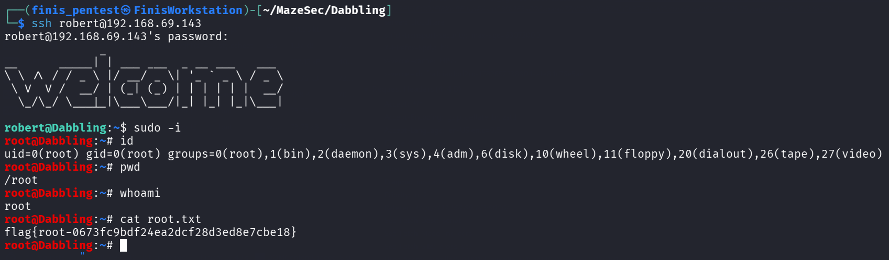
获得**Root_Flag**: **flag{root-0673fc9bdf24ea2dcf28d3ed8e7cbe18}**

# 小结

该靶机的难度不算高，但是所有内容都环环相扣，考的就是**信息收集/分析能力**
但也大幅度降低了难度，尤其是弱口令用户字典的构建（直接给出了三个用户名）。若没有直接给出：那就很考攻击者的信息整合能力以及社工能力了（这样才是更加现实的测试）

整体的攻击链：
```
弱口令爆破
	|
XXE漏洞读取文件
	|
横向移动（凭据泄露）
	|
提权枚举（手工+linpeas）
	|
ACL权限利用（修改指定文件内容）
```